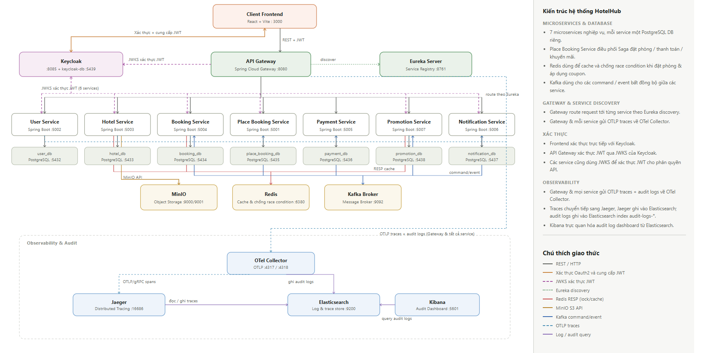

# Dự án Microservices Hệ thống SaaS quản lý đặt phòng khách sạn Multi-tenant 

---

## Thành viên nhóm & Phân công công việc

| Họ tên | Vai trò & Công việc đảm nhận |
|---|---|
| **Đoàn Quang Minh** | - Phân tích và thiết kế kiến trúc hệ thống, viết tài liệu SRS, API doc<br>- Cài đặt luồng Saga đặt phòng khách sạn (Place Booking Service)<br>- Tích hợp hệ thống quản lý định danh và phân quyền sử dụng Keycloak, bao gồm đăng nhập bằng Google, quản lý SSO, xác thực JWT và phân quyền theo vai trò.<br>- Tích hợp Firebase Cloud Messaging để gửi thông báo đẩy cho các sự kiện của hệ thống.<br>- Tích hợp các API khuyến mãi vào quy trình đặt phòng.<br>- Tham gia thiết kế giải pháp chống tình trạng đặt trùng phòng của nhiều người dùng khác nhau đồng thời.<br>- Tích hợp Distributed Tracing và Audit Logging cho các service của hệ thống. |
| **Vũ Nhân Kiên** | - Phân tích thiết kế hệ thống, viết API doc<br>- Cài đặt chức năng xem chi tiết khách sạn và loại phòng<br>- Cài đặt Redis cache cho tìm kiếm và xem chi tiết khách sạn<br>- Thiết kế và cài đặt giải pháp tránh yêu cầu đặt phòng trùng lặp của 1 người dùng<br>- Thiết kế và cài đặt giải pháp chống tình trạng đặt trùng phòng của nhiều người dùng khác nhau đồng thời<br>- Cài đặt tính năng checkin/checkout phòng đặt<br>- Cài đặt tính năng kiểm duyệt tin đăng khách sạn<br>- Cài đặt tính năng quản lý users, tenants và gói dịch vụ. |
| **Đồng Vũ Hoàng Long** | - Phân tích thiết kế hệ thống, viết API doc<br>- Cài đặt tính năng tìm kiếm khách sạn<br>- Cài đặt các tính năng CRUD khuyến mãi, coupon<br>- Cài đặt tính năng tạo tin đăng khách sạn<br>- Cài đặt API upload và xoá file với MinIO. |

---

## Phạm vi & Các Chức năng Hệ thống

**HotelHub SaaS Platform** là nền tảng SaaS đa tenant quản lý và đặt phòng khách sạn, kết nối 4 nhóm tác nhân (Customer, Hotel Staff, Hotel Owner, Platform Admin). Hệ thống cung cấp các nhóm chức năng chính bao gồm:

- **Quản lý Định danh & Phân quyền (Identity & Access Management)**: Đăng nhập tập trung (SSO) qua Keycloak, hỗ trợ OAuth2/OIDC, Google Social Login, cấp phát JWT Token và phân quyền chi tiết theo vai trò (RBAC).
- **Quản lý Nền tảng SaaS Đa Tenant (Multi-Tenant Management)**: Cho phép các chủ khách sạn (Hotel Owner) đăng ký, tạo lập tenant riêng, cấu hình chuỗi khách sạn và quản lý các gói thuê bao dịch vụ (subscription).
- **Tìm kiếm & Đặt phòng Trực tuyến (Hotel Search & Booking)**: Tìm kiếm khách sạn theo vị trí, khung ngày, mức giá; xem thông tin chi tiết & tiện ích; áp dụng mã giảm giá (coupon); thanh toán trực tuyến (mock) với cơ chế tự động xác nhận đơn qua **Saga Pattern** và chống đặt trùng phòng đồng thời với **Redis Lock**.
- **Quản lý Vận hành Khách sạn tại Quầy (Hotel Operations & PMS)**: thực hiện các thao tác Check-in, Check-out và quản lý trạng thái phòng cho nhân viên lễ tân.
- **Quản lý Chương trình Khuyến mãi (Promotions & Coupons)**: Tạo lập và quản lý các chiến dịch ưu đãi, mã giảm giá ở cấp toàn nền tảng hoặc cấp từng khách sạn; kiểm tra điều kiện áp dụng và giới hạn số lượt dùng voucher bằng Redis distributed lock.
- **Thông báo Đa kênh (Multi-Channel Notifications)**: Tự động gửi email xác nhận/hủy phòng và phát thông báo đẩy (push notification) qua Firebase Cloud Messaging (FCM).

---

## Observability & Giám sát Hệ thống

Hệ thống tích hợp giải pháp giám sát toàn diện gồm:
- **Distributed Tracing (Truy vết Phân tán)**: Sử dụng **OpenTelemetry (OTel) Java Agent** tự động tạo và thu thập Spans, đẩy qua **OTel Collector** lưu trữ tại **Elasticsearch** và tra cứu mốc thời gian xử lý (timeline/latency) trực quan trên **Jaeger UI**.
- **Centralized Audit Logging (Ghi log Kiểm toán Nghiệp vụ)**: Sử dụng **OpenTelemetry (OTel)** kết hợp **Logback Structured JSON Appender**, đẩy dữ liệu qua **Elasticsearch** và xây dựng Dashboard phân tích nhật ký thao tác nghiệp vụ trên **Kibana**.

---

## Sơ đồ Kiến trúc Hệ thống



---

## Thành phần & Cổng kết nối (Ports)

| Thành phần | Vai trò / Trách nhiệm | Công nghệ | Host Port |
|---|---|---|---:|
| **Frontend** | Giao diện Customer, Staff, Owner và Admin | React + Vite | `3000` |
| **API Gateway** | Entrypoint, routing, xác thực JWT với JWKS, OTel Traces | Spring Cloud Gateway | `8080` |
| **Eureka Server** | Service Registry & Discovery | Spring Cloud Netflix Eureka | `8761` |
| **Keycloak** | Xác thực & cấp phát JWT token, OAuth2/OIDC SSO, phân quyền vai trò, quản lý Realm | Keycloak 26.7.0 | `8085` |
| **keycloak-db** | Cơ sở dữ liệu tài khoản, vai trò & realm Keycloak | PostgreSQL 16 | `5439` |
| **user-service** | Quản lý hồ sơ user, tenant (chủ khách sạn) & gói đăng ký | Spring Boot 3 + PostgreSQL (`5432`) | `5002` |
| **hotel-service** | Khách sạn, loại phòng, tiện ích, MinIO (dùng Redis cache thông tin khách sạn) | Spring Boot 3 + PostgreSQL (`5433`) | `5003` |
| **booking-service** | Quản lý đơn đặt phòng, lịch sử đặt phòng, phòng còn trống (dùng redis chống race condition khi đặt) | Spring Boot 3 + PostgreSQL (`5434`) | `5004` |
| **place-booking-service** | Saga Orchestration điều phối luồng đặt phòng, thanh toán, khuyến mãi và bù trừ | Spring Boot 3 + PostgreSQL (`5435`) | `5001` |
| **payment-service** | Xử lý thanh toán | Spring Boot 3 + PostgreSQL (`5436`) | `5005` |
| **promotion-service** | Quản lý Coupon, khuyến mãi (dùng redis chống race condition khi sử dụng coupon ) | Spring Boot 3 + PostgreSQL (`5438`) | `5007` |
| **notification-service** | Gửi email, FCM push notification | Spring Boot 3 + PostgreSQL (`5437`) | `5006` |
| **Redis** | Cache thông tin khách sạn, xử lý race condition đặt phòng | Redis 7.2 Alpine | `6380` |
| **MinIO** | Object Storage lưu trữ hình ảnh khách sạn, phòng, avatar | MinIO | `9000` / `9001` |
| **Kafka & Zookeeper** | Message Broker cho giao tiếp bất đồng bộ | Apache Kafka + Zookeeper | `9092` |
| **OTel Collector** |  Thu thập Traces  & Audit Logs | OTel Collector Contrib | `4317` / `4318` |
| **Jaeger** | Backend và giao diện Distributed Tracing  | Jaeger 2.20 | `16686` |
| **Elasticsearch** | CSDL lưu trữ Audit Logs & dữ liệu Tracing | Elasticsearch 8.13 | `9200` |
| **Kibana** | Dashboard trực quan hóa Audit Log | Kibana 8.13 | `5601` |

---

## Hướng dẫn Chạy Hệ thống (Docker Compose)

### Yêu cầu tiên quyết:
- Docker Engine & Docker Compose

### Khởi động toàn bộ Hệ thống:

```bash
docker compose up --build
```

> **Lưu ý:** Các service giao tiếp nội bộ trong mạng ảo Docker `app-network` thông qua tên service container (ví dụ: `eureka-server`, `kafka`, `redis`, `minIO`, `keycloak`, `otel-collector`), **không sử dụng `localhost`** trong cấu hình container.

### Truy cập Giao diện & Công cụ:
- **Frontend App**: [http://localhost:3000](http://localhost:3000)
- **API Gateway Entry**: [http://localhost:8080](http://localhost:8080)
- **Eureka Service Registry**: [http://localhost:8761](http://localhost:8761)
- **Keycloak Admin Console**: [http://localhost:8085](http://localhost:8085)
- **MinIO Console**: [http://localhost:9001](http://localhost:9001)
- **Jaeger Tracing UI**: [http://localhost:16686](http://localhost:16686)
- **Kibana Audit Log Dashboard**: [http://localhost:5601](http://localhost:5601)

---

## Tài liệu Dự án

Tài liệu thiết kế chi tiết nằm trong thư mục `docs/`:
- [`docs/SRS.md`](docs/SRS.md) — Đặc tả yêu cầu phần mềm (SRS IEEE 830).
- [`docs/architecture.md`](docs/architecture.md) — Tài liệu Kiến trúc Hệ thống & Kafka Events Schema.
- [`docs/analysis-and-design.md`](docs/analysis-and-design.md) — Tài liệu Phân tích & Thiết kế Microservices (SDD).
- [`distributed_tracing_audit_logging_report.md`](distributed_tracing_audit_logging_report.md) — Báo cáo Chi tiết Tracing & Audit Logging.
- Các đặc tả OpenAPI 3.0 trong [`docs/api-specs/`](docs/api-specs/).

---

## License

MIT — Xem chi tiết tại [`LICENSE`](LICENSE).
