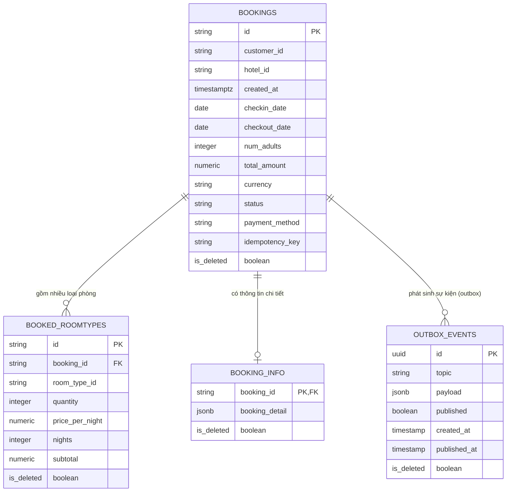
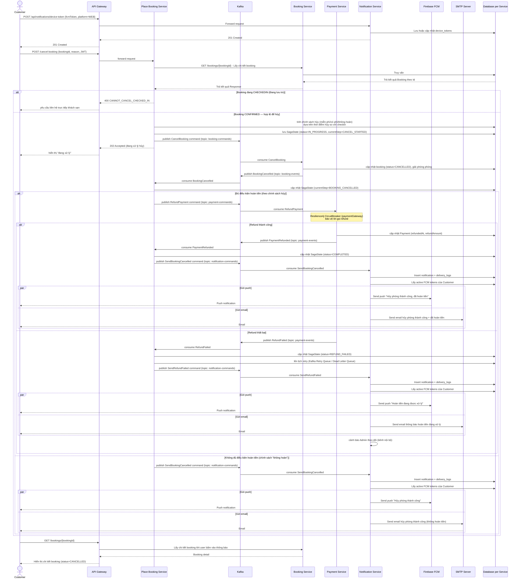
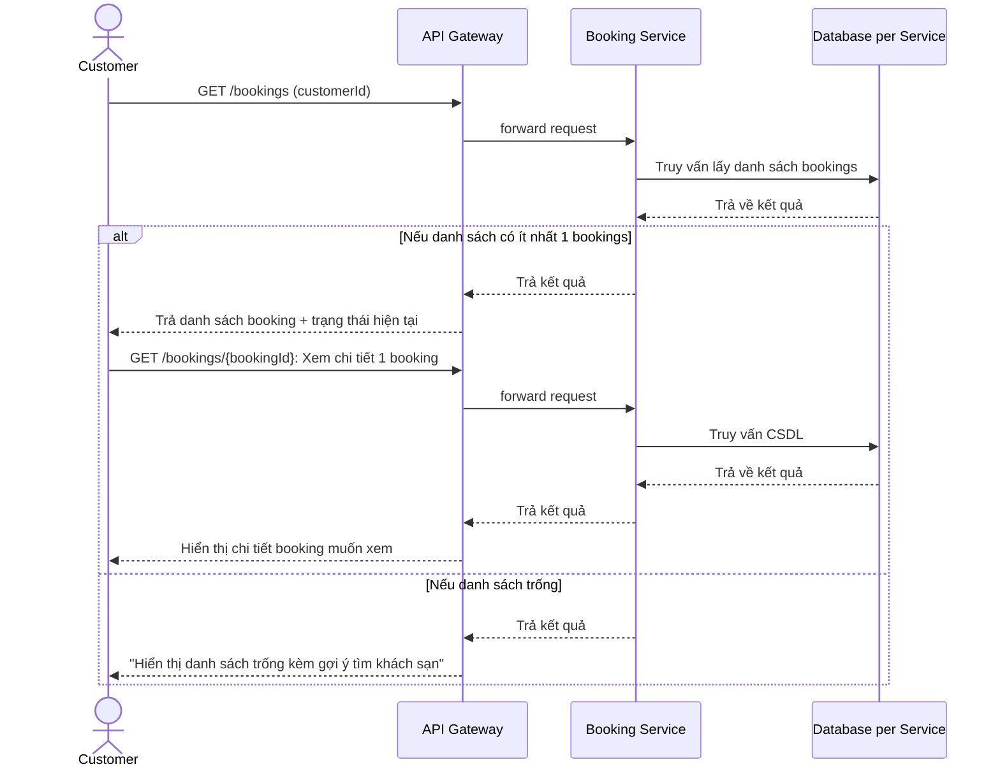
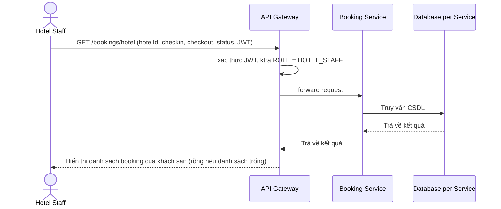
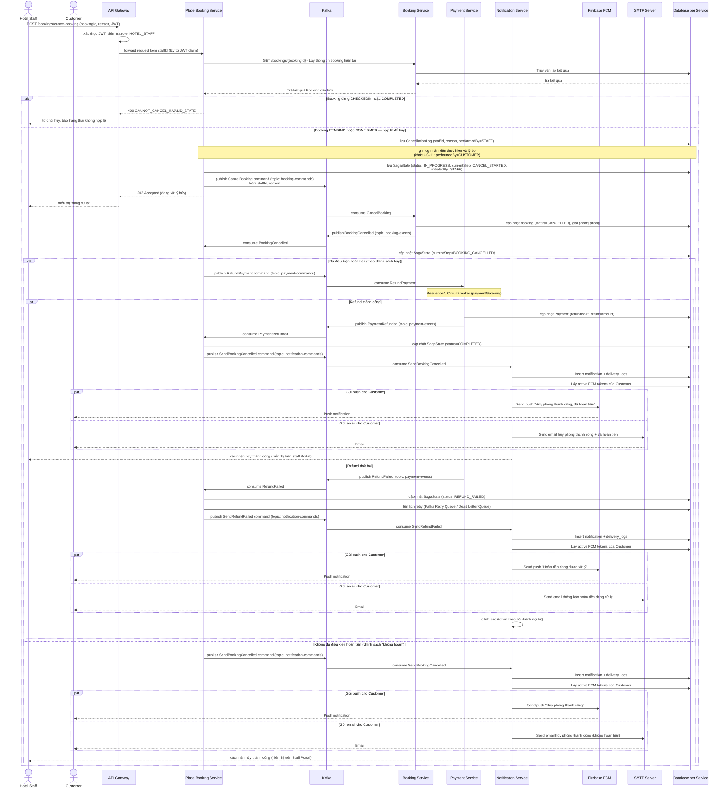

# Phân tích và thiết kế Booking Service

## 1. Thiết kế dữ liệu (`booking_db`)

### 1.1. Danh sách bảng và thuộc tính

#### 1.1.1. ENUM Types

**`booking_status_enum`**

| Giá trị | Mô tả |
| --- | --- |
| `FAILED` | Không đặt phòng thành công — xảy ra ở bước check availability để tránh race-condition |
| `PENDING` | Phòng đang được giữ chỗ, chờ thanh toán tiền cọc |
| `CONFIRMED` | Đã thanh toán tiền cọc, booking được xác nhận |
| `CANCELLED` | Không thanh toán được trong thời hạn, đơn bị huỷ hoặc khách hàng tự huỷ/liên hệ nhân viên khách sạn yêu cầu huỷ |
| `CHECKEDIN` | Khách hàng đã check-in |
| `COMPLETED` | Khách đã thanh toán đầy đủ, check-out, đơn hoàn thành |

**`payment_method_enum`**

| Giá trị | Mô tả |
| --- | --- |
| `CREDIT_CARD` | Thanh toán qua thẻ tín dụng |

---

**Bảng `bookings`**

| Cột | Kiểu dữ liệu | Ràng buộc | Mô tả |
| --- | --- | --- | --- |
| id | VARCHAR(255) | PK | Định danh booking |
| customer_id | VARCHAR(255) | NOT NULL | ID khách hàng (tham chiếu user-service) |
| hotel_id | VARCHAR(255) | NOT NULL | ID khách sạn (tham chiếu hotel-service) |
| created_at | TIMESTAMPTZ | NOT NULL, DEFAULT NOW() | Thời điểm tạo booking |
| checkin_date | DATE | NOT NULL | Ngày check-in |
| checkout_date | DATE | NOT NULL, > checkin_date | Ngày check-out |
| num_adults | INTEGER | NOT NULL, > 0 | Số người lớn |
| total_amount | NUMERIC | NOT NULL, > 0 | Tổng tiền |
| currency | VARCHAR(255) | NOT NULL, DEFAULT 'VND' | Đơn vị tiền tệ |
| status | booking_status_enum | NOT NULL, DEFAULT 'PENDING' | Trạng thái booking |
| payment_method | payment_method_enum | NULL | Phương thức thanh toán |
| idempotency_key | VARCHAR(255) | UNIQUE, NULL | Khoá idempotency tránh tạo booking trùng |
| is_deleted | BOOLEAN | NOT NULL | Xóa mềm đối tượng |

**Bảng `booked_roomtypes`**

| Cột | Kiểu dữ liệu | Ràng buộc | Mô tả |
| --- | --- | --- | --- |
| id | VARCHAR(255) | PK | Định danh bản ghi |
| booking_id | VARCHAR(255) | NOT NULL, FK → bookings.id | Booking chứa room type này |
| room_type_id | VARCHAR(255) | NOT NULL | ID loại phòng (tham chiếu hotel-service) |
| quantity | INTEGER | NOT NULL, > 0 | Số lượng phòng |
| price_per_night | NUMERIC | NOT NULL | Giá mỗi đêm |
| nights | INTEGER | NOT NULL, > 0 | Số đêm |
| subtotal | NUMERIC | NOT NULL | Thành tiền |
| is_deleted | BOOLEAN | NOT NULL | Xóa mềm đối tượng |

**Bảng `booking_info`**

| Cột | Kiểu dữ liệu | Ràng buộc | Mô tả |
| --- | --- | --- | --- |
| booking_id | VARCHAR(255) | PK, FK → bookings.id | Booking tương ứng |
| booking_detail | JSONB | NOT NULL | Chi tiết booking dạng JSON (thông tin snapshot tại thời điểm đặt) |
| is_deleted | BOOLEAN | NOT NULL | Xóa mềm đối tượng |

**Bảng `outbox_events`**

| Cột | Kiểu dữ liệu | Ràng buộc | Mô tả |
| --- | --- | --- | --- |
| id | UUID | PK, DEFAULT gen_random_uuid() | Định danh event |
| topic | VARCHAR(100) | NOT NULL | Tên Kafka topic |
| payload | JSONB | NOT NULL | Nội dung event |
| published | BOOLEAN | NOT NULL, DEFAULT FALSE | Đã publish lên Kafka chưa |
| created_at | TIMESTAMP | NOT NULL, DEFAULT NOW() | Thời điểm tạo event |
| published_at | TIMESTAMP | NULL | Thời điểm publish thành công |
| is_deleted | BOOLEAN | NOT NULL | Xóa mềm đối tượng |

> Outbox Pattern: event được INSERT cùng transaction với business data. `OutboxRelay` (`@Scheduled`) đọc bảng này và publish lên Kafka, đảm bảo at-least-once delivery.

---

### 1.2. Indexes

| Index | Bảng | Cột | Mục đích |
| --- | --- | --- | --- |
| `idx_bookings_availability` | `bookings` | `(checkin_date, checkout_date, status)` | Availability check — query đếm phòng đang PENDING/CONFIRMED trong khoảng ngày |
| `idx_booked_roomtypes_room_type` | `booked_roomtypes` | `(room_type_id)` | Lookup nhanh theo loại phòng |
| `idx_booked_roomtypes_booking` | `booked_roomtypes` | `(booking_id)` | Lookup nhanh theo booking |
| `idx_bookings_customer` | `bookings` | `(customer_id)` | Lịch sử booking theo khách hàng |
| `idx_bookings_status` | `bookings` | `(status)` | Lọc booking theo trạng thái |
| `idx_outbox_unpublished` | `outbox_events` | `(published, created_at) WHERE published = FALSE` | Partial index — OutboxRelay chỉ scan event chưa publish |

---

### 1.3. Quan hệ

- `booked_roomtypes.booking_id` → `bookings.id` (N–1, CASCADE DELETE).
- `booking_info.booking_id` → `bookings.id` (1–1, CASCADE DELETE).
- `bookings.customer_id` → `users.id` ở user-service (tham chiếu ngoài dịch vụ, không có FK vật lý).
- `bookings.hotel_id` → `hotels.id` ở hotel-service (tham chiếu ngoài dịch vụ, không có FK vật lý).
- `booked_roomtypes.room_type_id` → `room_types.id` ở hotel-service (tham chiếu ngoài dịch vụ, không có FK vật lý).

---

### 1.4. ERD


## 2. Tài nguyên API - base path `/api/bookings`

| Method | Endpoint | Mô tả | Response Code |
| --- | --- | --- | --- |
| POST | `/api/bookings` | **[internal]** Tạo booking ở trạng thái PENDING (gọi từ Place Booking Service) | 201 Created, 409 Conflict |
| GET | `/api/bookings/{id}` | Xem chi tiết một booking | 200 OK, 403 Forbidden, 404 Not Found |
| GET | `/api/bookings/my` | Khách hàng xem lịch sử đặt phòng của mình | 200 OK |
| GET | `/api/bookings` | Staff xem danh sách booking theo hotelId/ngày/trạng thái | 200 OK, 403 Forbidden |
| PATCH | `/api/bookings/{id}/check-in` | Staff check-in khách | 200 OK, 403 Forbidden, 409 Conflict (chưa Confirmed) |
| PATCH | `/api/bookings/{id}/check-out` | Staff check-out khách | 200 OK, 403 Forbidden, 409 Conflict |
| GET | `/api/bookings/stats` | Số liệu booking theo hotelId/khoảng thời gian (Owner Dashboard) | 200 OK, 403 Forbidden |
| GET | `/api/bookings/platform-stats` | Tổng số booking, tỷ lệ chuyển đổi toàn nền tảng (Admin Dashboard) | 200 OK, 403 Forbidden |

## 3. Sequence diagram theo use case

### 3.1. UC-10 - Đặt phòng sử dụng FCM notification thay cho polling

```mermaid
sequenceDiagram
    sequenceDiagram
    actor C as Customer
    participant GW as API Gateway
    participant PBS as Place Booking Service
    participant Redis as Redis
    participant KK as Kafka
    participant BS as Booking Service
    participant PS as Promotion Service
    participant PayS as Payment Service
    participant NS as Notification Service
    participant FCM as Firebase FCM
    participant SMTP as SMTP Server
    participant DB as Database per Service

    %% ===== Bước 0: Đăng ký FCM token =====
    C->>GW: POST /api/notifications/device-token {fcmToken, platform=WEB}
    GW->>NS: Forward request
    NS->>DB: Lưu hoặc cập nhật device_tokens
    NS-->>GW: 201 Created
    GW-->>C: 201 Created

    %% ===== Bước 1: Áp dụng coupon =====
    C->>GW: POST /promotion-service/validate {couponCode, amount}
    GW->>PS: Forward request
    PS->>DB: Kiểm tra hiệu lực coupon
    DB-->>PS: Coupon hợp lệ
    PS-->>GW: 200 OK {discount, newTotalAmount}
    GW-->>C: Hiển thị tổng tiền sau giảm giá

    %% ===== Bước 2: Khách hàng đặt phòng =====
    rect rgb(255, 247, 230)
    Note over C,DB: CHỐNG DUPLICATE REQUEST (userId + hash payload, độc lập với idempotencyKey)
    C->>GW: POST /place-booking {PlaceBookingRequest, idempotencyKey, forceToken?}
    GW->>PBS: Forward request

    PBS->>PBS: hashRequest = SHA256(userId, hotelId, checkin, checkout, numAdults, roomTypeList đã sort)

    alt forceToken khớp SHA256(userId:hash:"confirmed")
        PBS->>PBS: Coi như KHÔNG trùng (user đã bấm xác nhận đặt lại)
    else Chưa có forceToken hoặc không khớp
        PBS->>Redis: SETNX dup:booking-request:{userId}:{hash} "locked" EX 10s
        alt Redis: key đã tồn tại
            Redis-->>PBS: false (đã có request y hệt gần đây)
        else Redis lỗi (mất kết nối)
            PBS->>DB: SELECT SagaState WHERE userId+hash+createdAt>now-5p AND status NOT IN (FAILED,CANCELLED)
            DB-->>PBS: Kết quả (DB là source of truth khi Redis sập)
        end
    end

    alt Bị coi là trùng lặp
        PBS-->>GW: 200 OK, body {code=409, message, forceToken mới, hint}
        Note over PBS,GW: Lưu ý: HTTP status thật vẫn là 200,<br/>code 409 chỉ nằm trong body JSON
        GW-->>C: Hiện cảnh báo "Có đơn tương tự trong 5 phút trước" + nút "Vẫn đặt phòng"
        C->>GW: (nếu xác nhận) POST /place-booking lại, kèm forceToken vừa nhận
        GW->>PBS: Forward request (rơi vào nhánh forceToken khớp ở trên)
    else Không trùng
        PBS->>PBS: Validate user, hotel, roomType, số lượng phòng (check sơ bộ, KHÔNG khóa gì)
        PBS->>DB: existsSagaStateByIdempotencyKey(idempotencyKey)
        alt idempotencyKey đã tồn tại VÀ hashRequest khớp
            DB-->>PBS: SagaState cũ
            PBS-->>GW: 202 Accepted {bookingId cũ, status=PENDING}
            GW-->>C: Hiển thị trạng thái đang xử lý (không tạo saga mới)
        else idempotencyKey đã tồn tại NHƯNG hashRequest KHÁC
            PBS-->>GW: 409 SAGA_STATE_CONFLICT
            GW-->>C: Báo lỗi rõ ràng (client tái sử dụng sai idempotencyKey)
        else Request thật sự mới
            PBS->>DB: Lưu SagaState{status=IN_PROGRESS, hashRequest, userId}
            PBS->>DB: INSERT outbox_events(CreateBooking) -- cùng transaction với SagaState
            PBS-->>GW: 202 Accepted {bookingId, status=PENDING}
            GW-->>C: Hiển thị "Đơn đặt phòng đang được xử lý"
            PBS->>KK: OutboxRelay (@Scheduled) publish CreateBooking command
        end
    end
    end

    %% ===== Bước 3: Booking Service giữ chỗ =====
    rect rgb(230, 244, 255)
    Note over KK,DB: CHỐNG RACE CONDITION (Redisson MultiLock + PostgreSQL SELECT FOR UPDATE)
    KK->>BS: Consume CreateBooking

    BS->>BS: sort roomTypeId (distinct + sort UUID) -- tránh deadlock khi 1 request khóa nhiều loại phòng
    BS->>Redis: MultiLock.tryLock("lock:booking:{roomTypeId}"...) — wait=5s, lease=-1 (watchdog)

    alt Không lấy được lock trong 5s
        BS->>DB: INSERT outbox_events(BookingFailed, reason="Hệ thống đang bận/quá tải")
        Note over BS: KHÔNG có transaction DB nào mở -- lock luôn thử TRƯỚC,<br/>không tốn connection pool lúc chờ
    else Lấy được lock cho đủ mọi roomTypeId
        Note over BS,DB: Bắt đầu @Transactional handleCreateBooking
        loop Với mỗi roomTypeId (đúng thứ tự đã sort)
            BS->>DB: SELECT roomtype_inventory WHERE room_type_id=? FOR UPDATE (PESSIMISTIC_WRITE)
            DB-->>BS: Khóa dòng + trả totalQuantity (chặn mọi transaction khác đọc/ghi dòng này)
        end
        BS->>DB: COUNT active bookings (PENDING/CONFIRMED/CHECKEDIN) chồng lấn checkin-checkout
        DB-->>BS: Số liệu TƯƠI (đã khóa dòng nên không ai chen ngang được)
        BS->>BS: So sánh existingCount + requestedQuantity > totalQuantity ?

        alt Hết phòng
            BS->>DB: INSERT bookings(status=FAILED) + booked_roomtypes (vẫn lưu để audit)
            BS->>DB: INSERT outbox_events(BookingFailed, reason="Loại phòng X đã hết")
        else Còn đủ phòng
            BS->>DB: INSERT bookings(status=PENDING) + booked_roomtypes
            BS->>DB: INSERT outbox_events(BookingCreated)
        end
        Note over BS,DB: COMMIT -- row lock ở roomtype_inventory tự nhả theo transaction
        BS->>Redis: multiLock.unlock() (trong finally)
    end
    BS->>KK: OutboxRelay (@Scheduled) publish BookingFailed hoặc BookingCreated
    end

    alt Hết phòng / lock timeout
        KK->>PBS: Consume BookingFailed
        PBS->>DB: Cập nhật SagaState status=FAILED
        PBS->>KK: Publish SendBookingFailed command

        KK->>NS: Consume SendBookingFailed
        NS->>DB: Insert notification + delivery_logs
        NS->>DB: Lấy active FCM tokens của user
        par Gửi push
            NS->>FCM: Send push "Đặt phòng thất bại" (kèm reason)
            FCM-->>C: Push notification
        and Gửi email
            NS->>SMTP: Send email thông báo hết phòng
            SMTP-->>C: Email
        end

    else Còn phòng
        %% ===== Bước 4: Thanh toán =====
        KK->>PBS: Consume BookingCreated
        PBS->>DB: Cập nhật SagaState currentStep=BOOKING_CREATED
        PBS->>KK: Publish ProcessPayment command

        KK->>PayS: Consume ProcessPayment
        Note over PayS: Resilience4j CircuitBreaker<br/>Gọi cổng thanh toán ngoài như VNPay

        alt Thanh toán thành công
            PayS->>DB: Lưu Payment record
            PayS->>KK: Publish PaymentSucceeded

            KK->>PBS: Consume PaymentSucceeded
            PBS->>DB: Cập nhật SagaState status=PAYMENT_SUCCEEDED
            PBS->>KK: Publish ConfirmBooking command

            KK->>BS: Consume ConfirmBooking
            BS->>DB: Cập nhật booking status=CONFIRMED
            BS->>KK: Publish BookingConfirmed

            KK->>PBS: Consume BookingConfirmed
            PBS->>DB: Cập nhật SagaState status=CONFIRMED, currentStep=COMPLETED
            PBS->>KK: Publish SendBookingConfirmed command

            KK->>NS: Consume SendBookingConfirmed
            NS->>DB: Insert notification + delivery_logs
            NS->>DB: Lấy active FCM tokens của user

            par Gửi push
                NS->>FCM: Send push "Đặt phòng thành công"
                FCM-->>C: Push notification
            and Gửi email
                NS->>SMTP: Send email xác nhận đặt phòng
                SMTP-->>C: Email
            end

        else Thanh toán thất bại
            PayS->>KK: Publish PaymentFailed

            KK->>PBS: Consume PaymentFailed
            PBS->>DB: Cập nhật SagaState status=PAYMENT_FAILED
            PBS->>KK: Publish CancelBooking command

            KK->>BS: Consume CancelBooking
            BS->>DB: Cập nhật booking status=CANCELLED, giải phóng phòng
            BS->>KK: Publish BookingCancelled

            KK->>PBS: Consume BookingCancelled
            PBS->>DB: Cập nhật SagaState status=CANCELLED
            PBS->>KK: Publish SendBookingFailed command

            KK->>NS: Consume SendBookingFailed
            NS->>DB: Insert notification + delivery_logs
            NS->>DB: Lấy active FCM tokens của user

            par Gửi push
                NS->>FCM: Send push "Đặt phòng bị hủy do thanh toán thất bại"
                FCM-->>C: Push notification
            and Gửi email
                NS->>SMTP: Send email thông báo hủy booking
                SMTP-->>C: Email
            end
        end
    end

    %% ===== Sau khi nhận FCM =====
    C->>GW: GET /bookings/{bookingId}
    GW->>BS: Lấy chi tiết booking khi user bấm vào thông báo
    BS-->>GW: Booking detail
    GW-->>C: Hiển thị chi tiết booking
```

### 3.2. UC-11 - Hủy booking và hoàn tiền



### 3.3. UC-12 - Xem lịch sử booking



### 3.4. UC-16 - Xem danh sách booking của khách sạn



### 3.5. UC-19 - Nhân viên khách sạn hủy booking cho khách


