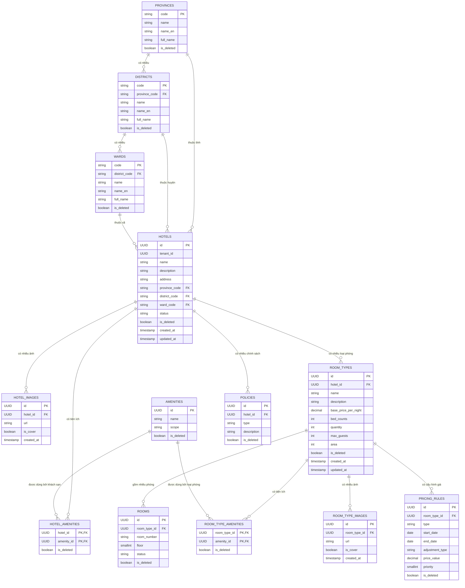
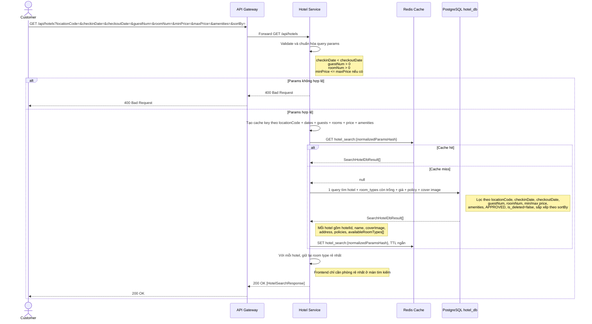
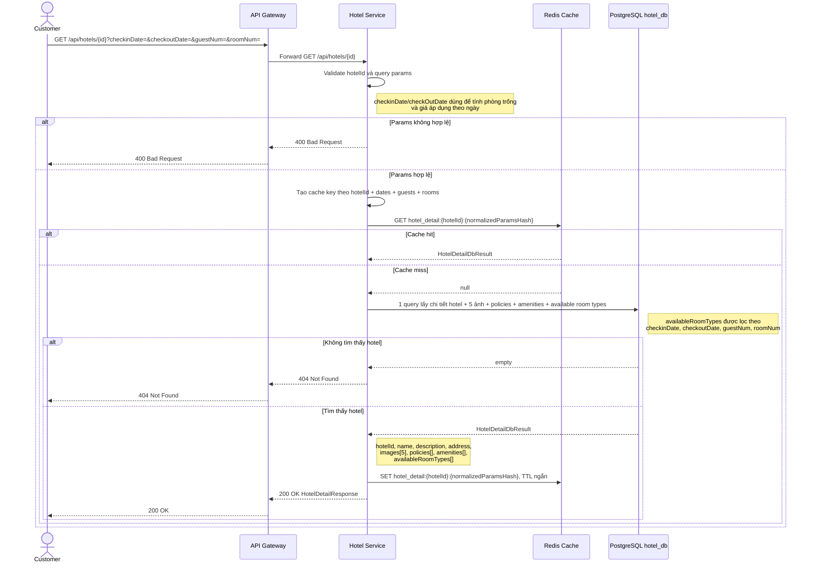
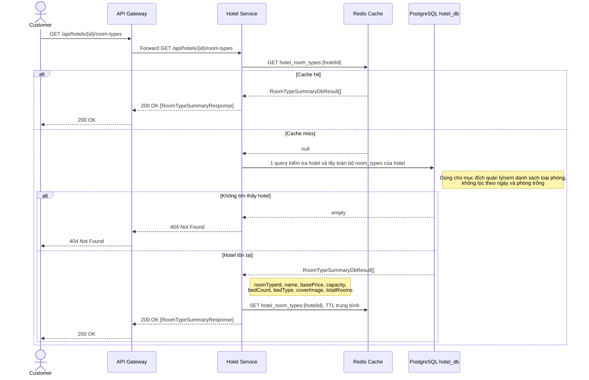
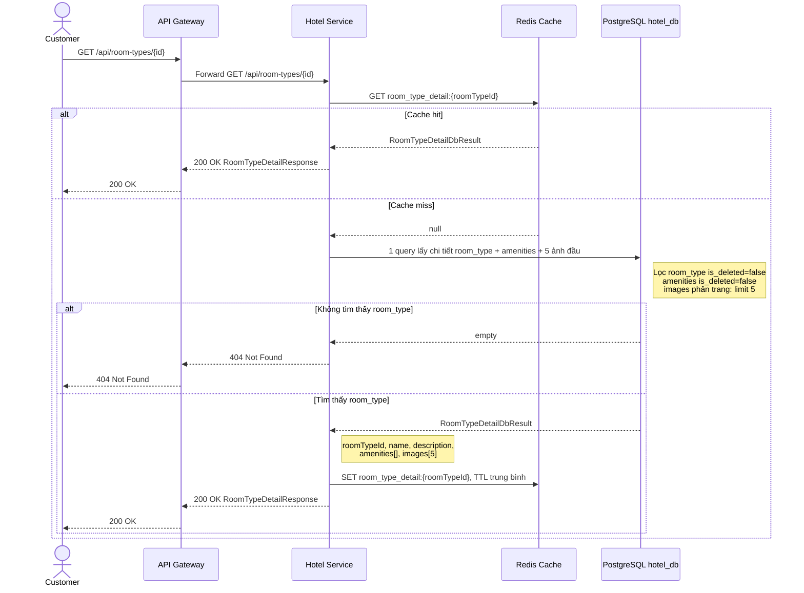
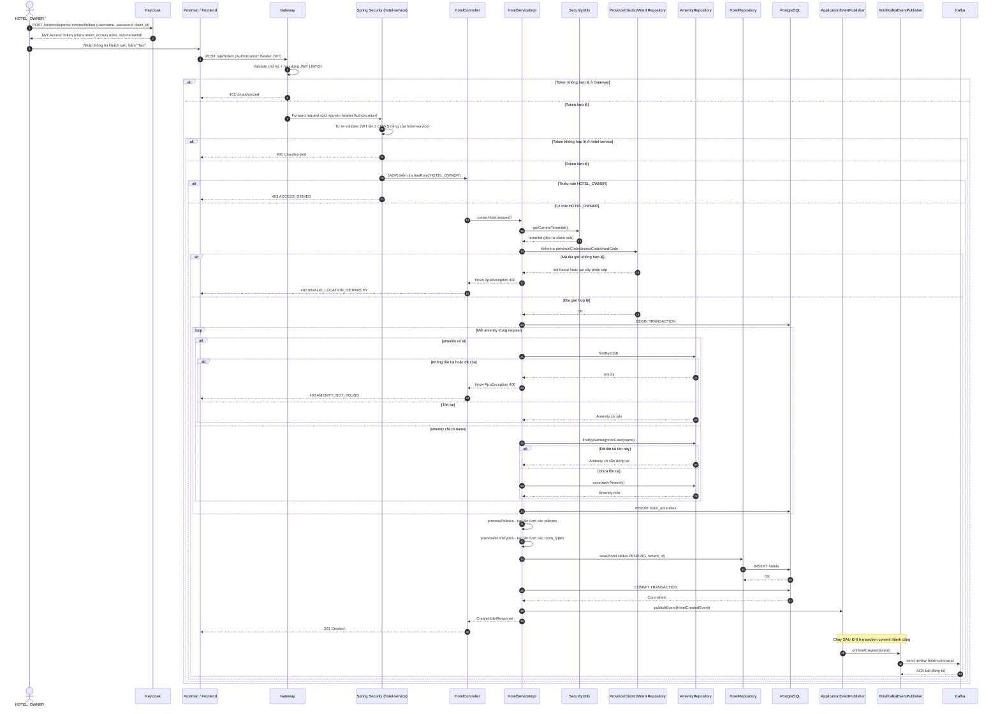
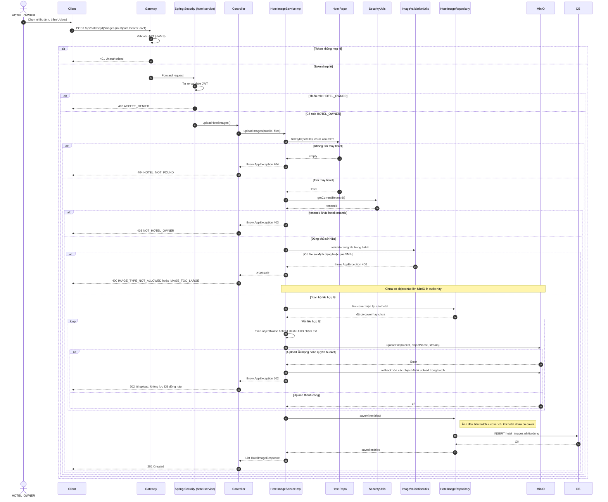
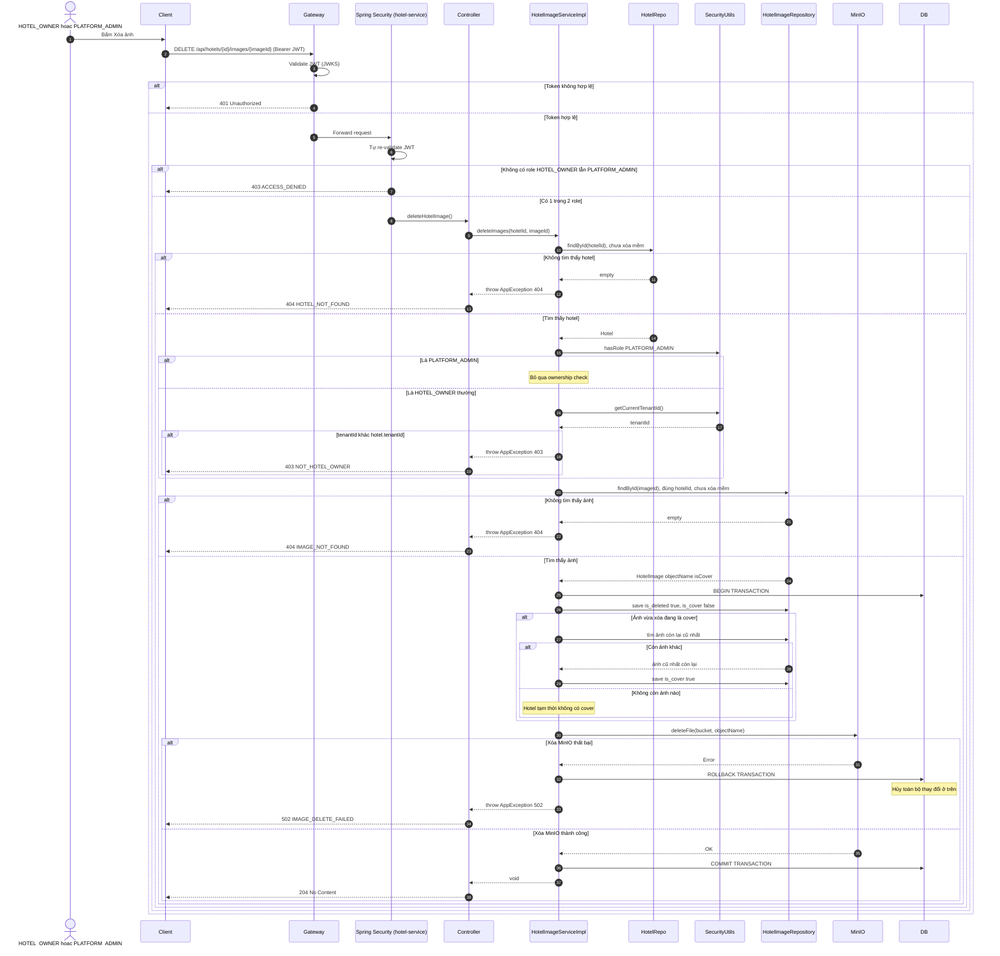

# Phân tích và thiết kế Hotel Service

## 1. Thiết kế dữ liệu (`hotel_db`)

### 1.1. Danh sách bảng và thuộc tính

**Bảng `hotels`**

| Cột | Kiểu dữ liệu | Ràng buộc | Mô tả |
| --- | --- | --- | --- |
| id | UUID | PK | Định danh khách sạn |
| tenant_id | UUID | NOT NULL | Tham chiếu logic tới `tenants.id` ở User Service, không FK vật lý xuyên service |
| name | VARCHAR(255) | NOT NULL | Tên khách sạn |
| description | TEXT | NULL | Mô tả khách sạn |
| address | VARCHAR(500) | NOT NULL | Địa chỉ chi tiết |
| province_code | VARCHAR(2) | FK → provinces.code, NOT NULL | Mã tỉnh/thành phố |
| district_code | VARCHAR(3) | FK → districts.code, NOT NULL | Mã quận/huyện |
| ward_code | VARCHAR(5) | FK → wards.code, NOT NULL | Mã xã/phường |
| status | ENUM | NOT NULL, DEFAULT 'PENDING' | PENDING, APPROVED, SUSPENDED |
| is_deleted | BOOLEAN | NOT NULL, DEFAULT false | Cờ xóa mềm |
| created_at | TIMESTAMP | NOT NULL | Thời điểm tạo |
| updated_at | TIMESTAMP | NOT NULL | Thời điểm cập nhật |

**Bảng `provinces`**

| Cột | Kiểu dữ liệu | Ràng buộc | Mô tả |
| --- | --- | --- | --- |
| code | VARCHAR(2) | PK | Mã tỉnh/thành phố |
| name | VARCHAR(100) | NOT NULL | Tên tiếng Việt |
| name_en | VARCHAR(100) | NULL | Tên tiếng Anh |
| full_name | VARCHAR(255) | NULL | Tên đầy đủ |
| is_deleted | BOOLEAN | NOT NULL, DEFAULT false | Cờ xóa mềm |

**Bảng `districts`**

| Cột | Kiểu dữ liệu | Ràng buộc | Mô tả |
| --- | --- | --- | --- |
| code | VARCHAR(3) | PK | Mã quận/huyện |
| province_code | VARCHAR(2) | FK → provinces.code, NOT NULL | Mã tỉnh/thành phố cha |
| name | VARCHAR(100) | NOT NULL | Tên tiếng Việt |
| name_en | VARCHAR(100) | NULL | Tên tiếng Anh |
| full_name | VARCHAR(255) | NULL | Tên đầy đủ |
| is_deleted | BOOLEAN | NOT NULL, DEFAULT false | Cờ xóa mềm |

**Bảng `wards`**

| Cột | Kiểu dữ liệu | Ràng buộc | Mô tả |
| --- | --- | --- | --- |
| code | VARCHAR(5) | PK | Mã xã/phường |
| district_code | VARCHAR(3) | FK → districts.code, NOT NULL | Mã quận/huyện cha |
| name | VARCHAR(100) | NOT NULL | Tên tiếng Việt |
| name_en | VARCHAR(100) | NULL | Tên tiếng Anh |
| full_name | VARCHAR(255) | NULL | Tên đầy đủ |
| is_deleted | BOOLEAN | NOT NULL, DEFAULT false | Cờ xóa mềm |

**Bảng `hotel_images`**

| Cột | Kiểu dữ liệu | Ràng buộc | Mô tả |
| --- | --- | --- | --- |
| id | UUID | PK | Định danh ảnh |
| hotel_id | UUID | FK → hotels.id, NOT NULL | Khách sạn sở hữu ảnh |
| url | VARCHAR(500) | NOT NULL | URL ảnh |
| is_cover | BOOLEAN | NOT NULL, DEFAULT false | Ảnh đại diện khách sạn |
| created_at | TIMESTAMP | NOT NULL | Thời điểm tạo |

**Bảng `amenities`**

| Cột | Kiểu dữ liệu | Ràng buộc | Mô tả |
| --- | --- | --- | --- |
| id | UUID | PK | Định danh tiện ích |
| name | VARCHAR(100) | UNIQUE, NOT NULL | Wifi, Hồ bơi, Bãi đỗ xe... |
| scope | ENUM | NOT NULL | HOTEL, ROOM_TYPE, BOTH |
| is_deleted | BOOLEAN | NOT NULL, DEFAULT false | Cờ xóa mềm |

**Bảng `hotel_amenities`**

| Cột | Kiểu dữ liệu | Ràng buộc | Mô tả |
| --- | --- | --- | --- |
| hotel_id | UUID | PK, FK → hotels.id | Khách sạn |
| amenity_id | UUID | PK, FK → amenities.id | Tiện ích |
| is_deleted | BOOLEAN | NOT NULL, DEFAULT false | Cờ xóa mềm |

**Bảng `room_types`**

| Cột | Kiểu dữ liệu | Ràng buộc | Mô tả |
| --- | --- | --- | --- |
| id | UUID | PK | Định danh loại phòng |
| hotel_id | UUID | FK → hotels.id, NOT NULL | Khách sạn sở hữu loại phòng |
| name | VARCHAR(255) | NOT NULL | Tên loại phòng |
| description | TEXT | NULL | Mô tả loại phòng |
| base_price_per_night | DECIMAL(12,2) | NOT NULL | Giá cơ bản mỗi đêm |
| max_guests  | SMALLINT | NOT NULL | Số khách tối đa |
| area | INT | NULL | Diện tích (m²) |
| bed_counts | INT | NOT NULL | Số giường |
| quantity | INT | NOT NULL | Tổng số phòng thuộc loại này |
| is_deleted | BOOLEAN | NOT NULL, DEFAULT false | Cờ xóa mềm |
| created_at | TIMESTAMP | NOT NULL | Thời điểm tạo |
| updated_at | TIMESTAMP | NOT NULL | Thời điểm cập nhật |

**Bảng `room_type_images`**

| Cột | Kiểu dữ liệu | Ràng buộc | Mô tả |
| --- | --- | --- | --- |
| id | UUID | PK | Định danh ảnh |
| room_type_id | UUID | FK → room_types.id, NOT NULL | Loại phòng sở hữu ảnh |
| url | VARCHAR(500) | NOT NULL | URL ảnh |
| is_cover | BOOLEAN | NOT NULL, DEFAULT false | Ảnh đại diện loại phòng |
| created_at | TIMESTAMP | NOT NULL | Thời điểm tạo |

**Bảng `room_type_amenities`**

| Cột | Kiểu dữ liệu | Ràng buộc | Mô tả |
| --- | --- | --- | --- |
| room_type_id | UUID | PK, FK → room_types.id | Loại phòng |
| amenity_id | UUID | PK, FK → amenities.id | Tiện ích |
| is_deleted | BOOLEAN | NOT NULL, DEFAULT false | Cờ xóa mềm |

**Bảng `rooms`**

| Cột | Kiểu dữ liệu | Ràng buộc | Mô tả |
| --- | --- | --- | --- |
| id | UUID | PK | Định danh phòng vật lý |
| room_type_id | UUID | FK → room_types.id, NOT NULL | Loại phòng |
| room_number | VARCHAR(20) | NOT NULL | Số phòng |
| floor | SMALLINT | NULL | Tầng |
| status | ENUM | NOT NULL, DEFAULT 'AVAILABLE' | AVAILABLE, OCCUPIED, CLEANING, MAINTENANCE |
| is_deleted | BOOLEAN | NOT NULL, DEFAULT false | Cờ xóa mềm |

> Nên có unique constraint: `(room_type_id, room_number)` hoặc tốt hơn là `(hotel_id, room_number)` nếu thêm `hotel_id` vào bảng `rooms`.

**Bảng `pricing_rules`**

| Cột | Kiểu dữ liệu | Ràng buộc | Mô tả |
| --- | --- | --- | --- |
| id | UUID | PK | Định danh rule giá |
| room_type_id | UUID | FK → room_types.id, NOT NULL | Loại phòng áp dụng |
| type | ENUM | NOT NULL | SEASONAL, WEEKEND, SPECIAL |
| start_date | DATE | NOT NULL | Ngày bắt đầu |
| end_date | DATE | NOT NULL | Ngày kết thúc |
| adjustment_type | ENUM | NOT NULL | FIXED_PRICE, PERCENTAGE_INCREASE, AMOUNT_INCREASE |
| price_value | DECIMAL(12,2) | NOT NULL | Giá cố định hoặc giá trị điều chỉnh |
| priority | SMALLINT | NOT NULL | SPECIAL=3, WEEKEND=2, SEASONAL=1 |
| is_deleted | BOOLEAN | NOT NULL, DEFAULT false | Cờ xóa mềm |

**Bảng `policies`**
| Cột | Kiểu dữ liệu | Ràng buộc | Mô tả |
| --- | --- | --- | --- |
| id | UUID | PK | Định danh chính sách |
| hotel_id | UUID | FK → hotels.id, NOT NULL | Khách sạn áp dụng |
| type | ENUM | NOT NULL | CANCELATION, CHECKIN, CHECKOUT, SMOKING, PAYMENT, PETS, CHILDREN |
| description | TEXT | NULL | Mô tả chính sách |
| is_deleted | BOOLEAN | NOT NULL, DEFAULT false | Cờ xóa mềm |

### 1.2. Quan hệ

- `provinces` 1–N `districts`.
- `districts` 1–N `wards`.
- `provinces` 1–N `hotels`.
- `districts` 1–N `hotels`.
- `wards` 1–N `hotels`.
- `hotels` 1–N `hotel_images`.
- `hotels` N–N `amenities` qua `hotel_amenities`.
- `hotels` 1–N `room_types`.
- `room_types` 1–N `rooms`.
- `room_types` 1–N `room_type_images`.
- `room_types` N–N `amenities` qua `room_type_amenities`.
- `room_types` 1–N `pricing_rules`.
- `hotels` 1–N `policies`.

### 1.3. ERD

## 2. Tài nguyên API - base path `/api/hotels`

| Method | Endpoint | Mô tả | Response Code |
| --- | --- | --- | --- |
| GET | `/api/hotels` | Tìm kiếm khách sạn theo địa điểm/ngày/khách/giá/tiện ích | 200 OK, 400 Bad Request, 404 Not Found |
| GET | `/api/hotels/{id}` | Xem chi tiết khách sạn | 200 OK, 404 Not Found |
| GET | `/api/hotels/{id}/room-types` | Lấy danh sách loại phòng | 200 OK, 404 Not Found |
| GET | `/api/room-types/{id}` | Xem chi tiết loại phòng | 200 OK, 404 Not Found |
| | | | | 
| POST | `/api/hotels` | Owner tạo khách sạn mới | 201 Created, 400 Bad Request, 403 Forbidden |
| PUT | `/api/hotels/{id}` | Owner sửa thông tin khách sạn | 200 OK, 403 Forbidden, 404 Not Found |
| DELETE | `/api/hotels/{id}` | Owner xóa khách sạn | 204 No Content, 403 Forbidden, 409 Conflict (còn booking hiệu lực) |
| POST | `/api/hotels/{id}/images` | Tải lên hình ảnh khách sạn | 201 Created, 400 Bad Request, 413 Payload Too Large |
| DELETE | `/api/hotels/{id}/images/{imageId}` | Xóa hình ảnh | 204 No Content, 404 Not Found |
| PATCH | `/api/hotels/{id}` | Admin duyệt/khóa/kích hoạt khách sạn | 200 OK, 403 Forbidden, 404 Not Found |
| POST | `/api/hotels/{id}/room-types` | Tạo loại phòng | 201 Created, 400 Bad Request |
| PUT | `/api/room-types/{id}` | Cập nhật loại phòng | 200 OK, 404 Not Found |
| GET | `/api/room-types/{id}/availability` | **[internal]** Kiểm tra phòng trống theo khoảng ngày | 200 OK, 404 Not Found |
| POST | `/api/room-types/{id}/reserve` | **[internal]** Giữ chỗ tạm thời (gọi từ Place Booking Service) | 200 OK, 409 Conflict (hết phòng) |
| POST | `/api/room-types/{id}/release` | **[internal]** Giải phóng phòng đã giữ (compensating transaction) | 200 OK, 404 Not Found |
| POST | `/api/rooms` | Staff thêm phòng cụ thể | 201 Created, 400 Bad Request |
| PUT | `/api/rooms/{id}` | Staff sửa thông tin phòng | 200 OK, 404 Not Found |
| PUT | `/api/rooms/{id}/status` | Staff cập nhật trạng thái phòng | 200 OK, 404 Not Found |
| DELETE | `/api/rooms/{id}` | Staff xóa phòng | 204 No Content, 409 Conflict |
| POST | `/api/room-types/{id}/pricing-rules` | Owner tạo giá Seasonal/Weekend/Special | 201 Created, 400 Bad Request |
| GET | `/api/hotels/{id}/occupancy-stats` | Số liệu công suất phòng (phục vụ Owner Dashboard) | 200 OK, 403 Forbidden |
| GET | `/api/hotels/stats` | Tổng số khách sạn toàn nền tảng (phục vụ Admin Dashboard) | 200 OK, 403 Forbidden |

## 3. Sequence diagram theo use case

### 3.1. UC-08 - Tìm kiếm khách sạn

### 3.2. UC-09 - Xem chi tiết khách sạn

### 3.3. UC-29 - Lấy danh sách loại phòng của khách sạn

### 3.4. UC-30 - Xem chi tiết loại phòng

## UC-31 — Tạo khách sạn mới (đã chỉnh sửa)

---

## UC-32 — Upload ảnh khách sạn (đã chỉnh sửa)

---

## UC-33 — Xóa ảnh khách sạn (đã chỉnh sửa)

