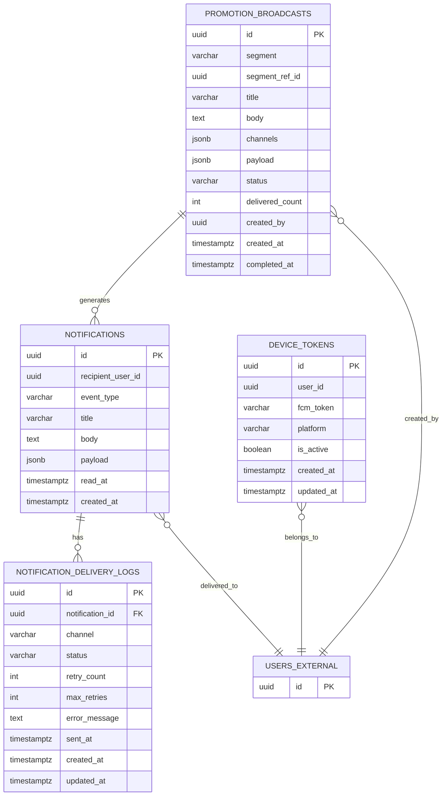
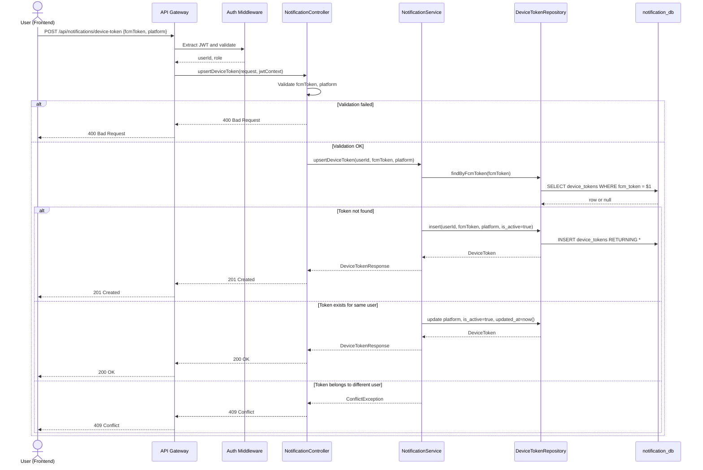
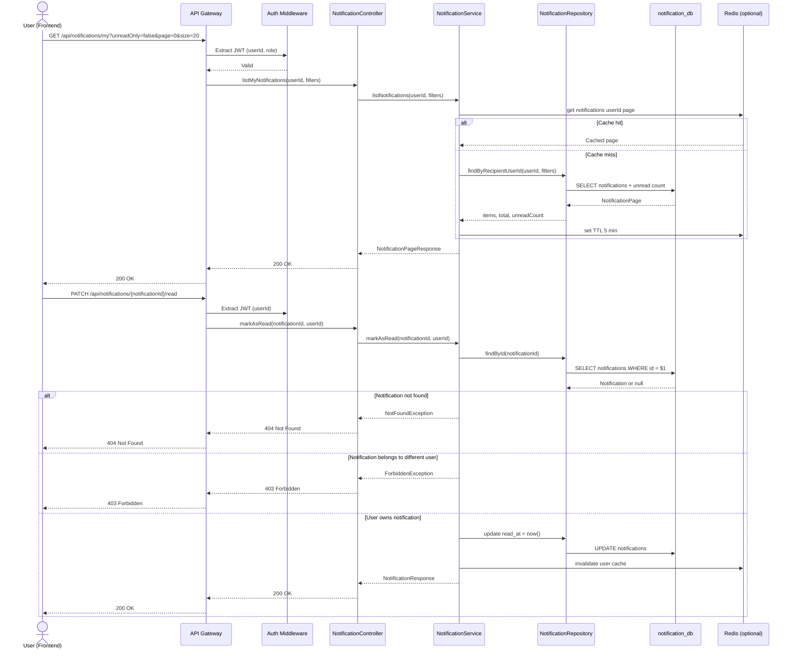
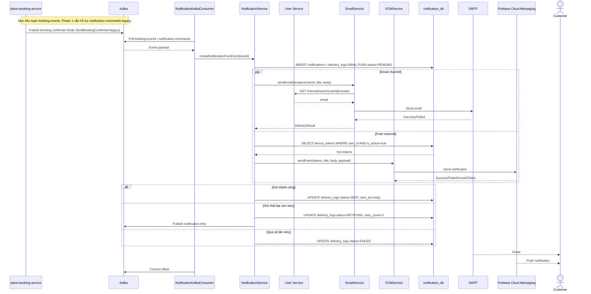
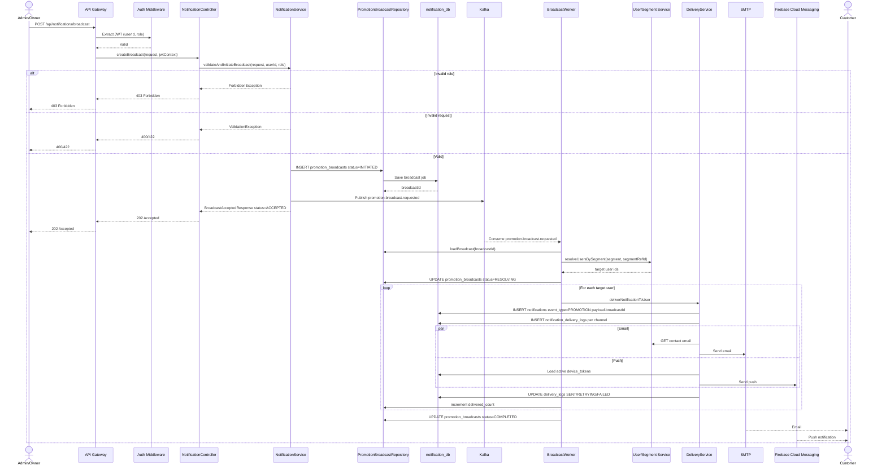

# Phân tích và thiết kế Notification Service

`notification-service` là service riêng dùng để quản lý thông báo người dùng, token thiết bị, trạng thái đã đọc, log gửi thông báo và điều phối gửi email/push notification trong hệ thống Hotel Booking SaaS.

Service này tuân theo nguyên tắc **Database per Service**:

- Sở hữu database riêng: `notification_db`.
- Không join trực tiếp sang database của `user-service`, `booking-service`, `hotel-service`, `promotion-service`.
- Chỉ lưu các định danh tham chiếu như `recipient_user_id`, `booking_id`, `hotel_id`, `promotion_id` trong `payload`.
- Nhận sự kiện nghiệp vụ qua Kafka và gửi thông báo bất đồng bộ qua SMTP/FCM.

## 1. Phạm vi trách nhiệm

`notification-service` chịu trách nhiệm:

- Lưu thông báo của người dùng vào `notifications`.
- Quản lý trạng thái đã đọc của thông báo.
- Quản lý FCM device token theo user.
- Tạo delivery log cho từng kênh gửi.
- Gửi email qua SMTP.
- Gửi push notification qua Firebase Cloud Messaging.
- Retry khi gửi thất bại và ghi nhận lỗi gửi.
- Nhận event booking/payment/check-in reminder từ Kafka để tạo thông báo tự động.
- Nhận yêu cầu broadcast khuyến mãi từ Admin/Owner và xử lý gửi bất đồng bộ.

`notification-service` không chịu trách nhiệm:

- Không xác nhận booking, hủy booking hoặc xử lý payment.
- Không quản lý promotion/coupon.
- Không quản lý phân khúc khách hàng như một domain chính; chỉ nhận `segment`/`segmentRefId` và gọi service liên quan hoặc dùng dữ liệu đồng bộ qua event để xác định người nhận.
- Không quyết định quyền sở hữu khách sạn của Owner; quyền này lấy từ JWT hoặc xác minh qua service liên quan khi cần.
- Không rollback Saga nếu gửi email/push thất bại; thông báo là side effect bất đồng bộ.

## 2. Quyền truy cập theo vai trò (RBAC)

| Endpoint | CUSTOMER | HOTEL_STAFF | HOTEL_OWNER | ADMIN | Điều kiện |
|---|---|---|---|---|---|
| `POST /api/notifications/device-token` | ✅ | ✅ | ✅ | ✅ | User được xác thực bất kỳ; token được lưu cho user của JWT |
| `GET /api/notifications/my` | ✅ | ✅ | ✅ | ✅ | User chỉ xem thông báo của chính mình |
| `PATCH /api/notifications/{id}/read` | ✅ | ✅ | ✅ | ✅ | User chỉ đánh dấu đã đọc thông báo của chính mình |
| `POST /api/notifications/broadcast` | ❌ | ❌ | ✅ | ✅ | Hotel Owner chỉ broadcast trong phạm vi hotel/tenant sở hữu; Admin broadcast toàn nền tảng |

## 3. Dòng dữ liệu và tích hợp dịch vụ

### 3.1. Event từ Kafka

Notification Service tiêu thụ các event sau:

| Topic | Event | Nguồn | Mục đích |
|---|---|---|---|
| `notification-commands` | `SendBookingConfirmed` | place-booking-service | Thông báo xác nhận đặt phòng |
| `notification-commands` | `SendBookingCancelled` | place-booking-service | Thông báo hủy đặt phòng |
| `notification-commands` | `SendBookingFailed` | place-booking-service | Thông báo thanh toán thất bại |
| `booking-events` | `checkin.reminder` | booking-service / scheduler | Nhắc check-in |
| `payment-events` | `payment.confirmed` | payment-service | Thông báo thanh toán thành công |
| `payment-events` | `payment.failed` | payment-service | Thông báo thanh toán thất bại (optional) |
| `notification-internal` | `promotion.broadcast.requested` | notification-service (sau REST broadcast) | Xử lý broadcast bất đồng bộ |
| `notification-internal` | `notification.retry` | notification-service | Retry gửi email/push |

Payload event nên gồm tối thiểu: `eventId`, `eventType`, `occurredAt`, `recipientUserId`, `title`, `body`, `payload` (JSON), `correlationId`. Consumer cần idempotent theo `eventId`.

### 3.2. Chuyển đổi từ implementation hiện tại

Hệ thống đang chạy (`docs/architecture.md`, code trong `services/notification-service/`) khác với thiết kế mục tiêu:

| | Hiện tại | Mục tiêu (tài liệu này) |
|---|---|---|
| Kafka topic | `notification-commands` | notificaition vẫn consume sự kiện qua topic này |
| Event type | `SendBookingConfirmed`, `SendBookingFailed` | vẫn giữ nguyên 2 event này, notification sẽ consume và thực hiện gửi email và push notification FCM |
| Lưu trữ | Không có DB; gửi email trực tiếp | `notification_db` + inbox + delivery log |
| REST | `POST /notifications/email` (nội bộ) | `/api/notifications/*` qua Gateway + JWT |
| Push | Chưa có | FCM qua `device_tokens` |

Hướng đi gợi ý:

1. Cài đặt `/device-token` để lưu FCM token của thiết bị người dùng sau khi người dùng đăng nhập, cấp quyền thông báo. Token này được dùng để gửi push notification.
2. Notification Service vẫn consume `notification-commands` để gửi thông báo cho khách hàng (email + push) như hiện tại, nhưng đồng thời ghi nhận vào `notifications` + `notification_delivery_logs` để lưu inbox và trạng thái gửi.
3. Cài đặt REST `/api/notifications/my` để người dùng xem inbox, `/read` để đánh dấu đã đọc.

Map event từ `notification-commands` sang `notifications`:
| Event | Mục đích | Ghi nhận vào DB |
|---|---|---|
| `SendBookingConfirmed` | Thông báo xác nhận đặt phòng | `notifications.event_type = BOOKING_CONFIRMED` |
| `SendBookingFailed` | Thông báo thanh toán thất bại | `notifications.event_type = BOOKING_FAILED` |
| `SendBookingCancelled` | Thông báo hủy đặt phòng | `notifications.event_type = BOOKING_CANCELLED` |

### 3.3. Gọi service khác

- Gọi **User Service** (via API nội bộ hoặc xác minh qua JWT) để lấy email từ user_id khi gửi email.
- Gọi **Hotel Service** (via API nội bộ) để xác minh ownership khi Owner yêu cầu broadcast.
- Gọi **Promotion Service** nếu cần validate coupon code trong payload (optional, tùy flow chi tiết).

## 4. Thiết kế dữ liệu (`notification_db`)

Database `notification_db` gồm các bảng chính sau:

| Bảng | Mục đích |
|---|---|
| `notifications` | Lưu inbox thông báo của từng user |
| `notification_delivery_logs` | Ghi nhận trạng thái gửi theo từng notification và channel |
| `device_tokens` | Lưu FCM token của thiết bị người dùng |
| `promotion_broadcasts` | Lưu yêu cầu broadcast khuyến mãi và trạng thái xử lý async |

### 4.1. Bảng `notifications`

| Cột | Kiểu dữ liệu | Ràng buộc | Ý nghĩa |
|---|---|---|---|
| `id` | `UUID` | PK | Khóa chính |
| `recipient_user_id` | `UUID` | not null, index | User nhận thông báo, tham chiếu logic tới User Service |
| `event_type` | `VARCHAR(50)` | not null, index | `BOOKING_CONFIRMED`, `BOOKING_CANCELLED`, `PROMOTION`, `CHECKIN_REMINDER`, `PAYMENT_CONFIRMED`, `PAYMENT_FAILED`, `BOOKING_FAILED` |
| `title` | `VARCHAR(255)` | not null | Tiêu đề thông báo |
| `body` | `TEXT` | not null | Nội dung thông báo |
| `payload` | `JSONB` | nullable | Dữ liệu bổ sung như `bookingId`, `hotelId`, `promotionId`, `couponCode`, `amount` |
| `read_at` | `TIMESTAMPTZ` | nullable, index | Thời điểm user đã đọc |
| `created_at` | `TIMESTAMPTZ` | not null, index | Thời điểm tạo |

Index khuyến nghị:

- `idx_notifications_recipient_created(recipient_user_id, created_at DESC)` — truy vấn inbox mới nhất cho user
- `idx_notifications_recipient_read(recipient_user_id, read_at)` — tìm thông báo chưa đọc
- `idx_notifications_event_type(event_type)` — filter theo loại sự kiện nếu cần
- `idx_notifications_created_at(created_at DESC)` — archiving hoặc cleanup script

Ràng buộc khuyến nghị:

- `CHECK(read_at IS NULL OR read_at >= created_at)` — đảm bảo thời gian logic

### 4.2. Bảng `notification_delivery_logs`

| Cột | Kiểu dữ liệu | Ràng buộc | Ý nghĩa |
|---|---|---|---|
| `id` | `UUID` | PK | Khóa chính |
| `notification_id` | `UUID` | FK -> `notifications.id`, not null, index | Thông báo được gửi |
| `channel` | `VARCHAR(20)` | not null | `EMAIL`, `PUSH` |
| `status` | `VARCHAR(30)` | not null, default `PENDING`, index | `PENDING`, `SENT`, `FAILED`, `RETRYING` |
| `retry_count` | `INT` | not null, default `0` | Số lần retry |
| `max_retries` | `INT` | not null, default `3` | Giới hạn retry tối đa |
| `error_message` | `TEXT` | nullable | Lý do lỗi nếu gửi thất bại |
| `sent_at` | `TIMESTAMPTZ` | nullable | Thời điểm gửi thành công |
| `created_at` | `TIMESTAMPTZ` | not null | Thời điểm tạo |
| `updated_at` | `TIMESTAMPTZ` | not null | Thời điểm cập nhật (dùng cho retry tracking) |

Index khuyến nghị:

- `idx_delivery_logs_notification_id(notification_id)` — join nhanh với notification
- `idx_delivery_logs_status_retry(status, retry_count)` — tìm log cần retry
- `idx_delivery_logs_channel_status(channel, status)` — filter theo kênh gửi
- `idx_delivery_logs_created_at(created_at DESC)` — audit và monitoring

Ràng buộc khuyến nghị:

- `CHECK(status IN ('PENDING', 'SENT', 'FAILED', 'RETRYING'))`
- `CHECK(retry_count <= max_retries)`
- `CHECK(sent_at IS NULL OR status = 'SENT')`

### 4.3. Bảng `device_tokens`

| Cột | Kiểu dữ liệu | Ràng buộc | Ý nghĩa |
|---|---|---|---|
| `id` | `UUID` | PK | Khóa chính |
| `user_id` | `UUID` | not null, index | User sở hữu thiết bị, tham chiếu logic tới User Service |
| `fcm_token` | `VARCHAR(500)` | unique, not null | Firebase Cloud Messaging registration token |
| `platform` | `VARCHAR(20)` | not null | `WEB`, `ANDROID`, `IOS` |
| `is_active` | `BOOLEAN` | not null, default `true`, index | Token còn hiệu lực hay không |
| `created_at` | `TIMESTAMPTZ` | not null | Thời điểm tạo |
| `updated_at` | `TIMESTAMPTZ` | not null | Thời điểm cập nhật |
| `invalidated_at` | `TIMESTAMPTZ` | nullable | Thời điểm FCM báo token invalid |

Index/ràng buộc khuyến nghị:

- `uq_device_tokens_fcm_token UNIQUE(fcm_token)` — FCM token toàn cục duy nhất
- `idx_device_tokens_user_active(user_id, is_active)` — lấy token hoạt động của user
- `idx_device_tokens_user_platform(user_id, platform)` — filter theo platform nếu cần
- `idx_device_tokens_updated_at(updated_at DESC)` — cleanup inactive token cũ

Lưu ý:

- Khi FCM báo token invalid, set `is_active = false` và `invalidated_at = now()` thay vì xóa để giữ lịch sử.
- Cleanup job định kỳ xóa soft-deleted token sau 90 ngày.

### 4.4. Bảng `promotion_broadcasts`

| Cột | Kiểu dữ liệu | Ràng buộc | Ý nghĩa |
|---|---|---|---|
| `id` | `UUID` | PK | Khóa chính; trả về client dưới tên `broadcastId` |
| `segment` | `VARCHAR(50)` | not null, index | Nhóm đối tượng: `ALL_USERS`, `RECENT_BOOKERS`, `HOTEL_PAST_GUESTS`, … |
| `segment_ref_id` | `UUID` | nullable | ID tham chiếu (hotelId hoặc custom segment) khi segment cần scope |
| `title` | `VARCHAR(255)` | not null | Tiêu đề broadcast |
| `body` | `TEXT` | not null | Nội dung broadcast |
| `channels` | `JSONB` | not null | Mảng kênh gửi, ví dụ `["EMAIL","PUSH"]` |
| `payload` | `JSONB` | nullable | Metadata như `promotionId`, `couponCode`, `hotelId` |
| `status` | `VARCHAR(30)` | not null, index | `INITIATED`, `RESOLVING`, `COMPLETED`, `FAILED` |
| `delivered_count` | `INT` | not null, default `0` | Số user đã gửi thông báo |
| `target_count` | `INT` | nullable | Tổng user trong segment sau khi resolve (optional) |
| `created_by` | `UUID` | not null, index | Admin/Owner tạo broadcast |
| `error_message` | `TEXT` | nullable | Lý do lỗi nếu `status=FAILED` |
| `created_at` | `TIMESTAMPTZ` | not null | Thời điểm nhận request |
| `resolved_at` | `TIMESTAMPTZ` | nullable | Thời điểm resolve xong danh sách user |
| `completed_at` | `TIMESTAMPTZ` | nullable | Thời điểm gửi xong toàn bộ |

Index khuyến nghị:

- `idx_promotion_broadcasts_status_created(status, created_at DESC)` — theo dõi job đang chạy
- `idx_promotion_broadcasts_created_by(created_by, created_at DESC)` — audit theo người tạo

Ràng buộc khuyến nghị:

- `CHECK(status IN ('INITIATED', 'RESOLVING', 'COMPLETED', 'FAILED'))`
- `CHECK(delivered_count >= 0)`

Lưu ý: REST trả `202 Accepted` với `status: ACCEPTED` — đây là trạng thái API. Bản ghi DB bắt đầu với `status=INITIATED`.

## 5. ERD `notification_db`

`USERS_EXTERNAL` chỉ là thực thể logic để thể hiện quan hệ tham chiếu sang User Service. Không có foreign key vật lý sang database của User Service.

## 6. Quan hệ giữa các bảng

- `notifications` 1-n `notification_delivery_logs`: một thông báo có thể có nhiều log gửi theo kênh `EMAIL` và `PUSH`.
- `promotion_broadcasts` 1-n `notifications`: một broadcast tạo nhiều bản ghi inbox (`event_type=PROMOTION`); liên kết logic qua `payload.broadcastId`, không bắt buộc FK vật lý.
- `promotion_broadcasts.created_by` tham chiếu logic tới `users.id` ở User Service.
- `device_tokens.user_id` tham chiếu logic tới `users.id` ở User Service.
- `notifications.recipient_user_id` tham chiếu logic tới `users.id` ở User Service.
- `payload` có thể chứa ID từ các service khác như `bookingId`, `hotelId`, `promotionId`, nhưng không tạo FK vật lý.

## 7. Tài nguyên API

Base path qua API Gateway: `/api/notifications`.

| Method | Endpoint | Mô tả | Quyền | Response chính |
|---|---|---|---|---|
| `POST` | `/api/notifications/device-token` | Đăng ký hoặc cập nhật FCM token thiết bị | Authenticated user | `201 Created`, `200 OK` |
| `GET` | `/api/notifications/my` | Xem danh sách thông báo của user hiện tại | Authenticated user | `200 OK` |
| `PATCH` | `/api/notifications/{notificationId}/read` | Đánh dấu một thông báo là đã đọc | Owner of notification | `200 OK` |
| `POST` | `/api/notifications/broadcast` | Tạo yêu cầu gửi thông báo khuyến mãi theo nhóm khách hàng | Admin/Owner | `202 Accepted` |

Không expose endpoint quản lý `notification_delivery_logs` vì các sequence hiện tại chỉ dùng log như dữ liệu nội bộ của worker gửi thông báo.

## 8. Sequence diagram

### 8.1. Đăng ký hoặc cập nhật FCM token

### 8.2. Xem inbox và đánh dấu đã đọc

### 8.3. UC-13 - Nhận thông báo tự động

Notification thất bại không rollback booking/payment. Worker dùng retry có giới hạn và có thể đẩy message lỗi sang DLQ theo cấu hình Kafka.

### 8.4. UC-14 - Gửi thông báo khuyến mãi

## 9. OpenAPI specification

Đặc tả API chi tiết (schema, validation, examples, security) nằm tại [docs/api-specs/notification-service.yaml](docs/api-specs/notification-service.yaml).
