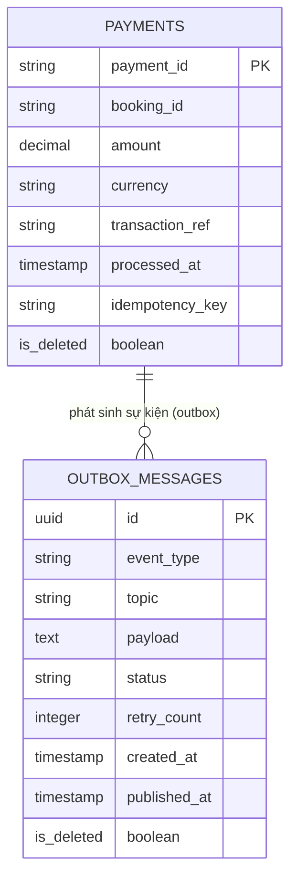

# Phân tích và thiết kế Payment Service

## 1. Thiết kế dữ liệu (`payment_db`)

### 1.1. Danh sách bảng & thuộc tính

**Bảng `payments`**

| Cột | Kiểu dữ liệu | Ràng buộc | Mô tả |
| --- | --- | --- | --- |
| payment_id | VARCHAR(255) | PK | Định danh giao dịch thanh toán |
| booking_id | VARCHAR(255) | NOT NULL | ID booking tương ứng (tham chiếu booking-service) |
| amount | DECIMAL | NOT NULL | Số tiền thanh toán |
| currency | VARCHAR(255) | NOT NULL | Đơn vị tiền tệ |
| transaction_ref | VARCHAR(255) | NULL | Mã tham chiếu giao dịch từ cổng thanh toán |
| processed_at | TIMESTAMP | NULL | Thời điểm giao dịch được xử lý |
| idempotency_key | VARCHAR(255) | UNIQUE, NULL | Khoá idempotency tránh xử lý thanh toán trùng |
| is_deleted | BOOLEAN | NOT NULL | Xóa mềm đối tượng |

**Bảng `outbox_messages`**

| Cột | Kiểu dữ liệu | Ràng buộc | Mô tả |
| --- | --- | --- | --- |
| id | UUID | PK | Định danh event |
| event_type | VARCHAR(255) | NOT NULL | Loại sự kiện (ví dụ: `PAYMENT_SUCCESS`, `PAYMENT_FAILED`) |
| topic | VARCHAR(255) | NOT NULL | Tên Kafka topic |
| payload | TEXT | NOT NULL | Nội dung event dạng JSON string |
| status | VARCHAR(255) | NOT NULL | Trạng thái publish (`PENDING`, `PUBLISHED`, `FAILED`) |
| retry_count | INTEGER | NOT NULL, DEFAULT 0 | Số lần retry publish |
| created_at | TIMESTAMP | NOT NULL | Thời điểm tạo event |
| published_at | TIMESTAMP | NULL | Thời điểm publish thành công |
| is_deleted | BOOLEAN | NOT NULL | Xóa mềm đối tượng |

> Outbox Pattern: event được INSERT cùng transaction với business data. Relay service đọc bảng này theo `status = PENDING` và publish lên Kafka, hỗ trợ retry khi publish thất bại.

---

### 1.2. Quan hệ

- `payments.booking_id` → `bookings.id` ở booking-service (tham chiếu ngoài dịch vụ, không có FK vật lý).
- `outbox_messages` không có FK trực tiếp tới `payments` — liên kết qua `payload` (chứa `payment_id`/`booking_id` bên trong JSON).

---

### 1.3. ERD

## 2. Tài nguyên API

Hiện tại payment-service chỉ có api "/api/health" để kiểm tra trạng thái hoạt động của service. Các api liên quan đến thanh toán được booking-service gọi thông qua event-driven (Kafka) và không expose trực tiếp ra ngoài.

## 3. Sequence diagram theo use case

Các usecase liên quan đến Payment Service gồm:
- UC-10: Đặt phòng
- UC-11: Huỷ đặt phòng & hoàn tiền
- UC-19: Nhân viên huỷ đặt phòng theo yêu cầu khách hàng
Các biểu đồ tuần tự được mô tả trong file [ad_booking_service.md](ad_booking_service.md) (phần UC-10, UC-11, UC-19) và [kafka-events.md](kafka-events.md) (các event liên quan đến thanh toán & hoàn tiền).
