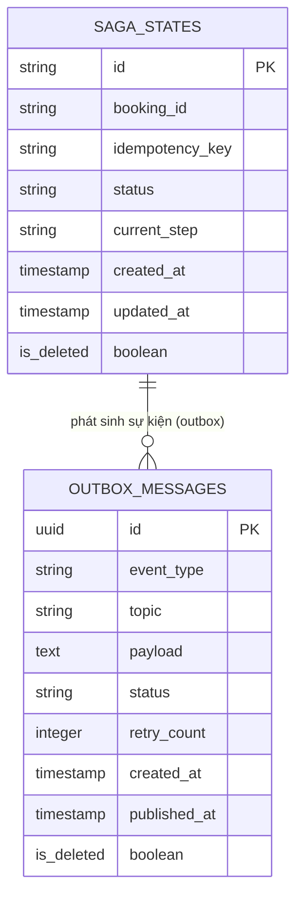

# Phân tích và thiết kế Place Booking Service

## 1. Thiết kế dữ liệu (`place_booking_db`)

### 1.1. Danh sách bảng & thuộc tính

**Bảng `saga_states`**

| Cột | Kiểu dữ liệu | Ràng buộc | Mô tả |
| --- | --- | --- | --- |
| id | VARCHAR(255) | PK | Định danh saga instance |
| booking_id | VARCHAR(255) | NOT NULL | ID booking đang được xử lý trong saga |
| idempotency_key | VARCHAR(255) | UNIQUE, NULL | Khoá idempotency tránh khởi chạy saga trùng |
| status | VARCHAR(255) | NOT NULL | Trạng thái tổng thể của saga (`STARTED`, `COMPLETED`, `COMPENSATING`, `COMPENSATED`, `FAILED`) |
| current_step | VARCHAR(255) | NOT NULL | Bước hiện tại đang thực thi trong saga |
| created_at | TIMESTAMP | NOT NULL | Thời điểm khởi tạo saga |
| updated_at | TIMESTAMP | NOT NULL | Thời điểm cập nhật gần nhất |
| is_deleted | BOOLEAN | NOT NULL | Xóa mềm đối tượng |

> Saga Pattern: mỗi bản ghi đại diện cho một luồng đặt phòng đang được điều phối qua nhiều service (booking-service, payment-service, ...). `current_step` và `status` được cập nhật theo từng sự kiện nhận về. Khi có lỗi, saga chuyển sang bước compensate để rollback các bước đã thực hiện.

**Bảng `outbox_messages`**

| Cột | Kiểu dữ liệu | Ràng buộc | Mô tả |
| --- | --- | --- | --- |
| id | UUID | PK | Định danh event |
| event_type | VARCHAR(255) | NOT NULL | Loại sự kiện (ví dụ: `BOOKING_REQUESTED`, `PAYMENT_INITIATED`) |
| topic | VARCHAR(255) | NOT NULL | Tên Kafka topic |
| payload | TEXT | NOT NULL | Nội dung event dạng JSON string |
| status | VARCHAR(255) | NOT NULL | Trạng thái publish (`PENDING`, `PUBLISHED`, `FAILED`) |
| retry_count | INTEGER | NOT NULL, DEFAULT 0 | Số lần retry publish |
| created_at | TIMESTAMP | NOT NULL | Thời điểm tạo event |
| published_at | TIMESTAMP | NULL | Thời điểm publish thành công |
| is_deleted | BOOLEAN | NOT NULL | Xóa mềm đối tượng |

> Outbox Pattern: event được INSERT cùng transaction với việc cập nhật `saga_states`. Relay service đọc theo `status = PENDING` và publish lên Kafka, đảm bảo at-least-once delivery khi điều phối saga.

---

### 1.2. Quan hệ

- `saga_states.booking_id` → `bookings.id` ở booking-service (tham chiếu ngoài dịch vụ, không có FK vật lý).
- `outbox_messages` không có FK trực tiếp tới `saga_states` — liên kết qua `payload` (chứa `booking_id`/`saga_id` bên trong JSON).

---

### 1.3. ERD

## 2. Tài nguyên API - base path `/api/place-booking`

| Method | Endpoint | Mô tả | Response Code |
| --- | --- | --- | --- |
| POST | `/api/place-booking` | Khách hàng khởi tạo Saga đặt phòng (header `Idempotency-Key`) | 202 Accepted, 400 Bad Request, 409 Conflict (trùng idempotency key đang xử lý) |
| GET | `/api/place-booking/{sagaId}/status` | Theo dõi trạng thái Saga (polling từ client) | 200 OK, 404 Not Found |
| POST | `/api/place-booking/{bookingId}/cancel` | Khởi tạo luồng hủy + hoàn tiền (saga bù trừ) | 202 Accepted, 404 Not Found, 409 Conflict |

## 3. Sequence diagram theo use case

Các usecase liên quan đến Place Booking Service gồm:
- UC-10: Đặt phòng
- UC-11: Huỷ đặt phòng & hoàn tiền
- UC-19: Nhân viên huỷ đặt phòng theo yêu cầu khách hàng
Các biểu đồ tuần tự được mô tả trong file [ad_booking_service.md](ad_booking_service.md) (phần UC-10, UC-11, UC-19) và [kafka-events.md](kafka-events.md) (các event liên quan đến thanh toán & hoàn tiền).
