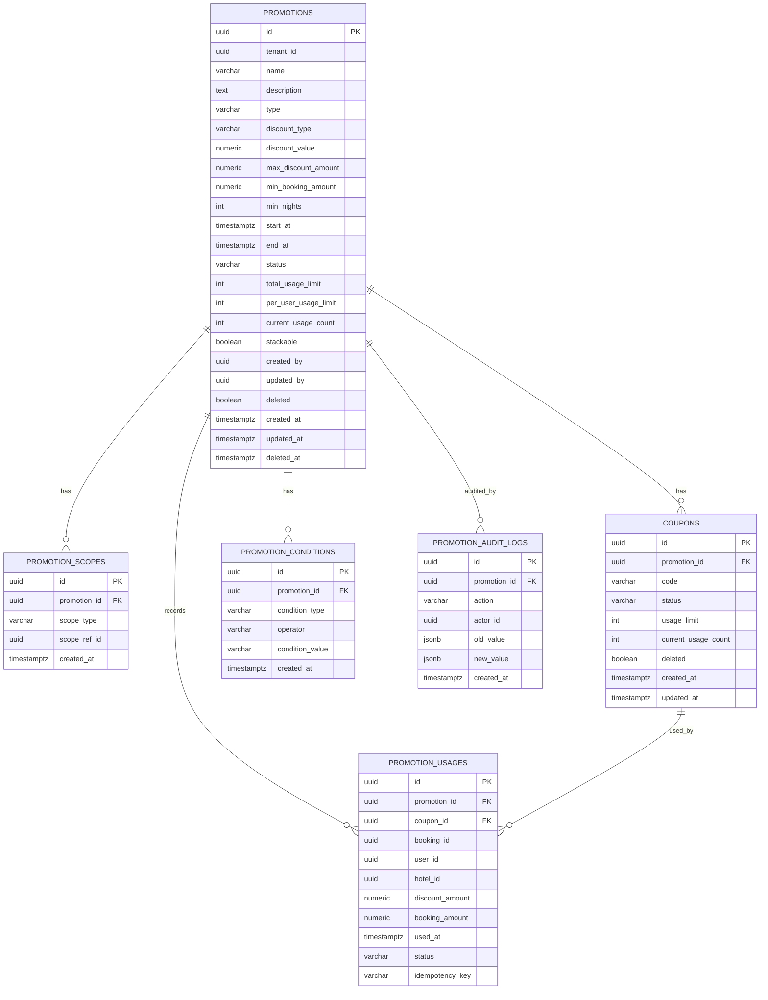
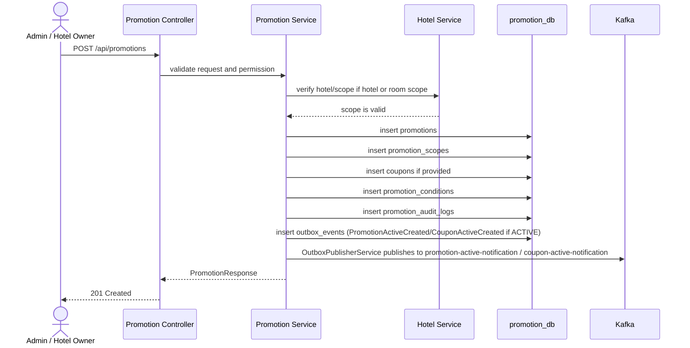
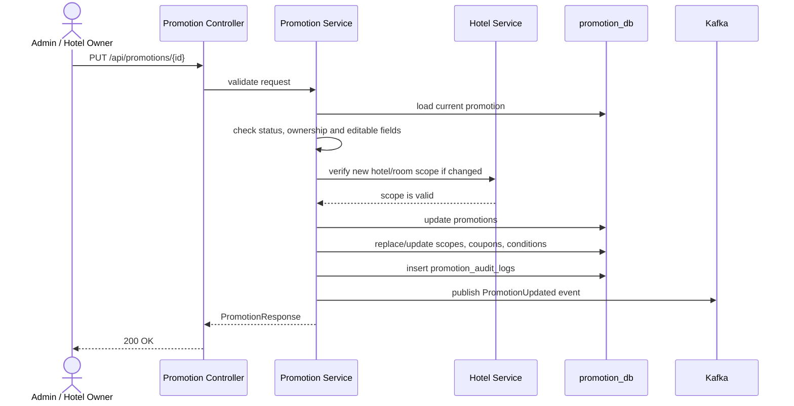
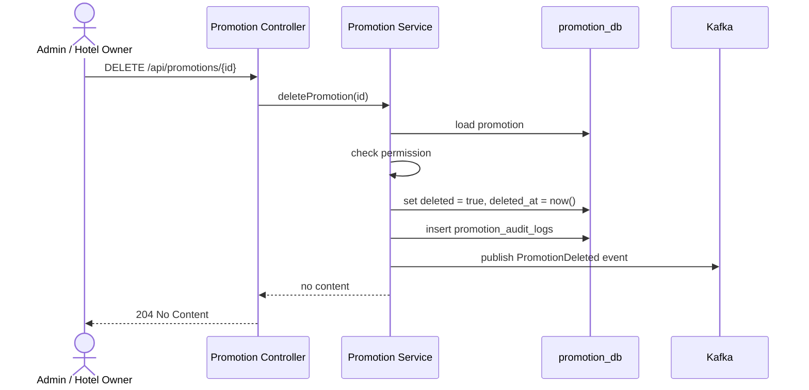
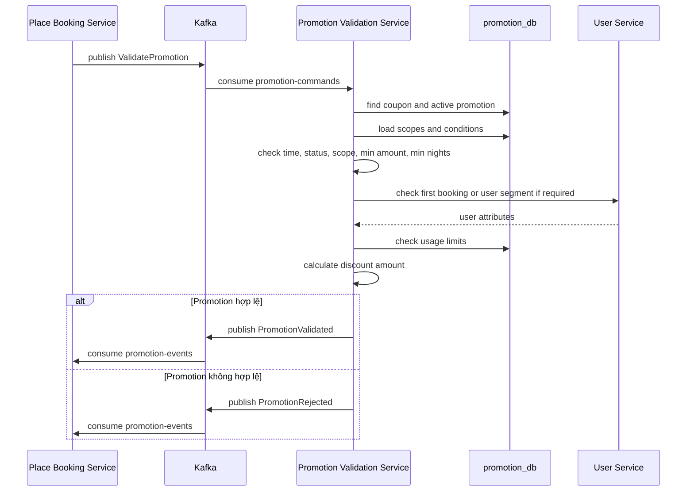
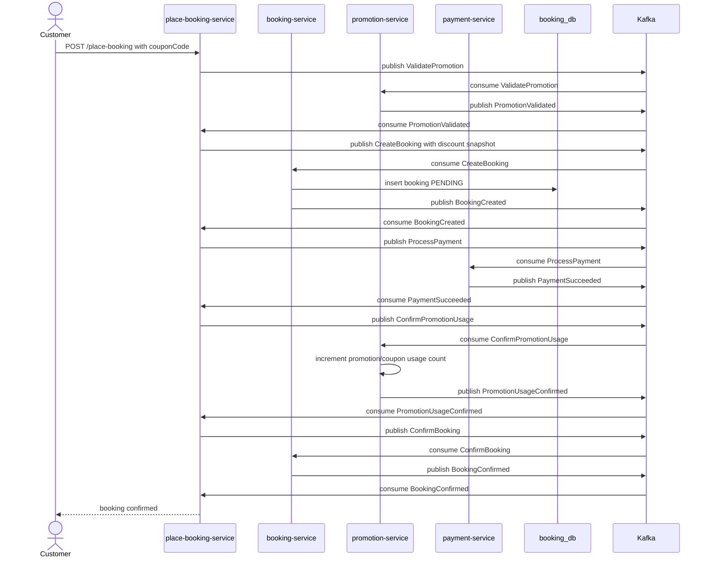

# Phân tích và thiết kế Promotion Service

`promotion-service` là service riêng dùng để quản lý promotion, coupon, điều kiện áp dụng và lịch sử sử dụng mã giảm giá trong hệ thống Hotel Booking SaaS.

Service này tuân theo nguyên tắc **Database per Service**:

- Sở hữu database riêng: `promotion_db`.
- Không join trực tiếp sang database của `hotel-service`, `booking-service`, `user-service`.
- Chỉ lưu các định danh tham chiếu như `hotel_id`, `room_type_id`, `user_id`, `booking_id`.
- Khi cần kiểm tra dữ liệu thuộc service khác, gọi API nội bộ hoặc dùng event đã đồng bộ.

## 1. Phạm vi trách nhiệm

Phân biệt khái niệm Promotion và coupon:
- Promotion: chương trình khuyến mãi cấp hệ thống/khách sạn (giảm giá theo %, theo mùa, flash sale...), không cần user nhập mã.
- Coupon: mã giảm giá cụ thể (có code), user phải nhập ở bước checkout, có thể do admin phát hành hàng loạt hoặc user tự thu thập (collect).

`promotion-service` chịu trách nhiệm:

- Tạo, cập nhật, tạm dừng, xóa mềm promotion.
- Quản lý coupon code.
- Quản lý phạm vi áp dụng promotion: toàn hệ thống, khách sạn, loại phòng, nhóm user.
- Quản lý điều kiện áp dụng promotion.
- Validate promotion khi khách đặt phòng.
- Tính số tiền giảm giá.
- Ghi nhận promotion đã được dùng sau khi booking thành công.
- Publish event cho các service khác khi promotion được tạo, cập nhật hoặc sử dụng.

`promotion-service` không chịu trách nhiệm:

- Không quản lý giá gốc của phòng.
- Không kiểm tra phòng trống.
- Không tạo booking.
- Không xử lý thanh toán.
- Không gửi email hoặc push notification trực tiếp.

## 2. Thiết kế dữ liệu (`promotion_db`)

Database `promotion_db` gồm các bảng chính sau:

| Bảng | Mục đích |
|---|---|
| `promotions` | Lưu thông tin campaign/promotion chính |
| `promotion_scopes` | Lưu phạm vi áp dụng của promotion |
| `coupons` | Lưu mã coupon gắn với promotion |
| `promotion_conditions` | Lưu điều kiện áp dụng mở rộng |
| `promotion_usages` | Ghi nhận lịch sử sử dụng promotion/coupon |
| `promotion_audit_logs` | Ghi log thay đổi promotion phục vụ audit |

### 2.1. Bảng `promotions`

| Cột | Kiểu dữ liệu | Ràng buộc | Ý nghĩa |
|---|---|---|---|
| `id` | `UUID` | PK | Khóa chính |
| `tenant_id` | `UUID` | nullable, index | Tenant hoặc chuỗi khách sạn sở hữu promotion |
| `name` | `VARCHAR(150)` | not null | Tên promotion |
| `description` | `TEXT` | nullable | Mô tả |
| `type` | `VARCHAR(50)` | not null, index | `SYSTEM`, `HOTEL`, `ROOM_TYPE` |
| `discount_type` | `VARCHAR(30)` | not null | `PERCENTAGE`, `FIXED_AMOUNT` |
| `discount_value` | `NUMERIC(12,2)` | not null | Giá trị giảm |
| `max_discount_amount` | `NUMERIC(12,2)` | nullable | Mức giảm tối đa khi giảm theo phần trăm |
| `min_booking_amount` | `NUMERIC(12,2)` | nullable | Giá trị booking tối thiểu |
| `min_nights` | `INT` | nullable | Số đêm tối thiểu |
| `start_at` | `TIMESTAMPTZ` | not null, index | Thời điểm bắt đầu hiệu lực |
| `end_at` | `TIMESTAMPTZ` | not null, index | Thời điểm kết thúc hiệu lực |
| `status` | `VARCHAR(30)` | not null, index | `DRAFT`, `ACTIVE`, `PAUSED`, `EXPIRED` |
| `total_usage_limit` | `INT` | nullable | Tổng số lượt dùng tối đa |
| `per_user_usage_limit` | `INT` | nullable | Số lượt dùng tối đa mỗi user |
| `current_usage_count` | `INT` | default `0` | Tổng số lượt đã dùng |
| `stackable` | `BOOLEAN` | default `false` | Có được cộng dồn với promotion khác không |
| `created_by` | `UUID` | nullable | User tạo promotion |
| `updated_by` | `UUID` | nullable | User cập nhật gần nhất |
| `is_deleted` | `BOOLEAN` | default `false`, index | Soft delete |
| `created_at` | `TIMESTAMPTZ` | not null | Thời điểm tạo |
| `updated_at` | `TIMESTAMPTZ` | not null | Thời điểm cập nhật |
| `deleted_at` | `TIMESTAMPTZ` | nullable | Thời điểm xóa mềm |

Index khuyến nghị:

- `idx_promotions_status_time(status, start_at, end_at)`
- `idx_promotions_tenant_id(tenant_id)`
- `idx_promotions_type(type)`
- `idx_promotions_deleted(deleted)`

### 2.2. Bảng `promotion_scopes`

| Cột | Kiểu dữ liệu | Ràng buộc | Ý nghĩa |
|---|---|---|---|
| `id` | `UUID` | PK | Khóa chính |
| `promotion_id` | `UUID` | FK -> `promotions.id`, not null | Promotion cha |
| `scope_type` | `VARCHAR(30)` | not null | `SYSTEM`, `HOTEL`, `ROOM_TYPE`, `USER_SEGMENT` |
| `scope_ref_id` | `UUID` | nullable | ID tham chiếu tới hotel, room type hoặc segment |
| `created_at` | `TIMESTAMPTZ` | not null | Thời điểm tạo |

Index khuyến nghị:

- `idx_promotion_scopes_promotion_id(promotion_id)`
- `idx_promotion_scopes_type_ref(scope_type, scope_ref_id)`

Lý do tách bảng: một promotion có thể áp dụng cho nhiều khách sạn hoặc nhiều loại phòng. Nếu đưa `hotel_id`, `room_type_id` trực tiếp vào `promotions`, schema sẽ có nhiều cột nullable và khó mở rộng.

### 2.3. Bảng `coupons`

| Cột | Kiểu dữ liệu | Ràng buộc | Ý nghĩa |
|---|---|---|---|
| `id` | `UUID` | PK | Khóa chính |
| `promotion_id` | `UUID` | FK -> `promotions.id`, not null | Promotion cha |
| `code` | `VARCHAR(50)` | unique, not null | Mã coupon, ví dụ `SUMMER2026` |
| `status` | `VARCHAR(30)` | not null, index | `ACTIVE`, `PAUSED`, `EXPIRED` |
| `usage_limit` | `INT` | nullable | Giới hạn lượt dùng của riêng coupon |
| `current_usage_count` | `INT` | default `0` | Số lượt coupon đã dùng |
| `is_deleted` | `BOOLEAN` | default `false` | Soft delete |
| `created_at` | `TIMESTAMPTZ` | not null | Thời điểm tạo |
| `updated_at` | `TIMESTAMPTZ` | not null | Thời điểm cập nhật |

Ràng buộc khuyến nghị:

- `uq_coupons_code UNIQUE(code)`
- Nếu hệ thống cho phép trùng mã giữa các tenant: `UNIQUE(tenant_id, code)` thay cho `UNIQUE(code)`.

### 2.4. Bảng `promotion_conditions`

| Cột | Kiểu dữ liệu | Ràng buộc | Ý nghĩa |
|---|---|---|---|
| `id` | `UUID` | PK | Khóa chính |
| `promotion_id` | `UUID` | FK -> `promotions.id`, not null | Promotion cha |
| `condition_type` | `VARCHAR(50)` | not null | `FIRST_BOOKING`, `EARLY_BIRD_DAYS`, `LAST_MINUTE_DAYS`, `MIN_GUESTS` |
| `operator` | `VARCHAR(20)` | not null | `EQ`, `GTE`, `LTE` |
| `condition_value` | `VARCHAR(100)` | not null | Giá trị điều kiện |
| `created_at` | `TIMESTAMPTZ` | not null | Thời điểm tạo |

Index khuyến nghị:

- `idx_promotion_conditions_promotion_type(promotion_id, condition_type)`

Lý do dùng bảng condition riêng: dễ thêm rule mới mà không cần sửa schema chính. Trade-off là logic validate phức tạp hơn so với thiết kế mỗi rule là một cột riêng.

### 2.5. Bảng `promotion_usages`

| Cột | Kiểu dữ liệu | Ràng buộc | Ý nghĩa |
|---|---|---|---|
| `id` | `UUID` | PK | Khóa chính |
| `promotion_id` | `UUID` | FK -> `promotions.id`, not null | Promotion được dùng |
| `coupon_id` | `UUID` | FK -> `coupons.id`, nullable | Coupon được dùng nếu có |
| `booking_id` | `UUID` | not null, unique theo promotion | Booking đã dùng promotion |
| `user_id` | `UUID` | not null, index | User sử dụng |
| `hotel_id` | `UUID` | not null, index | Hotel trong booking |
| `discount_amount` | `NUMERIC(12,2)` | not null | Số tiền đã giảm |
| `booking_amount` | `NUMERIC(12,2)` | not null | Giá trị booking trước giảm |
| `used_at` | `TIMESTAMPTZ` | not null | Thời điểm ghi nhận |
| `status` | `VARCHAR(30)` | not null | `RESERVED`, `CONFIRMED`, `CANCELLED` |
| `idempotency_key` | `VARCHAR(100)` | nullable, unique | Khóa chống request trùng |

Ràng buộc và index khuyến nghị:

- `uq_promotion_usages_booking_promotion UNIQUE(booking_id, promotion_id)`
- `uq_promotion_usages_idempotency_key UNIQUE(idempotency_key)`
- `idx_promotion_usages_promotion_id(promotion_id)`
- `idx_promotion_usages_user_promotion(user_id, promotion_id)`
- `idx_promotion_usages_booking_id(booking_id)`

Lý do có bảng usage: promotion ảnh hưởng trực tiếp tới tiền, cần audit lịch sử, chống dùng trùng và hỗ trợ hoàn quota nếu booking bị hủy.

### 2.6. Bảng `promotion_audit_logs`

| Cột | Kiểu dữ liệu | Ràng buộc | Ý nghĩa |
|---|---|---|---|
| `id` | `UUID` | PK | Khóa chính |
| `promotion_id` | `UUID` | FK -> `promotions.id`, not null | Promotion bị thay đổi |
| `action` | `VARCHAR(50)` | not null | `CREATED`, `UPDATED`, `PAUSED`, `DELETED` |
| `actor_id` | `UUID` | nullable | User thực hiện |
| `old_value` | `JSONB` | nullable | Dữ liệu trước khi thay đổi |
| `new_value` | `JSONB` | nullable | Dữ liệu sau khi thay đổi |
| `created_at` | `TIMESTAMPTZ` | not null | Thời điểm ghi log |

Không nên xóa mềm hoặc xóa cứng bảng audit và usage vì đây là dữ liệu phục vụ truy vết nghiệp vụ.

### 2.7 **Bảng `outbox_events`**

| Cột | Kiểu dữ liệu | Ràng buộc | Mô tả |
| --- | --- | --- | --- |
| id | UUID | PK, DEFAULT gen_random_uuid() | Định danh event |
| topic | VARCHAR(100) | NOT NULL | Tên Kafka topic |
| payload | JSONB | NOT NULL | Nội dung event |
| published | BOOLEAN | NOT NULL, DEFAULT FALSE | Đã publish lên Kafka chưa |
| created_at | TIMESTAMP | NOT NULL, DEFAULT NOW() | Thời điểm tạo event |
| published_at | TIMESTAMP | NULL | Thời điểm publish thành công |
| is_deleted | BOOLEAN | NOT NULL | Xóa mềm đối tượng |

## 3. ERD `promotion_db`

## 4. Quan hệ giữa các bảng

- `promotions` 1-n `promotion_scopes`: một promotion có thể áp dụng cho nhiều phạm vi.
- `promotions` 1-n `coupons`: một promotion có thể có nhiều mã coupon.
- `promotions` 1-n `promotion_conditions`: một promotion có thể có nhiều điều kiện áp dụng.
- `promotions` 1-n `promotion_usages`: một promotion có thể được dùng nhiều lần.
- `coupons` 1-n `promotion_usages`: một coupon có thể xuất hiện trong nhiều booking.
- `promotions` 1-n `promotion_audit_logs`: một promotion có nhiều log thay đổi.

Không có quan hệ vật lý tới bảng của `hotel-service`, `booking-service`, `user-service` vì mỗi service sở hữu database riêng.

## 5. Tài nguyên API - base path `/api/promotions`

| Method | Endpoint | Mô tả | Response Code |
| --- | --- | --- | --- |
| POST | `/api/promotions` | Admin/Owner tạo promotion mới, kèm scopes, coupons và conditions | 201 Created, 400 Bad Request, 401 Unauthorized, 403 Forbidden, 409 Conflict, 422 Unprocessable Entity |
| GET | `/api/promotions` | Admin/Owner lấy danh sách promotion (có phân trang/lọc) | 200 OK, 400 Bad Request, 401 Unauthorized, 403 Forbidden |
| GET | `/api/promotions/{promotionId}` | Xem chi tiết một promotion | 200 OK, 401 Unauthorized, 403 Forbidden, 404 Not Found |
| PUT | `/api/promotions/{promotionId}` | Cập nhật thông tin promotion, scopes, coupons hoặc conditions | 200 OK, 400 Bad Request, 401 Unauthorized, 403 Forbidden, 404 Not Found, 409 Conflict, 422 Unprocessable Entity |
| DELETE | `/api/promotions/{promotionId}` | Xóa mềm promotion | 204 No Content, 401 Unauthorized, 403 Forbidden, 404 Not Found, 409 Conflict |
| PATCH | `/api/promotions/{promotionId}/status` | Thay đổi trạng thái promotion (DRAFT, ACTIVE, PAUSED, EXPIRED) | 200 OK, 400 Bad Request, 401 Unauthorized, 403 Forbidden, 404 Not Found, 409 Conflict, 422 Unprocessable Entity |
| POST | `/api/promotions/validate` | Booking/Place Booking Service validate promotion/coupon và tính số tiền giảm | 200 OK, 400 Bad Request, 401 Unauthorized, 403 Forbidden, 404 Not Found, 409 Conflict, 422 Unprocessable Entity |
| POST | `/api/promotions/usages/confirm` | Xác nhận promotion/coupon đã được sử dụng sau khi booking/payment thành công | 200 OK, 400 Bad Request, 401 Unauthorized, 403 Forbidden, 404 Not Found, 409 Conflict, 422 Unprocessable Entity |
| POST | `/api/promotions/usages/cancel` | Hủy hoặc hoàn quota sử dụng promotion khi booking bị hủy hoặc thanh toán thất bại | 200 OK, 400 Bad Request, 401 Unauthorized, 403 Forbidden, 404 Not Found, 409 Conflict, 422 Unprocessable Entity |

## 6. Sequence diagram

### 6.1. Tạo promotion

Transaction chính nằm trong `promotion-service`, bao gồm insert promotion, scope, coupon, condition và audit log. Việc gọi `hotel-service` nên thực hiện trước transaction ghi DB để tránh giữ transaction trong lúc chờ network.

### 6.2. Cập nhật promotion

Nếu promotion đã có `promotion_usages`, không nên sửa tùy tiện các field ảnh hưởng tiền như `discount_type`, `discount_value`. Cách an toàn hơn là pause promotion cũ và tạo promotion mới.

### 6.3. Xóa promotion

Xóa promotion nên là soft delete để giữ lịch sử phục vụ đối soát booking và doanh thu.

### 6.4. Kiểm tra promotion

Validate promotion chỉ kiểm tra điều kiện và tính discount. Bước này không nên xác nhận usage cuối cùng, vì booking hoặc payment vẫn có thể thất bại.

### 6.5. Áp dụng promotion khi đặt phòng

`place-booking-service` vẫn là Saga Orchestrator cho luồng đặt phòng. `promotion-service` nhận command và trả event qua Kafka để validate, tính discount, xác nhận usage hoặc hoàn tác usage khi Saga thất bại. Contract chi tiết được mô tả tại [kafka-events.md](kafka-events.md).
