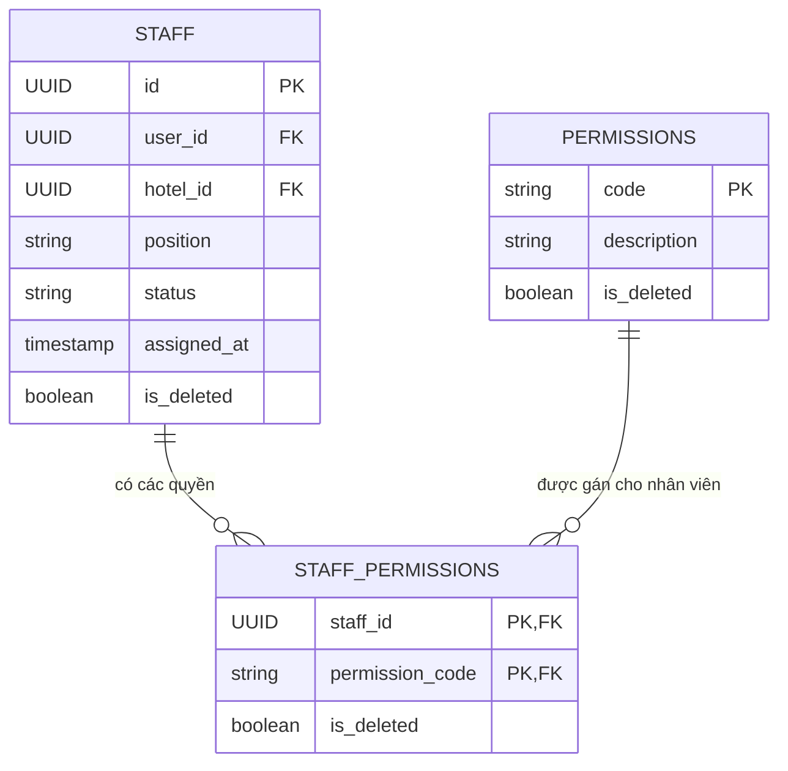
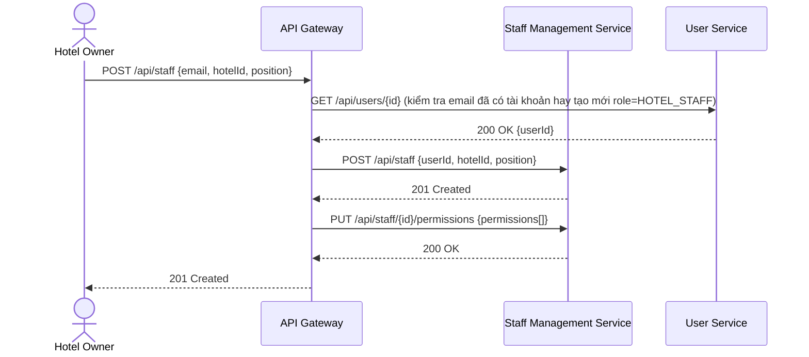

# Phân tích và thiết kế Staff Management Service

## 1. Thiết kế dữ liệu (`staff_db`)

### 1.1. Danh sách bảng và thuộc tính

**Bảng `staff`**

| Cột | Kiểu dữ liệu | Ràng buộc | Mô tả |
| --- | --- | --- | --- |
| id | UUID | PK | |
| user_id | UUID | NOT NULL | Tham chiếu logic `users.id` (role = HOTEL_STAFF) |
| hotel_id | UUID | NOT NULL | Tham chiếu logic `hotels.id` |
| position | VARCHAR(15) | NULL | RECEPTIONIST, MANAGER |
| status | ENUM | NOT NULL, DEFAULT 'ACTIVE' | ACTIVE, REMOVED |
| assigned_at | TIMESTAMP | NOT NULL | |
| is_deleted | BOOLEAN | NOT NULL, DEFAULT false | Cờ xóa mềm |

**Bảng `staff_permissions`**

| Cột | Kiểu dữ liệu | Ràng buộc | Mô tả |
| --- | --- | --- | --- |
| staff_id | UUID | PK, FK → staff.id, NOT NULL | |
| permission_code | VARCHAR(50) | PK, FK → permissions.code, NOT NULL | MANAGE_ROOM, MANAGE_BOOKING, CHECK_IN_OUT |
| is_deleted | BOOLEAN | NOT NULL, DEFAULT false | Cờ xóa mềm |

**Bảng `permissions`**
| Cột | Kiểu dữ liệu | Ràng buộc | Mô tả |
| --- | --- | --- | --- |
| code | VARCHAR(50) | PK | MANAGE_ROOM, MANAGE_BOOKING, CHECK_IN_OUT |
| description | VARCHAR(255) | NULL | Mô tả quyền |
| is_deleted | BOOLEAN | NOT NULL, DEFAULT false | Cờ xóa mềm |

### 1.2. Quan hệ

- `staff` N–N `permissions`, qua bảng trung gian `staff_permissions`.

### 1.3. ERD

## 2. Tài nguyên API - base path `/api/staff`

| Method | Endpoint | Mô tả | Response Code |
| --- | --- | --- | --- |
| POST | `/api/staff` | Owner thêm nhân viên (gán vào khách sạn) | 201 Created, 400 Bad Request, 403 Forbidden |
| PUT | `/api/staff/{id}` | Owner sửa thông tin/vị trí nhân viên | 200 OK, 404 Not Found |
| DELETE | `/api/staff/{id}` | Owner xóa nhân viên | 204 No Content, 404 Not Found |
| PUT | `/api/staff/{id}/permissions` | Owner gán quyền hạn nhân viên | 200 OK, 400 Bad Request |
| GET | `/api/staff/{id}` | Xem thông tin gán nhân viên | 200 OK, 404 Not Found |
| GET | `/api/staff/by-hotel/{hotelId}` | Danh sách nhân viên theo khách sạn | 200 OK |

## 3. Sequence diagram theo use case

### 3.1. UC-22 - Quản lý nhân viên và phân quyền

