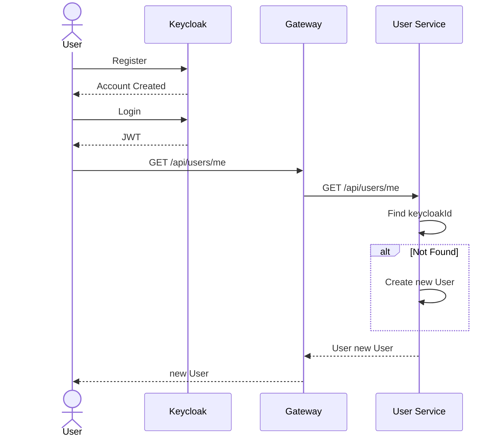
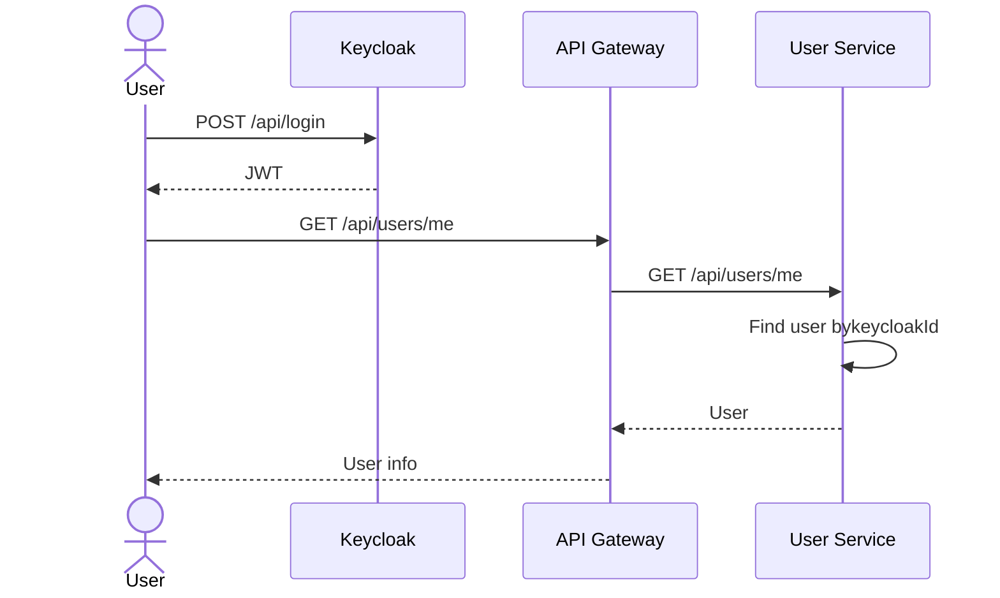
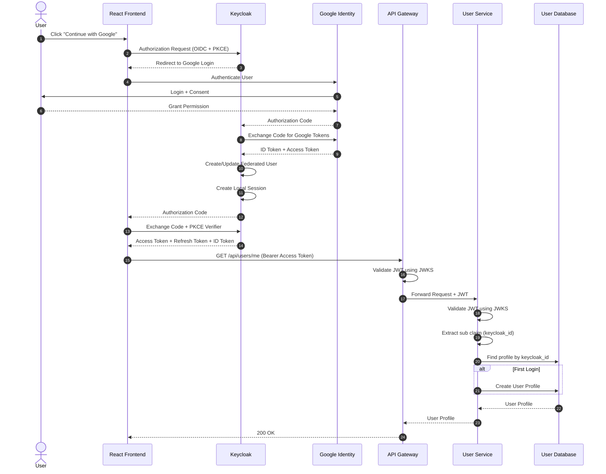
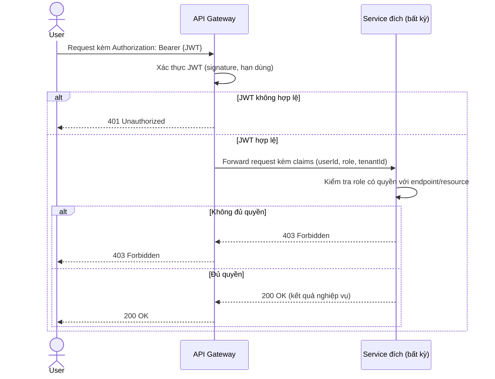
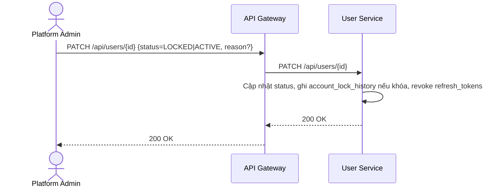

# Phân tích và thiết kế User Service

## 1. Thiết kế dữ liệu (`user_db`)

### 1.1. Danh sách bảng và thuộc tính

**Bảng `users`**

| Cột | Kiểu dữ liệu | Ràng buộc | Mô tả                              |
| --- | --- | --- |------------------------------------|
| id | UUID | PK | Định danh người dùng               |
| keycloak_id | UUID | UNIQUE, NOT NULL | Định danh người dùng trong Keycloak |
| email | VARCHAR(255) | UNIQUE, NOT NULL | Email đăng nhập                    |
| phone | VARCHAR(20) | NULL | Số điện thoại                      |
| full_name | VARCHAR(255) | NOT NULL | Họ tên                             |
| avatar_url | VARCHAR(500) | NULL | Ảnh đại diện                       |
| address | VARCHAR(500) | NULL | Địa chỉ                            |
| status | ENUM | NOT NULL, DEFAULT 'ACTIVE' | ACTIVE, LOCKED         |
| created_at | TIMESTAMP | NOT NULL |                                    |
| updated_at | TIMESTAMP | NOT NULL |                                    |
| is_deleted | BOOLEAN | NOT NULL, DEFAULT false | Cờ đánh dấu xóa mềm (soft delete)  |


**Bảng `tenants`**

| Cột | Kiểu dữ liệu | Ràng buộc | Mô tả |
| --- | --- | --- | --- |
| id | UUID | PK | Định danh tenant |
| owner_user_id | UUID | FK → users.id, NOT NULL | Chủ khách sạn sở hữu tenant |
| name | VARCHAR(255) | NOT NULL | Tên doanh nghiệp/chuỗi khách sạn |
| status | ENUM | NOT NULL, DEFAULT 'ACTIVE' | ACTIVE, SUSPENDED |
| created_at | TIMESTAMP | NOT NULL | |
| updated_at | TIMESTAMP | NOT NULL | |
| is_deleted | BOOLEAN | NOT NULL, DEFAULT false | Cờ đánh dấu xóa mềm (soft delete) |

**Bảng `subscription_plans`**

| Cột | Kiểu dữ liệu | Ràng buộc | Mô tả |
| --- | --- | --- | --- |
| id | UUID | PK | Định danh gói thuê bao |
| code | VARCHAR(50) | UNIQUE, NOT NULL | FREE, BASIC, PRO |
| name | VARCHAR(255) | NOT NULL | Tên gói thuê bao |
| description | VARCHAR(500) | NULL | Mô tả gói |
| price | DECIMAL(12,2) | NOT NULL, DEFAULT 0 | Giá gói |
| billing_cycle | ENUM | NOT NULL | MONTHLY, YEARLY |
| created_at | TIMESTAMP | NOT NULL | |
| updated_at | TIMESTAMP | NOT NULL | |
| is_deleted | BOOLEAN | NOT NULL, DEFAULT false | Cờ đánh dấu xóa mềm (soft delete) |

**Bảng `tenant_subscriptions`**

| Cột | Kiểu dữ liệu | Ràng buộc | Mô tả |
| --- | --- | --- | --- |
| id | UUID | PK | Định danh lịch sử subscription của tenant |
| tenant_id | UUID | FK → tenants.id, NOT NULL | Tenant sử dụng gói |
| subscription_plan_id | UUID | FK → subscription_plans.id, NOT NULL | Gói thuê bao |
| status | ENUM | NOT NULL, DEFAULT 'ACTIVE' | ACTIVE, EXPIRED, CANCELLED, SUSPENDED |
| started_at | TIMESTAMP | NOT NULL | Thời điểm bắt đầu dùng gói |
| expires_at | TIMESTAMP | NULL | Thời điểm hết hạn |
| created_at | TIMESTAMP | NOT NULL | |
| is_deleted | BOOLEAN | NOT NULL, DEFAULT false | Cờ đánh dấu xóa mềm (soft delete) |

> Ràng buộc nghiệp vụ: mỗi `tenant` có thể có nhiều bản ghi trong `tenant_subscriptions` theo lịch sử, nhưng tại một thời điểm chỉ được có một subscription có `status = ACTIVE`.


**Bảng `account_lock_history`**

| Cột | Kiểu dữ liệu | Ràng buộc | Mô tả |
| --- | --- | --- | --- |
| id | UUID | PK | |
| user_id | UUID | FK → users.id, NOT NULL | Tài khoản bị khóa |
| locked_by | UUID | FK → users.id, NOT NULL | Admin thực hiện |
| reason | VARCHAR(500) | NOT NULL | |
| locked_at | TIMESTAMP | NOT NULL | |
| unlocked_at | TIMESTAMP | NULL | |
| is_deleted | BOOLEAN | NOT NULL, DEFAULT false | Cờ đánh dấu xóa mềm (soft delete) |

### 1.2. Quan hệ

- `tenants.owner_user_id` → `users.id` (1–1 trong phạm vi MVP: một Owner sở hữu một tenant).
- `tenant_subscriptions.tenant_id` → `tenants.id` (N–1: một tenant có nhiều lịch sử subscription).
- `tenant_subscriptions.subscription_plan_id` → `subscription_plans.id` (N–1).
- `account_lock_history.user_id`, `account_lock_history.locked_by` → `users.id` (N–1, hai quan hệ riêng tới cùng bảng).

### 1.3. ERD

```mermaid
erDiagram
    USERS ||--o| TENANTS : "sở hữu (owner_user_id)"
    TENANTS ||--o{ TENANT_SUBSCRIPTIONS : "có lịch sử subscription"
    SUBSCRIPTION_PLANS ||--o{ TENANT_SUBSCRIPTIONS : "được đăng ký"

    USERS ||--o{ ACCOUNT_LOCK_HISTORY : "bị khóa"
    USERS ||--o{ ACCOUNT_LOCK_HISTORY : "thực hiện khóa"

    USERS {
        UUID id PK
        UUID keycloak_id UNIQUE
        string email
        string phone
        string full_name
        string avatar_url
        string address
        string status
        timestamp created_at
        timestamp updated_at
        boolean is_deleted
    }
    
    TENANTS {
        UUID id PK
        UUID owner_user_id FK
        string name
        string status
        timestamp created_at
        timestamp updated_at
        boolean is_deleted
    }

    SUBSCRIPTION_PLANS {
        UUID id PK
        string code
        string name
        string description
        decimal price
        string billing_cycle
        timestamp created_at
        timestamp updated_at
        boolean is_deleted
    }

    TENANT_SUBSCRIPTIONS {
        UUID id PK
        UUID tenant_id FK
        UUID subscription_plan_id FK
        string status
        timestamp started_at
        timestamp expires_at
        timestamp created_at
        boolean is_deleted
    }

    ACCOUNT_LOCK_HISTORY {
        UUID id PK
        UUID user_id FK
        UUID locked_by FK
        string reason
        timestamp locked_at
        timestamp unlocked_at
        boolean is_deleted
    }
```
## 2. Tài nguyên API - base path `/api/users`

| Method | Endpoint | Mô tả | Response Code |
| --- | --- | --- | --- |
| POST | `/api/users` | Đăng ký tài khoản Customer | 201 Created, 400 Bad Request, 409 Conflict (email tồn tại) |
| GET | `/api/users/me` | Lấy hồ sơ cá nhân hiện tại | 200 OK, 401 Unauthorized |
| PUT | `/api/users/me` | Cập nhật hồ sơ cá nhân | 200 OK, 400 Bad Request, 401 Unauthorized |
| GET | `/api/users/{id}` | **[internal]** Lấy thông tin người dùng theo ID | 200 OK, 404 Not Found |
| PATCH | `/api/users/{id}` | Admin khóa tài khoản | 200 OK, 403 Forbidden, 404 Not Found |
| PATCH | `/api/users/{id}` | Admin mở khóa tài khoản | 200 OK, 403 Forbidden, 404 Not Found |
| GET | `/api/users/stats` | Số liệu tổng số người dùng (phục vụ Admin Dashboard) | 200 OK, 403 Forbidden |
| GET | `/api/tenants/{id}` | Lấy thông tin tenant | 200 OK, 404 Not Found |
| PUT | `/api/tenants/{id}/subscription` | Admin cập nhật gói thuê bao | 200 OK, 400 Bad Request, 404 Not Found |
## 3. Sequence diagram theo use case

> Quy ước: `GW` = API Gateway. Mọi lời gọi từ Client đều qua GW trước khi tới service đích; để súc tích, một số sơ đồ rút gọn `Client->>GW->>Service` thành một mũi tên có ghi rõ endpoint, ngụ ý đã đi qua Gateway. Mũi tên nét đứt (`-->>`) biểu diễn message Kafka bất đồng bộ.

### 3.1. UC-01 - Đăng ký tài khoản



### 3.2. UC-02 - Đăng nhập

> Refresh token được phát hành sau khi đăng nhập thành công, ở phía client, refresh token được lưu trong cookie HttpOnly, access token được lưu trong local storage.


### 3.3. UC-03 - Đăng nhập bằng Google



### 3.6. UC-06 - Kiểm soát truy cập theo vai trò (RBAC)



### 3.7. UC-07 - Khóa/Mở khóa tài khoản


