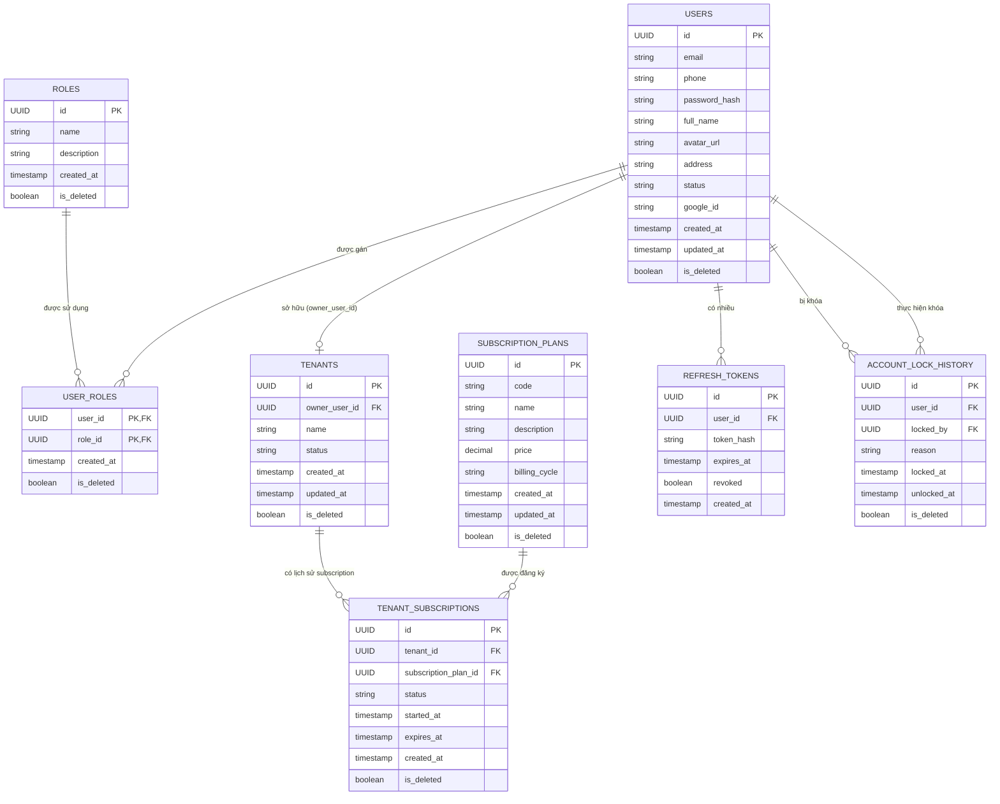
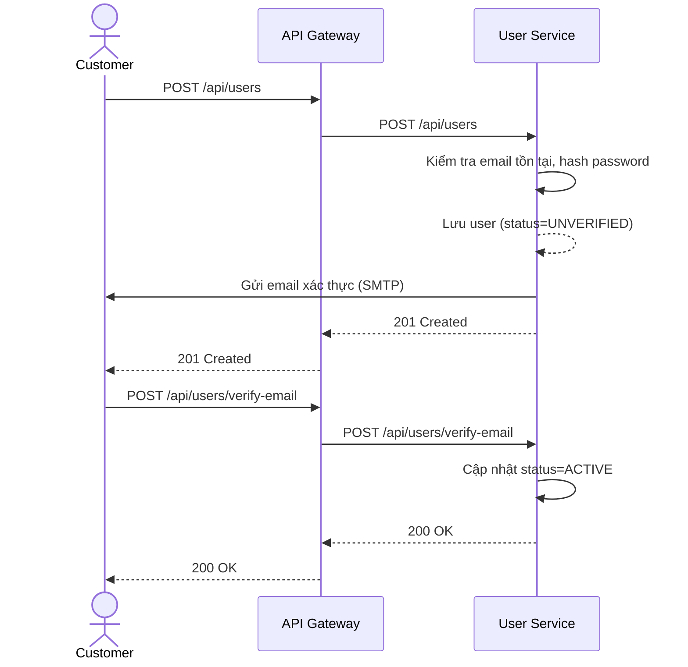
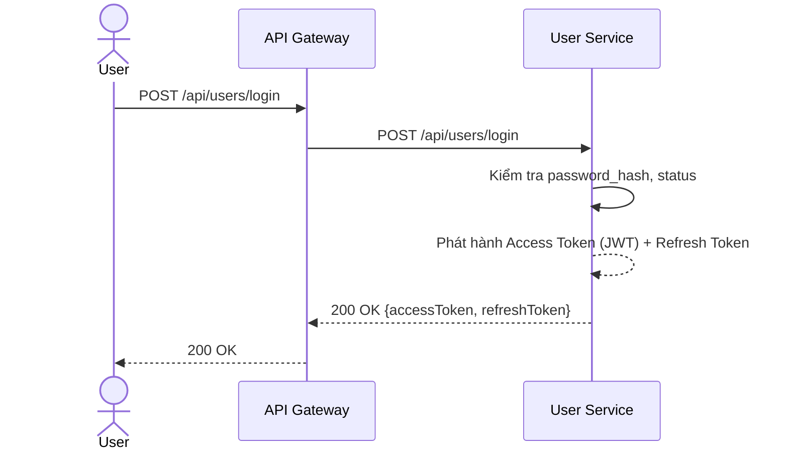
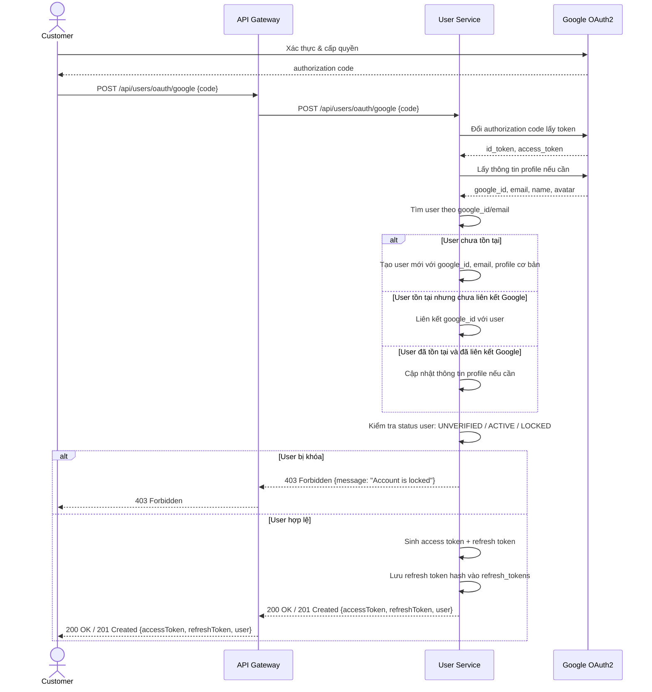
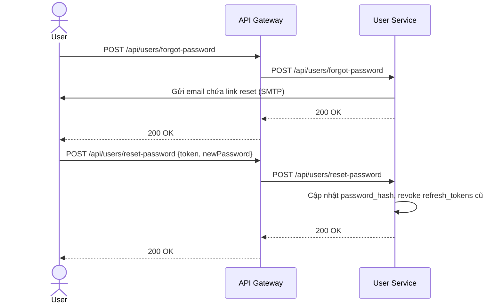
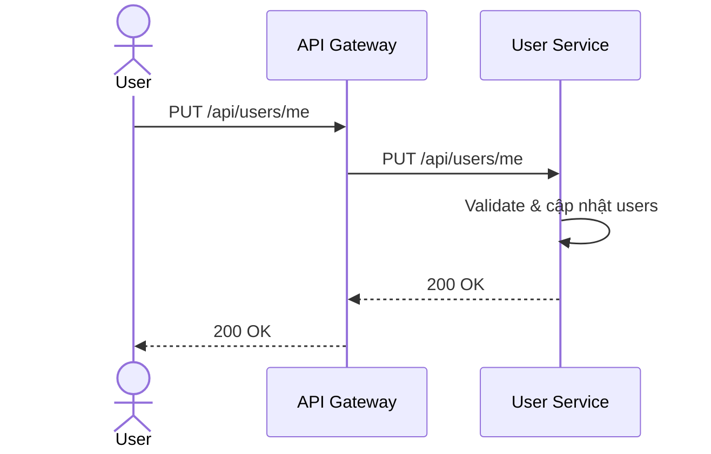
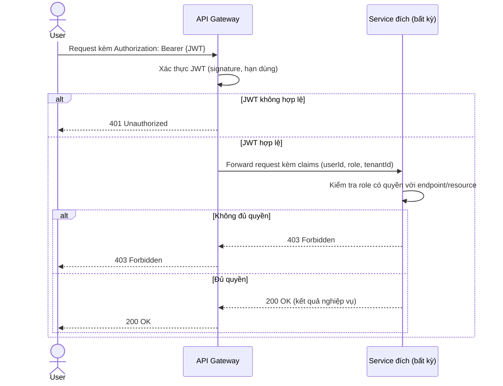
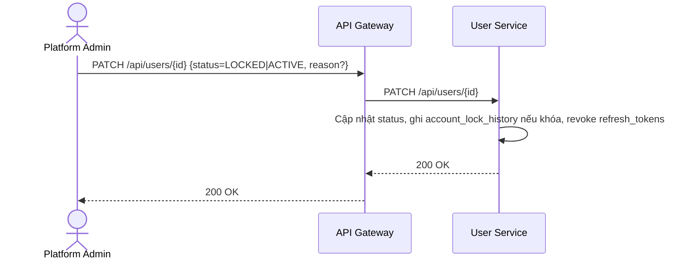

# Phân tích và thiết kế User Service

## 1. Thiết kế dữ liệu (`user_db`)

### 1.1. Danh sách bảng và thuộc tính

**Bảng `users`**

| Cột | Kiểu dữ liệu | Ràng buộc | Mô tả |
| --- | --- | --- | --- |
| id | UUID | PK | Định danh người dùng |
| email | VARCHAR(255) | UNIQUE, NOT NULL | Email đăng nhập |
| phone | VARCHAR(20) | NULL | Số điện thoại |
| password_hash | VARCHAR(255) | NULL | NULL nếu chỉ đăng nhập Google |
| full_name | VARCHAR(255) | NOT NULL | Họ tên |
| avatar_url | VARCHAR(500) | NULL | Ảnh đại diện |
| address | VARCHAR(500) | NULL | Địa chỉ |
| status | ENUM | NOT NULL, DEFAULT 'UNVERIFIED' | UNVERIFIED, ACTIVE, LOCKED |
| google_id | VARCHAR(255) | UNIQUE, NULL | Định danh OAuth2 Google |
| created_at | TIMESTAMP | NOT NULL | |
| updated_at | TIMESTAMP | NOT NULL | |
| is_deleted | BOOLEAN | NOT NULL, DEFAULT false | Cờ đánh dấu xóa mềm (soft delete) |

**Bảng `roles`**

| Cột | Kiểu dữ liệu | Ràng buộc | Mô tả |
| --- | --- | --- | --- |
| id | UUID | PK | Định danh vai trò |
| name | VARCHAR(100) | UNIQUE, NOT NULL | CUSTOMER, HOTEL_STAFF, HOTEL_OWNER, PLATFORM_ADMIN |
| description | VARCHAR(255) | NULL | Mô tả vai trò |
| created_at | TIMESTAMP | NOT NULL | |
| is_deleted | BOOLEAN | NOT NULL, DEFAULT false | Cờ đánh dấu xóa mềm (soft delete) |

**Bảng `user_roles`**

| Cột | Kiểu dữ liệu | Ràng buộc | Mô tả |
| --- | --- | --- | --- |
| user_id | UUID | PK, FK → users.id | Người dùng |
| role_id | UUID | PK, FK → roles.id | Vai trò |
| created_at | TIMESTAMP | NOT NULL | Thời điểm gán vai trò |
| is_deleted | BOOLEAN | NOT NULL, DEFAULT false | Cờ đánh dấu xóa mềm (soft delete) |
**Bảng `tenants`**

| Cột | Kiểu dữ liệu | Ràng buộc | Mô tả |
| --- | --- | --- | --- |
| id | UUID | PK | Định danh tenant |
| owner_user_id | UUID | FK → users.id, NOT NULL | Chủ khách sạn sở hữu tenant |
| name | VARCHAR(255) | NOT NULL | Tên doanh nghiệp/chuỗi khách sạn |
| status | ENUM | NOT NULL, DEFAULT 'ACTIVE' | ACTIVE, SUSPENDED |
| created_at | TIMESTAMP | NOT NULL | |
| updated_at | TIMESTAMP | NOT NULL | |
| is_deleted | BOOLEAN | NOT NULL, DEFAULT false | Cờ đánh dấu xóa mềm (soft delete) |

**Bảng `subscription_plans`**

| Cột | Kiểu dữ liệu | Ràng buộc | Mô tả |
| --- | --- | --- | --- |
| id | UUID | PK | Định danh gói thuê bao |
| code | VARCHAR(50) | UNIQUE, NOT NULL | FREE, BASIC, PRO |
| name | VARCHAR(255) | NOT NULL | Tên gói thuê bao |
| description | VARCHAR(500) | NULL | Mô tả gói |
| price | DECIMAL(12,2) | NOT NULL, DEFAULT 0 | Giá gói |
| billing_cycle | ENUM | NOT NULL | MONTHLY, YEARLY |
| created_at | TIMESTAMP | NOT NULL | |
| updated_at | TIMESTAMP | NOT NULL | |
| is_deleted | BOOLEAN | NOT NULL, DEFAULT false | Cờ đánh dấu xóa mềm (soft delete) |

**Bảng `tenant_subscriptions`**

| Cột | Kiểu dữ liệu | Ràng buộc | Mô tả |
| --- | --- | --- | --- |
| id | UUID | PK | Định danh lịch sử subscription của tenant |
| tenant_id | UUID | FK → tenants.id, NOT NULL | Tenant sử dụng gói |
| subscription_plan_id | UUID | FK → subscription_plans.id, NOT NULL | Gói thuê bao |
| status | ENUM | NOT NULL, DEFAULT 'ACTIVE' | ACTIVE, EXPIRED, CANCELLED, SUSPENDED |
| started_at | TIMESTAMP | NOT NULL | Thời điểm bắt đầu dùng gói |
| expires_at | TIMESTAMP | NULL | Thời điểm hết hạn |
| created_at | TIMESTAMP | NOT NULL | |
| is_deleted | BOOLEAN | NOT NULL, DEFAULT false | Cờ đánh dấu xóa mềm (soft delete) |

> Ràng buộc nghiệp vụ: mỗi `tenant` có thể có nhiều bản ghi trong `tenant_subscriptions` theo lịch sử, nhưng tại một thời điểm chỉ được có một subscription có `status = ACTIVE`.

**Bảng `refresh_tokens`**

| Cột | Kiểu dữ liệu | Ràng buộc | Mô tả |
| --- | --- | --- | --- |
| id | UUID | PK | |
| user_id | UUID | FK → users.id, NOT NULL | |
| token_hash | VARCHAR(255) | NOT NULL | |
| expires_at | TIMESTAMP | NOT NULL | |
| revoked | BOOLEAN | NOT NULL, DEFAULT false | |
| created_at | TIMESTAMP | NOT NULL | |

**Bảng `account_lock_history`**

| Cột | Kiểu dữ liệu | Ràng buộc | Mô tả |
| --- | --- | --- | --- |
| id | UUID | PK | |
| user_id | UUID | FK → users.id, NOT NULL | Tài khoản bị khóa |
| locked_by | UUID | FK → users.id, NOT NULL | Admin thực hiện |
| reason | VARCHAR(500) | NOT NULL | |
| locked_at | TIMESTAMP | NOT NULL | |
| unlocked_at | TIMESTAMP | NULL | |
| is_deleted | BOOLEAN | NOT NULL, DEFAULT false | Cờ đánh dấu xóa mềm (soft delete) |

### 1.2. Quan hệ

- `tenants.owner_user_id` → `users.id` (1–1 trong phạm vi MVP: một Owner sở hữu một tenant).
- `user_roles.user_id` → `users.id` (N–1).
- `user_roles.role_id` → `roles.id` (N–1).
- `user_roles.tenant_id` → `tenants.id` (N–1, NULL nếu role không gắn với tenant).
- `tenant_subscriptions.tenant_id` → `tenants.id` (N–1: một tenant có nhiều lịch sử subscription).
- `tenant_subscriptions.subscription_plan_id` → `subscription_plans.id` (N–1).
- `refresh_tokens.user_id` → `users.id` (N–1).
- `account_lock_history.user_id`, `account_lock_history.locked_by` → `users.id` (N–1, hai quan hệ riêng tới cùng bảng).

### 1.3. ERD

## 2. Tài nguyên API - base path `/api/users`

| Method | Endpoint | Mô tả | Response Code |
| --- | --- | --- | --- |
| POST | `/api/users` | Đăng ký tài khoản Customer | 201 Created, 400 Bad Request, 409 Conflict (email tồn tại) |
| POST | `/api/users/verify-email` | Xác thực email qua token | 200 OK, 400 Bad Request, 410 Gone (token hết hạn) |
| POST | `/api/users/login` | Đăng nhập email/mật khẩu | 200 OK, 401 Unauthorized, 423 Locked |
| POST | `/api/users/oauth/google` | Đăng nhập/đăng ký bằng Google OAuth2 | 200 OK, 201 Created, 401 Unauthorized |
| POST | `/api/users/refresh-token` | Làm mới Access Token | 200 OK, 401 Unauthorized |
| POST | `/api/users/forgot-password` | Yêu cầu khôi phục mật khẩu | 200 OK, 400 Bad Request |
| POST | `/api/users/reset-password` | Đặt lại mật khẩu | 200 OK, 400 Bad Request, 410 Gone |
| GET | `/api/users/me` | Lấy hồ sơ cá nhân hiện tại | 200 OK, 401 Unauthorized |
| PUT | `/api/users/me` | Cập nhật hồ sơ cá nhân | 200 OK, 400 Bad Request, 401 Unauthorized |
| GET | `/api/users/{id}` | **[internal]** Lấy thông tin người dùng theo ID | 200 OK, 404 Not Found |
| PATCH | `/api/users/{id}` | Admin khóa tài khoản | 200 OK, 403 Forbidden, 404 Not Found |
| PATCH | `/api/users/{id}` | Admin mở khóa tài khoản | 200 OK, 403 Forbidden, 404 Not Found |
| GET | `/api/users/stats` | Số liệu tổng số người dùng (phục vụ Admin Dashboard) | 200 OK, 403 Forbidden |
| GET | `/api/tenants/{id}` | Lấy thông tin tenant | 200 OK, 404 Not Found |
| PUT | `/api/tenants/{id}/subscription` | Admin cập nhật gói thuê bao | 200 OK, 400 Bad Request, 404 Not Found |
## 3. Sequence diagram theo use case

> Quy ước: `GW` = API Gateway. Mọi lời gọi từ Client đều qua GW trước khi tới service đích; để súc tích, một số sơ đồ rút gọn `Client->>GW->>Service` thành một mũi tên có ghi rõ endpoint, ngụ ý đã đi qua Gateway. Mũi tên nét đứt (`-->>`) biểu diễn message Kafka bất đồng bộ.

### 3.1. UC-01 - Đăng ký tài khoản

 

### 3.2. UC-02 - Đăng nhập

> Refresh token được phát hành sau khi đăng nhập thành công, được lưu trong `refresh_tokens` dưới dạng hash. Khi client gửi refresh token để lấy access token mới, service sẽ kiểm tra hash của token có tồn tại và chưa bị thu hồi. Ở phía client, refresh token được lưu trong cookie HttpOnly, access token được lưu trong local storage.

### 3.3. UC-03 - Đăng nhập bằng Google

### 3.4. UC-04 - Khôi phục mật khẩu

### 3.5. UC-05 - Cập nhật hồ sơ cá nhân

### 3.6. UC-06 - Kiểm soát truy cập theo vai trò (RBAC)

### 3.7. UC-07 - Khóa/Mở khóa tài khoản

