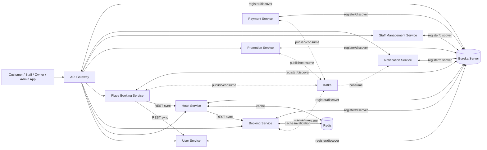

# TÀI LIỆU PHÂN TÍCH THIẾT KẾ HỆ THỐNG (SOFTWARE DESIGN DOCUMENT)

### HotelHub SaaS Platform - Hệ thống quản lý đặt phòng khách sạn đa tenant

- **Phiên bản:** 1.0
- **Ngày phát hành:** 29/06/2026
- **Tài liệu nguồn:** SRS HotelHub SaaS Platform v1.1

---

## MỤC LỤC

- [1. Phân tích nghiệp vụ và phân rã Microservices](#1-phân-tích-nghiệp-vụ-và-phân-rã-microservices)
- [2. Tài liệu phân tích và thiết kế theo service](#2-tài-liệu-phân-tích-và-thiết-kế-theo-service)

---

# 1. PHÂN TÍCH NGHIỆP VỤ VÀ PHÂN RÃ MICROSERVICES

## 1.1. Phương pháp phân rã

Việc phân rã service dựa trên nguyên tắc **Domain-Driven Design (Bounded Context)** kết hợp nhóm theo vai trò nghiệp vụ trong SRS (Customer, Hotel Staff, Hotel Owner, Platform Admin). Mỗi domain nghiệp vụ độc lập về dữ liệu và vòng đời thay đổi được tách thành một service riêng, sở hữu cơ sở dữ liệu riêng (Database-per-Service). Các domain có quan hệ chặt (ví dụ xác thực và quản lý tenant cùng xoay quanh thực thể "người dùng/tổ chức") được gộp vào một service để giảm độ phức tạp giao tiếp liên service không cần thiết.

## 1.2. Bảng phân rã nghiệp vụ -> Microservice

| **Nhóm nghiệp vụ (SRS)** | **Domain** | **Microservice phụ trách** | **Lý do gộp/tách** |
| --- | --- | --- | --- |
| FR-ACC (tài khoản, xác thực, RBAC) | Identity & Access | **User Service** | Gộp nghiệp vụ Auth (đăng nhập, OAuth2, JWT) vào User vì cùng vòng đời "người dùng"; tách riêng tạo round-trip không cần thiết giữa User và Auth cho mọi request. |
| Quản lý tenant/subscription (trước đây Tenant Service) | Tenant Management | **User Service** | Tenant gắn chặt với Hotel Owner (một user-owner sở hữu một tenant); gộp giảm một service mà không tăng coupling thực tế vì Hotel Service chỉ cần `tenant_id` tham chiếu. |
| FR-SEARCH, một phần FR-BOOK-01 (chi tiết khách sạn), FR-OWNER-01..03, 09..11, FR-ADMIN-01..03 | Hotel & Inventory Management | **Hotel Service** | Toàn bộ dữ liệu khách sạn, phòng và giá là một bounded context thống nhất, được nhiều vai trò cùng truy cập với quyền khác nhau. |
| FR-BOOK-02,03,04 (một phần), 06,11; FR-STAFF-03 | Booking Management | **Booking Service** | Quản lý vòng đời đơn đặt phòng (trạng thái, lịch sử) độc lập với việc điều phối giao dịch phân tán. |
| FR-BOOK-07 (Saga), 08 (một phần) | Distributed Transaction Orchestration | **Place Booking Service** | Cô lập logic điều phối Saga, state machine và compensating transaction khỏi domain dữ liệu booking. |
| FR-BOOK-05,08,09,10 (một phần) | Payment Processing | **Payment Service** | Domain thanh toán có yêu cầu bảo mật và Circuit Breaker riêng, tích hợp VNPay độc lập với nghiệp vụ booking. |
| FR-BOOK-04 (một phần), FR-ADMIN-04..06, FR-NOTI-04 (một phần) | Promotion & Discount | **Promotion Service** | Logic coupon/campaign thay đổi độc lập và được tái sử dụng trong luồng booking, thông báo khuyến mãi. |
| FR-NOTI-01..05 | Notification | **Notification Service** | Domain gửi thông báo đa kênh (email, FCM) độc lập, tiêu thụ event bất đồng bộ từ các service khác. |
| FR-STAFF-01,02,04..07; FR-OWNER-04 | Staff & HR Management | **Staff Management Service** | Vòng đời nhân sự khác vòng đời tài khoản đăng nhập; Owner có thể quản lý nhân sự độc lập với Identity domain. |
| FR-OWNER-05..08, FR-ADMIN-07 (Dashboard) | Reporting (không có service riêng) | **Booking/Payment/Hotel/User Service** | Mỗi service cung cấp số liệu thuộc domain của mình, tránh duplicate dữ liệu và đồng bộ lệch pha. |

## 1.3. Danh sách Microservices sau điều chỉnh

| # | Service | Cơ sở dữ liệu | Vai trò chính |
| --- | --- | --- | --- |
| 1 | API Gateway | - (stateless) | Định tuyến, rate limiting, xác thực JWT đầu vào |
| 2 | Eureka Server | - | Service Discovery |
| 3 | User Service | PostgreSQL `user_db` | Tài khoản, xác thực, OAuth2 Google, JWT, RBAC, tenant/subscription |
| 4 | Hotel Service | PostgreSQL `hotel_db` | Khách sạn, loại phòng, phòng, tiện ích, hình ảnh, giá động |
| 5 | Booking Service | PostgreSQL `booking_db` | Đơn đặt phòng, trạng thái, lịch sử |
| 6 | Place Booking Service | PostgreSQL `place_booking_db` | Saga Orchestrator cho luồng đặt phòng, thanh toán và bù trừ |
| 7 | Payment Service | PostgreSQL `payment_db` | Giao dịch thanh toán, refund, tích hợp VNPay |
| 8 | Promotion Service | PostgreSQL `promotion_db` | Coupon, campaign, kiểm tra và áp dụng khuyến mãi |
| 9 | Staff Management Service | PostgreSQL `staff_db` | Gán nhân viên vào khách sạn, phân quyền nội bộ |
| 10 | Notification Service | PostgreSQL `notification_db` | Gửi email, push notification (FCM), log thông báo |
| - | Redis | - | Cache dữ liệu tìm kiếm, phòng và session |
| - | Kafka | - | Message broker cho giao tiếp bất đồng bộ giữa các service |

## 1.4. Sơ đồ giao tiếp tổng quan giữa các service

Trong luồng Saga, Place Booking Service giao tiếp với Booking Service, Payment Service và Promotion Service qua Kafka. Các lời gọi đồng bộ chỉ được dùng khi cần phản hồi tức thời, như xác minh người dùng và kiểm tra thông tin/khả dụng của khách sạn.

---

# 2. TÀI LIỆU PHÂN TÍCH VÀ THIẾT KẾ THEO SERVICE

Thiết kế dữ liệu, API và sequence diagram chi tiết được tách thành các tài liệu độc lập:

| # | Service | Tài liệu phân tích và thiết kế |
| --- | --- | --- |
| 1 | User Service | [ad_user_service.md](ad_user_service.md) |
| 2 | Hotel Service | [ad_hotel_service.md](ad_hotel_service.md) |
| 3 | Booking Service | [ad_booking_service.md](ad_booking_service.md) |
| 4 | Place Booking Service | [ad_place_booking_service.md](ad_place_booking_service.md) |
| 5 | Payment Service | [ad_payment_service.md](ad_payment_service.md) |
| 6 | Promotion Service | [ad_promotion_service.md](ad_promotion_service.md) |
| 7 | Staff Management Service | [ad_staff_management_service.md](ad_staff_management_service.md) |
| 8 | Notification Service | [ad_notification_service1.md](ad_notification_service1.md) |

Các Kafka topic, event type và event schema dùng chung được mô tả tại [kafka-events.md](kafka-events.md).
