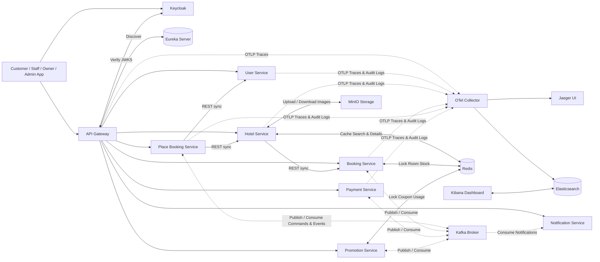

# TÀI LIỆU PHÂN TÍCH THIẾT KẾ HỆ THỐNG (SOFTWARE DESIGN DOCUMENT)

### HotelHub SaaS Platform - Hệ thống quản lý đặt phòng khách sạn đa tenant

- **Phiên bản:** 2.0
- **Ngày phát hành:** 07/08/2026
- **Tài liệu nguồn:** SRS HotelHub SaaS Platform v1.1 & Architecture Spec

---

## MỤC LỤC

- [1. Phân tích nghiệp vụ và phân rã Microservices](#1-phân-tích-nghiệp-vụ-và-phân-rã-microservices)
  - [1.1. Phương pháp phân rã](#11-phương-pháp-phân-rã)
  - [1.2. Bảng phân rã nghiệp vụ -> Microservice](#12-bảng-phân-rã-nghiệp-vụ---microservice)
  - [1.3. Danh sách Microservices sau điều chỉnh](#13-danh-sách-microservices-sau-điều-chỉnh)
  - [1.4. Sơ đồ giao tiếp tổng quan giữa các service](#14-sơ-đồ-giao-tiếp-tổng-quan-giữa-các-service)
- [2. Tài liệu phân tích và thiết kế theo service](#2-tài-liệu-phân-tích-và-thiết-kế-theo-service)

---

# 1. PHÂN TÍCH NGHIỆP VỤ VÀ PHÂN RÃ MICROSERVICES

## 1.1. Phương pháp phân rã

Việc phân rã service dựa trên nguyên tắc **Domain-Driven Design (Bounded Context)** kết hợp nhóm theo vai trò nghiệp vụ trong SRS (Customer, Hotel Staff, Hotel Owner, Platform Admin). Mỗi domain nghiệp vụ độc lập về dữ liệu và vòng đời thay đổi được tách thành một service riêng, sở hữu cơ sở dữ liệu riêng (Database-per-Service).

- **Xác thực & Ủy quyền (Authentication & Authorization)** được đảm nhiệm tập trung bởi **Keycloak** (IdP), quản lý SSO, Realm `hotel-booking-system`, OAuth2/OIDC Token và phân quyền RBAC.
- **Hồ sơ Người dùng & Tenant Subscription** do **User Service** phụ trách.
- **Vận hành & Nhân sự Khách sạn** được tích hợp vào **Hotel Service** và phân quyền RBAC trực tiếp qua Keycloak, loại bỏ `Staff Management Service` độc lập để đơn giản hóa giao tiếp và tránh phân tán dữ liệu.
- **Khuyến mãi (Promotions & Coupons)** được tách thành **Promotion Service** riêng biệt để phục vụ các chiến dịch giảm giá, tính toán ưu đãi và quản lý lượt sử dụng voucher bất đồng bộ với Redis lock.
- **Lưu trữ ảnh & file** sử dụng **MinIO Object Storage**.
- **Chống Race Condition & Cache** sử dụng **Redis Cluster/Instance** cho Hotel Service (cache khách sạn), Booking Service (giữ chỗ/stock phòng) và Promotion Service (đếm số lượt voucher).
- **Giám sát & Nhật ký vận hành (Observability)** tích hợp **OpenTelemetry Collector**, **Jaeger** (Distributed Tracing), **Elasticsearch** & **Kibana** (Audit Logging).

---

## 1.2. Bảng phân rã nghiệp vụ -> Microservice

| **Nhóm nghiệp vụ (SRS)** | **Domain** | **Microservice / Hạ tầng phụ trách** | **Lý do gộp/tách** |
| --- | --- | --- | --- |
| FR-ACC (Xác thực, SSO, Token, OAuth2 Google, RBAC) | Identity Provider & Access Control | **Keycloak + `keycloak-db`** | Quản lý SSO chuẩn OAuth2/OIDC tập trung, cấp phát Access Token/JWKS và phân quyền vai trò người dùng (Customer, Staff, Owner, Admin). |
| Quản lý hồ sơ người dùng, thông tin cá nhân, gói thuê bao Tenant | User & Tenant Profile | **User Service** (`user_db`) | Quản lý thông tin chi tiết tài khoản, quy trình đăng ký tenant và các gói dịch vụ của chủ khách sạn. |
| FR-SEARCH, Thông tin Khách sạn, loại phòng, danh mục phòng, tiện ích, hình ảnh, phân công nhân viên tại quầy | Hotel & Inventory Management | **Hotel Service** (`hotel_db`, MinIO, Redis) | Toàn bộ dữ liệu khách sạn, phòng, bảng giá và phân quyền nhân viên quầy được quản lý trong cùng một Bounded Context. Tích hợp MinIO lưu ảnh và Redis cache tìm kiếm. |
| FR-BOOK (Vòng đời đơn đặt phòng, lịch sử, trạng thái) | Booking Management | **Booking Service** (`booking_db`, Redis) | Quản lý trạng thái đơn đặt phòng. Sử dụng Redis Lock / Stock Counter để ngăn ngừa race condition khi nhiều khách đặt cùng một loại phòng. |
| FR-BOOK-SAGA (Điều phối Saga phân tán) | Distributed Transaction Orchestration | **Place Booking Service** (`place_booking_db`) | Cô lập logic điều phối Saga, state machine và các giao dịch bù trừ (compensating transactions). |
| FR-PAYMENT (Thanh toán, hoàn tiền, cổng VNPay) | Payment Processing | **Payment Service** (`payment_db`) | Quản lý giao dịch thanh toán, tích hợp cổng VNPay và cơ chế Circuit Breaker (Resilience4j) xử lý lỗi kết nối ngoài. |
| FR-PROMO (Khuyến mãi, coupon, mã giảm giá, campaign) | Promotion & Discount | **Promotion Service** (`promotion_db`, Redis) | Quản lý campaign, mã coupon, kiểm tra điều kiện áp dụng và giữ lượt dùng voucher bằng Redis distributed lock. |
| FR-NOTI (Thông báo email, FCM push) | Notification | **Notification Service** (`notification_db`) | Tiêu thụ event/command từ Kafka để gửi email xác nhận/hủy phòng và push notification tới ứng dụng di động. |
| Observability (Distributed Tracing & Audit Log) | Tracing & Audit | **OTel Collector, Jaeger, Elasticsearch, Kibana** | Thu thập vạch vết request qua OTel Java Agent, hiển thị vạch vết trên Jaeger UI; lưu vết Audit Log nghiệp vụ vào Elasticsearch và theo dõi qua Kibana Dashboard. |

---

## 1.3. Danh sách Microservices sau điều chỉnh

| # | Service / Hạ tầng | Cơ sở dữ liệu / Storage | Vai trò chính |
| --- | --- | --- | --- |
| 1 | API Gateway | - (stateless) | Point-of-entry, routing request, kiểm tra JWT Signature qua Keycloak JWKS, rate limiting |
| 2 | Eureka Server | - | Service Registry & Discovery |
| 3 | Keycloak | PostgreSQL `keycloak-db` | Identity Provider (IdP), SSO, cấp phát OAuth2/OIDC Token, Realm management |
| 4 | User Service | PostgreSQL `user_db` | Quản lý thông tin người dùng, tài khoản, tenant & subscription |
| 5 | Hotel Service | PostgreSQL `hotel_db` | Quản lý khách sạn, loại phòng, phòng, tiện ích, tích hợp MinIO & Redis cache |
| 6 | Booking Service | PostgreSQL `booking_db` | Vòng đời đơn đặt phòng, trạng thái, chống trùng phòng với Redis lock |
| 7 | Place Booking Service | PostgreSQL `place_booking_db` | Saga Orchestrator cho luồng đặt phòng, thanh toán, khuyến mãi và bù trừ |
| 8 | Payment Service | PostgreSQL `payment_db` | Giao dịch thanh toán, refund, tích hợp VNPay, Circuit Breaker |
| 9 | Promotion Service | PostgreSQL `promotion_db` | Quản lý coupon, khuyến mãi, kiểm tra và giữ lượt dùng voucher với Redis |
| 10 | Notification Service | PostgreSQL `notification_db` | Gửi email, push notification (FCM), lưu nhật ký thông báo |
| - | Redis | Memory / Persistent Volume | Cache thông tin khách sạn, chống race condition đặt phòng & giữ voucher |
| - | MinIO | Object Storage Volume | Lưu trữ tập trung ảnh khách sạn, loại phòng, avatar người dùng |
| - | Kafka & Zookeeper | Disk Log | Event Streaming Broker cho truyền nhận command & event giữa các service |
| - | OpenTelemetry Collector | Volume Shared Logs | Thu thập OTLP Traces và Audit Log files từ các service |
| - | Jaeger | In-Memory / ES | Hệ thống tra cứu Distributed Tracing UI |
| - | Elasticsearch & Kibana | ES Index Data Volume | Cơ sở dữ liệu lưu trữ Audit Log và Kibana Visualization Dashboard |

---

## 1.4. Sơ đồ giao tiếp tổng quan giữa các service

Trong luồng Saga, Place Booking Service giao tiếp với Booking Service, Payment Service và Promotion Service qua Kafka. Các lời gọi đồng bộ REST chỉ sử dụng khi cần phản hồi ngay lập tức (xác minh tài khoản, kiểm tra thông tin phòng).

---

# 2. TÀI LIỆU PHÂN TÍCH VÀ THIẾT KẾ THEO SERVICE

Chi tiết thiết kế dữ liệu (Data Schema/ERD), API Spec và Sequence Diagram cho từng service được quản lý trong các tài liệu chuyên biệt:

| # | Service / Thành phần | Tài liệu thiết kế chi tiết |
| --- | --- | --- |
| 1 | Architecture & Kafka Events | [architecture.md](architecture.md) *(Bao gồm sơ đồ tổng thể và toàn bộ Kafka Topics / Event Schemas)* |
| 2 | User Service | [ad_user_service.md](ad_user_service.md) |
| 3 | Hotel Service | [ad_hotel_service.md](ad_hotel_service.md) |
| 4 | Booking Service | [ad_booking_service.md](ad_booking_service.md) |
| 5 | Place Booking Service (Saga) | [ad_place_booking_service.md](ad_place_booking_service.md) |
| 6 | Payment Service | [ad_payment_service.md](ad_payment_service.md) |
| 7 | Promotion Service | [ad_promotion_service.md](ad_promotion_service.md) |
| 8 | Notification Service | [ad_notification_service.md](ad_notification_service.md) |
| 9 | Keycloak Integration | [keycloak_integration.md](keycloak_integration.md) |

---
