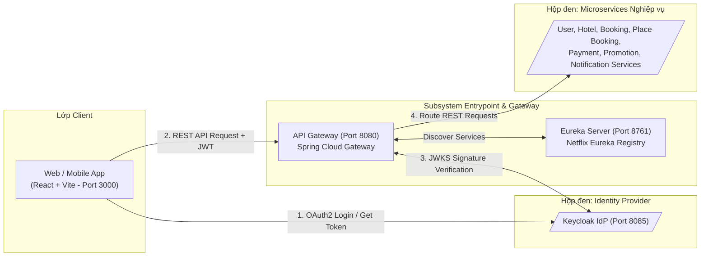
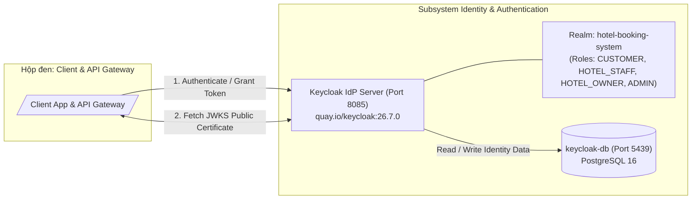
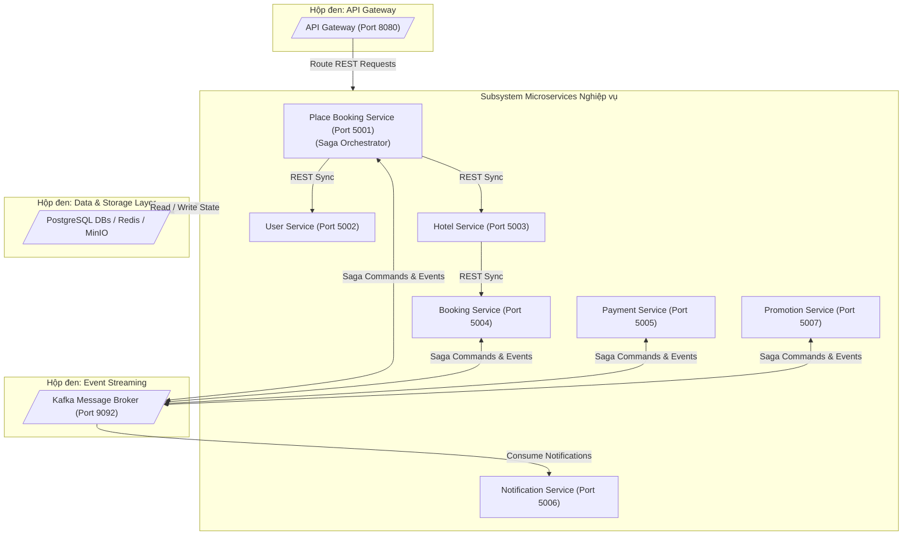
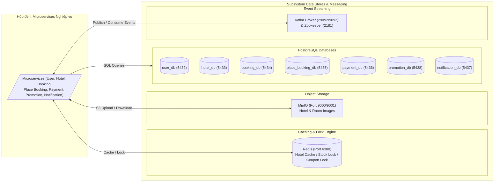

# KIẾN TRÚC HỆ THỐNG

## 1. Lựa chọn Pattern Kiến trúc

| Pattern | Được chọn? | Lý do Nghiệp vụ & Kỹ thuật |
| --- | --- | --- |
| API Gateway | Có | Cung cấp một entry point duy nhất cho client, xử lý JWT (Keycloak JWKS validation), routing, CORS và rate limiting tập trung. |
| OAuth2 / OIDC | Có | Keycloak đóng vai trò Identity Provider (IdP) quản lý SSO, cấp phát Access Token/Refresh Token và quản lý Realm/Roles. |
| Database per Service | Có | Mỗi microservice sở hữu cơ sở dữ liệu PostgreSQL riêng biệt; các service không truy cập trực tiếp DB của nhau. |
| Saga Orchestration | Có | Place Booking Service đóng vai trò Orchestrator điều phối luồng đặt phòng, thanh toán, áp dụng khuyến mãi và giao dịch bù trừ (compensating transactions). |
| Event-driven (Kafka) | Có | Tách rời các service trong quy trình xử lý bất đồng bộ, truyền nhận command và event giữa Place Booking, Booking, Payment, Promotion và Notification Service. |
| Transactional Outbox | Có | Business data và event được lưu trong cùng 1 database transaction tại từng service (Outbox table), sau đó relay worker publish lên Kafka đảm bảo tính nhất quán dữ liệu (At-least-once delivery). |
| Circuit Breaker | Có | Resilience4j bảo vệ hệ thống và Payment Service khi các cổng thanh toán bên ngoài (VNPay, Stripe) bị chậm hoặc gián đoạn. |
| Service Discovery | Có | Netflix Eureka Server quản lý đăng ký và phát hiện dịch vụ cho API Gateway và các lời gọi REST nội bộ giữa các service. |
| Distributed Cache & Lock | Có | Redis được dùng để cache thông tin tìm kiếm/khách sạn (Hotel Service), chống Race Condition cho số lượng phòng trống (Booking Service) và quản lý số lượng coupon/voucher khuyến mãi (Promotion Service) qua Redlock/distributed counter. |
| Object Storage | Có | MinIO lưu trữ dữ liệu phi cấu trúc (hình ảnh khách sạn, hình ảnh phòng, avatar người dùng). |
| Distributed Tracing | Có | OpenTelemetry Collector kết hợp Jaeger backend để theo dõi distributed trace qua header W3C Trace Context (traceparent) xuyên suốt các request. |
| Centralized Audit Logging | Có | Logback Audit Appender ghi log thao tác nghiệp vụ ra file audit log, OTel Collector thu thập và đẩy vào Elasticsearch, hiển thị trực quan qua Kibana. |

---

## 2. Các thành phần Hệ thống

### 2.1. Các thành phần Ứng dụng & Hạ tầng

| Thành phần | Vai trò / Trách nhiệm | Công nghệ | Port Nội bộ (Container) | Port Bên ngoài (Host) |
| --- | --- | --- | --- | --- |
| Frontend | Giao diện người dùng cho Customer, Staff, Owner và Admin | React + Vite | 5173 | 3000 |
| API Gateway | Entrypoint, routing, JWT Keycloak verification, rate limiting, OTel tracing | Spring Cloud Gateway | 8000 | 8080 |
| Eureka Server | Service registry và discovery | Spring Cloud Netflix Eureka | 8761 | 8761 |
| Keycloak | Identity Provider (IdP), quản lý SSO, cấp phát OAuth2/OIDC token, Realm `hotel-booking-system` | Keycloak 26.7.0 | 8080 | 8085 |
| User Service | Hồ sơ người dùng, quản lý vai trò, đăng ký, thông tin tenant và gói thuê bao | Spring Boot 3 + OTel Agent | 5000 | 5002 |
| Hotel Service | Khách sạn, loại phòng, danh mục phòng, tiện ích, tích hợp MinIO & Redis cache | Spring Boot 3 + OTel Agent | 5000 | 5003 |
| Booking Service | Quản lý vòng đời đơn đặt phòng, lịch sử, chống trùng phòng với Redis | Spring Boot 3 + OTel Agent | 5000 | 5004 (Debug: 5010) |
| Place Booking Service | Saga Orchestrator điều phối luồng đặt phòng, thanh toán, khuyến mãi và bù trừ | Spring Boot 3 + OTel Agent | 5000 | 5001 (Debug: 5011) |
| Payment Service | Xử lý thanh toán, hoàn tiền, tích hợp VNPay và Circuit Breaker | Spring Boot 3 + OTel Agent | 5000 | 5005 |
| Promotion Service | Quản lý mã giảm giá (coupon), chương trình khuyến mãi, kiểm tra & giữ lượt dùng với Redis | Spring Boot 3 | 5000 | 5007 |
| Notification Service | Gửi email thông báo, FCM push notification và lưu lịch sử thông báo | Spring Boot 3 | 5000 | 5006 (Debug: 5013) |
| Kafka Broker | Message broker cho luồng command/event bất đồng bộ | Apache Kafka + Zookeeper | 29092 | 9092 |
| Zookeeper | Quản lý cluster và metadata cho Kafka | Apache Zookeeper | 2181 | 2181 |
| Redis | Dynamic cache dữ liệu khách sạn, distributed lock và chống race condition | Redis 7.2 Alpine | 6379 | 6380 |
| MinIO | Object Storage lưu trữ ảnh khách sạn, loại phòng, avatar người dùng | MinIO | 9000 (API), 9001 (Console) | 9000, 9001 |
| OTel Collector | Agent thu thập traces qua gRPC/HTTP và thu thập Audit Logs từ shared volume | OpenTelemetry Collector Contrib | 4317 (gRPC), 4318 (HTTP) | 4317, 4318, 8888 |
| Jaeger | Backend lưu trữ và giao diện tra cứu Distributed Tracing | Jaeger 2.20 | 16686 | 16686 |
| Elasticsearch | Cơ sở dữ liệu lưu trữ Audit Logs và Tracing data | Elasticsearch 8.13 | 9200 | 9200 |
| Kibana | Dashboard trực quan hóa Audit Logs và theo dõi nhật ký vận hành | Kibana 8.13 | 5601 | 5601 |

### 2.2. Các Cơ sở Dữ liệu & Lưu trữ (Data Stores)

| Data Store | Service sở hữu | Công nghệ | Port Nội bộ | Port Bên ngoài |
| --- | --- | --- | --- | --- |
| `keycloak-db` | Keycloak | PostgreSQL 16 | 5432 | 5439 |
| `user-db` (`user_db`) | User Service | PostgreSQL 16 | 5432 | 5432 |
| `hotel-db` (`hotel_db`) | Hotel Service | PostgreSQL 16 | 5432 | 5433 |
| `booking-db` (`booking_db`) | Booking Service | PostgreSQL 16 | 5432 | 5434 |
| `place-booking-db` (`place_booking_db`) | Place Booking Service | PostgreSQL 16 | 5432 | 5435 |
| `payment-db` (`payment_db`) | Payment Service | PostgreSQL 16 | 5432 | 5436 |
| `promotion-db` (`promotion_db`) | Promotion Service | PostgreSQL 16 | 5432 | 5438 |
| `notification-db` (`notification_db`) | Notification Service | PostgreSQL 16 | 5432 | 5437 |
| `redis-data` | Redis (Hạ tầng dùng chung) | Redis In-Memory + Persistence | 6379 | 6380 |
| `minio-data` | MinIO (Object Storage dùng chung) | MinIO Local Storage | 9000 | 9000 |
| `elasticsearch_data` | Elasticsearch (Log Index dùng chung) | Lucene Engine | 9200 | 9200 |

---

## 3. Giao tiếp & Tích hợp

### 3.1. Phương thức Giao tiếp

| Phương thức | Từ | Đến | Mục đích |
| --- | --- | --- | --- |
| REST sync | Client (Browser/App) | Keycloak | Đăng nhập, cấp OAuth2 Access Token / Refresh Token. |
| REST sync | Client (Browser/App) | API Gateway | Mọi request gọi API nghiệp vụ (kèm Bearer JWT Token). |
| REST sync | API Gateway | Microservices | Định tuyến request tới các service tương ứng sau khi kiểm tra Token qua Keycloak JWKS. |
| REST sync | Place Booking Service | User Service | Xác minh thông tin khách hàng trước khi bắt đầu Saga. |
| REST sync | Place Booking Service | Hotel Service | Kiểm tra thông tin khách sạn, giá phòng và phòng trống ban đầu. |
| REST sync | Hotel Service | Booking Service | Truy vấn số lượng phòng đang được giữ/đặt active để tính availability thực tế. |
| REST sync | Hotel Service | MinIO | Upload/Download hình ảnh khách sạn, phòng. |
| Kafka async | Place Booking Service | Booking Service | Gửi command khởi tạo/xác nhận/hủy phòng và nhận event kết quả. |
| Kafka async | Place Booking Service | Payment Service | Gửi command thanh toán/hoàn tiền và nhận event kết quả. |
| Kafka async | Place Booking Service | Promotion Service | Gửi command kiểm tra/áp dụng/giải phóng mã giảm giá. |
| Kafka async | Place Booking Service | Notification Service | Gửi command gửi email/push notification mà không chặn Saga thread. |
| OTLP gRPC | Microservices (Java Agent) | OTel Collector | Gửi dữ liệu Traces (Spans) theo chuẩn OpenTelemetry (port 4317). |
| File + Pipeline | Microservices -> Shared Volume | OTel Collector -> ES | Microservices xuất file `/var/log/audit/*.log`, OTel Collector đọc log file và đẩy vào Elasticsearch. |

---

### 3.2. Danh sách Kafka Topic & Event Schema

#### 3.2.1. Tổng quan các Kafka Topic

| Topic | Publisher | Consumer | Event Types |
| --- | --- | --- | --- |
| `booking-commands` | place-booking-service | booking-service | `CreateBooking`, `ConfirmBooking`, `CancelBooking` |
| `booking-events` | booking-service | place-booking-service | `BookingCreated`, `BookingConfirmed`, `BookingCancelled`, `BookingFailed` |
| `payment-commands` | place-booking-service | payment-service | `ProcessPayment`, `RefundPayment` |
| `payment-events` | payment-service | place-booking-service | `PaymentSucceeded`, `PaymentFailed`, `PaymentRefunded`, `RefundFailed` |
| `promotion-commands` | place-booking-service | promotion-service | `ValidatePromotion`, `ConfirmPromotionUsage`, `ReleasePromotionUsage` |
| `promotion-events` | promotion-service | place-booking-service | `PromotionValidated`, `PromotionRejected`, `PromotionUsageConfirmed`, `PromotionUsageFailed` |
| `promotion-active-notification` | promotion-service | notification-service | `PromotionActiveCreated`, `PromotionActiveUpdated` |
| `coupon-active-notification` | promotion-service | notification-service | `CouponActiveCreated`, `CouponActiveUpdated` |
| `notification-commands` | place-booking-service | notification-service | `SendBookingConfirmed`, `SendBookingFailed`, `SendBookingCancelled`, `SendRefundFailed` |

---

#### 3.2.2. Các Đối tượng Dữ liệu Dùng chung

`User`
| Thuộc tính | Kiểu dữ liệu | Mô tả |
| --- | --- | --- |
| `userId` | `String` | ID của người dùng. |
| `name` | `String` | Tên hiển thị của người dùng. |
| `email` | `String` | Email nhận thông báo/liên hệ. |

`Hotel`
| Thuộc tính | Kiểu dữ liệu | Mô tả |
| --- | --- | --- |
| `hotelId` | `String` | ID khách sạn. |
| `name` | `String` | Tên khách sạn. |
| `address` | `String` | Địa chỉ khách sạn. |

`RoomType`
| Thuộc tính | Kiểu dữ liệu | Mô tả |
| --- | --- | --- |
| `roomTypeId` | `String` | ID loại phòng được đặt. |
| `name` | `String` | Tên loại phòng. |
| `bedCount` | `int` | Số giường của loại phòng. |
| `bookingQuantity` | `int` | Số lượng phòng khách đặt. |
| `totalQuantity` | `int` | Tổng số phòng của loại phòng. |
| `price` | `Double/BigDecimal` | Giá phòng dùng để tính tổng tiền. |

`BookingInfo`
| Thuộc tính | Kiểu dữ liệu | Mô tả |
| --- | --- | --- |
| `bookingId` | `String` | ID booking. |
| `customer` | `User` | Thông tin khách hàng đặt phòng. |
| `checkin` | `String` | Ngày nhận phòng (YYYY-MM-DD). |
| `checkout` | `String` | Ngày trả phòng (YYYY-MM-DD). |
| `numAdults` | `int` | Số người lớn. |
| `totalAmount` | `Double/BigDecimal` | Tổng số tiền booking. |
| `hotel` | `Hotel` | Thông tin khách sạn. |
| `roomTypeList` | `List<RoomType>` | Danh sách loại phòng và số lượng đặt. |

---

#### 3.2.3. Chi tiết Event Schema

**1. `booking-commands`**

| Event Type | Thuộc tính | Kiểu dữ liệu | Mô tả |
| --- | --- | --- | --- |
| `CreateBooking` | `sagaId` | `String` | ID của saga đặt phòng. |
|  | `eventType` | `String` | `CreateBooking`. |
|  | `user` | `User` | Khách hàng đặt phòng. |
|  | `hotel` | `Hotel` | Khách sạn được đặt. |
|  | `bookingId` | `String` | ID booking do orchestrator sinh ra. |
|  | `roomTypeList` | `List<RoomType>` | Danh sách loại phòng cần giữ chỗ. |
|  | `checkin` | `String` | Ngày nhận phòng. |
|  | `checkout` | `String` | Ngày trả phòng. |
|  | `numAdults` | `int` | Số lượng khách người lớn. |
|  | `totalAmount` | `BigDecimal` | Tổng tiền cần thanh toán. |
|  | `currency` | `String` | Mã tiền tệ (`VND`). |
|  | `paymentMethod` | `String` | Phương thức thanh toán. |
|  | `paymentToken` | `String` | Token/tham chiếu thanh toán từ client. |
| `ConfirmBooking` | `sagaId` | `String` | ID của saga đặt phòng. |
|  | `eventType` | `String` | `ConfirmBooking`. |
|  | `bookingId` | `String` | Booking ID chuyển sang `CONFIRMED`. |
| `CancelBooking` | `sagaId` | `String` | ID của saga đặt phòng. |
|  | `eventType` | `String` | `CancelBooking`. |
|  | `bookingId` | `String` | Booking ID cần hủy. |
|  | `reason` | `String` | Lý do hủy đơn đặt phòng. |

**2. `booking-events`**

| Event Type | Thuộc tính | Kiểu dữ liệu | Mô tả |
| --- | --- | --- | --- |
| `BookingCreated` | `sagaId` | `String` | ID của saga đặt phòng. |
|  | `eventType` | `String` | `BookingCreated`. |
|  | `bookingId` | `String` | Booking đã được khởi tạo ở trạng thái `PENDING`. |
|  | `userId` | `String` | ID khách hàng. |
|  | `totalAmount` | `BigDecimal` | Tổng tiền booking. |
|  | `currency` | `String` | Mã tiền tệ. |
|  | `paymentMethod` | `String` | Phương thức thanh toán. |
|  | `paymentToken` | `String` | Token thanh toán. |
| `BookingConfirmed` | `sagaId` | `String` | ID của saga đặt phòng. |
|  | `eventType` | `String` | `BookingConfirmed`. |
|  | `booking` | `BookingInfo` | Chi tiết đơn đặt phòng đã xác nhận thành công. |
| `BookingCancelled` | `sagaId` | `String` | ID của saga đặt phòng. |
|  | `eventType` | `String` | `BookingCancelled`. |
|  | `booking` | `BookingInfo` | Chi tiết booking đã hủy. |
|  | `reason` | `String` | Lý do hủy. |
| `BookingFailed` | `sagaId` | `String` | ID của saga đặt phòng. |
|  | `eventType` | `String` | `BookingFailed`. |
|  | `booking` | `BookingInfo` | Chi tiết đơn đặt phòng bị thất bại. |
|  | `reason` | `String` | Lý do giữ phòng thất bại (hết phòng, lỗi logic). |

**3. `payment-commands`**

| Event Type | Thuộc tính | Kiểu dữ liệu | Mô tả |
| --- | --- | --- | --- |
| `ProcessPayment` | `eventType` | `String` | `ProcessPayment`. |
|  | `sagaId` | `String` | ID của saga đặt phòng. |
|  | `bookingId` | `String` | ID đơn đặt phòng cần thanh toán. |
|  | `amount` | `Double` | Số tiền thu thanh toán. |
|  | `currency` | `String` | Mã tiền tệ. |
|  | `paymentMethod` | `String` | Phương thức thanh toán. |
|  | `paymentToken` | `String` | Token/mã giao dịch thanh toán. |
|  | `idempotencyKey` | `String` | Khóa chống xử lý trùng thanh toán. |
|  | `userId` | `String` | ID khách hàng thanh toán. |
| `RefundPayment` | `eventType` | `String` | `RefundPayment`. |
|  | `sagaId` | `String` | ID của saga hủy phòng. |
|  | `bookingId` | `String` | ID đơn đặt phòng cần hoàn tiền. |
|  | `paymentId` | `String` | Giao dịch thanh toán gốc. |
|  | `refundAmount` | `Double` | Số tiền hoàn (tính theo chính sách hủy). |
|  | `currency` | `String` | Mã tiền tệ. |
|  | `reason` | `String` | Lý do hoàn tiền. |

**4. `payment-events`**

| Event Type | Thuộc tính | Kiểu dữ liệu | Mô tả |
| --- | --- | --- | --- |
| `PaymentSucceeded` | `eventType` | `String` | `PaymentSucceeded`. |
|  | `sagaId` | `String` | ID của saga đặt phòng. |
|  | `bookingId` | `String` | Booking ID đã thanh toán thành công. |
|  | `paymentId` | `String` | ID bản ghi thanh toán. |
|  | `amount` | `Double` | Số tiền thực thu. |
|  | `currency` | `String` | Mã tiền tệ. |
|  | `transactionRef` | `String` | Mã giao dịch tham chiếu từ cổng thanh toán. |
|  | `processedAt` | `String` | Thời điểm hoàn tất giao dịch. |
| `PaymentFailed` | `eventType` | `String` | `PaymentFailed`. |
|  | `sagaId` | `String` | ID của saga đặt phòng. |
|  | `bookingId` | `String` | Booking ID bị thanh toán thất bại. |
|  | `reason` | `String` | Lý do thanh toán không thành công. |
| `PaymentRefunded` | `eventType` | `String` | `PaymentRefunded`. |
|  | `sagaId` | `String` | ID của saga hủy phòng. |
|  | `bookingId` | `String` | Booking ID đã hoàn tiền. |
|  | `paymentId` | `String` | Giao dịch thanh toán đã được hoàn tiền. |
|  | `amount` | `Double` | Số tiền hoàn lại. |
|  | `currency` | `String` | Mã tiền tệ. |
|  | `refundedAt` | `LocalDateTime` | Thời gian hoàn tiền. |
| `RefundFailed` | `eventType` | `String` | `RefundFailed`. |
|  | `sagaId` | `String` | ID saga hủy phòng. |
|  | `bookingId` | `String` | Booking ID bị hoàn tiền thất bại. |
|  | `paymentId` | `String` | Giao dịch thanh toán cần hoàn nhưng thất bại. |
|  | `reason` | `String` | Lý do hoàn tiền thất bại. |

**5. `promotion-commands`**

| Event Type | Thuộc tính | Kiểu dữ liệu | Mô tả |
| --- | --- | --- | --- |
| `ValidatePromotion` | `eventType` | `String` | `ValidatePromotion`. |
|  | `sagaId` | `String` | ID của saga đặt phòng. |
|  | `bookingId` | `String` | Booking ID đang áp dụng mã. |
|  | `userId` | `String` | ID khách hàng áp dụng coupon. |
|  | `couponCode` | `String` | Mã coupon kiểm tra. |
|  | `hotelId` | `String` | ID khách sạn được đặt. |
|  | `roomTypeIds` | `List<String>` | Danh sách ID loại phòng. |
|  | `checkin` | `String` | Ngày nhận phòng. |
|  | `checkout` | `String` | Ngày trả phòng. |
|  | `totalAmount` | `BigDecimal` | Tổng giá trị đơn phòng trước giảm. |
| `ConfirmPromotionUsage` | `eventType` | `String` | `ConfirmPromotionUsage`. |
|  | `sagaId` | `String` | ID của saga đặt phòng. |
|  | `bookingId` | `String` | Booking ID đã thanh toán thành công. |
|  | `promotionId` | `String` | Promotion ID chính thức ghi nhận. |
|  | `couponId` | `String` | Coupon ID chính thức ghi nhận. |
|  | `userId` | `String` | Người sử dụng. |
|  | `discountAmount` | `BigDecimal` | Số tiền được giảm giá. |
| `ReleasePromotionUsage` | `eventType` | `String` | `ReleasePromotionUsage`. |
|  | `sagaId` | `String` | ID saga cần thực hiện bù trừ. |
|  | `bookingId` | `String` | Booking ID bị thất bại hoặc hủy đơn. |
|  | `promotionId` | `String` | Promotion ID cần giải phóng giữ lượt. |
|  | `couponId` | `String` | Coupon ID cần giải phóng giữ lượt. |
|  | `reason` | `String` | Lý do bù trừ. |

**6. `promotion-events`**

| Event Type | Thuộc tính | Kiểu dữ liệu | Mô tả |
| --- | --- | --- | --- |
| `PromotionValidated` | `eventType` | `String` | `PromotionValidated`. |
|  | `sagaId` | `String` | ID của saga đặt phòng. |
|  | `bookingId` | `String` | Booking ID được áp dụng mã thành công. |
|  | `promotionId` | `String` | ID chương trình khuyến mãi. |
|  | `couponId` | `String` | ID mã coupon. |
|  | `discountAmount` | `BigDecimal` | Số tiền được chiết khấu. |
|  | `finalAmount` | `BigDecimal` | Số tiền thanh toán cuối cùng sau khi giảm. |
| `PromotionRejected` | `eventType` | `String` | `PromotionRejected`. |
|  | `sagaId` | `String` | ID của saga đặt phòng. |
|  | `bookingId` | `String` | Booking ID không áp dụng được mã. |
|  | `reason` | `String` | Lý do từ chối (hết hạn, hết số lượt, không đạt giá trị tối thiểu). |
| `PromotionUsageConfirmed` | `eventType` | `String` | `PromotionUsageConfirmed`. |
|  | `sagaId` | `String` | ID của saga đặt phòng. |
|  | `bookingId` | `String` | Booking ID đã hoàn tất ghi nhận mã. |
|  | `promotionId` | `String` | Promotion ID đã tăng usage counter. |
|  | `couponId` | `String` | Coupon ID đã tăng usage counter. |
| `PromotionUsageFailed` | `eventType` | `String` | `PromotionUsageFailed`. |
|  | `sagaId` | `String` | ID của saga đặt phòng. |
|  | `bookingId` | `String` | Booking ID ghi nhận mã thất bại. |
|  | `reason` | `String` | Lý do thất bại. |

**7. `promotion-active-notification` & `coupon-active-notification`**

| Event Type | Thuộc tính | Kiểu dữ liệu | Mô tả |
| --- | --- | --- | --- |
| `PromotionActiveCreated` / `Updated` | `eventId` | `UUID` | ID sự kiện outbox. |
|  | `eventType` | `String` | `PromotionActiveCreated` / `PromotionActiveUpdated`. |
|  | `promotionId` | `UUID` | ID chương trình khuyến mãi. |
|  | `name` | `String` | Tên chương trình. |
|  | `discountType` | `String` | `PERCENTAGE` hoặc `FIXED_AMOUNT`. |
|  | `discountValue` | `BigDecimal` | Mức giảm giá. |
|  | `startAt` / `endAt` | `OffsetDateTime` | Khung thời gian hiệu lực. |
| `CouponActiveCreated` / `Updated` | `eventId` | `UUID` | ID sự kiện outbox. |
|  | `eventType` | `String` | `CouponActiveCreated` / `CouponActiveUpdated`. |
|  | `couponId` | `UUID` | ID coupon. |
|  | `code` | `String` | Mã giảm giá (ví dụ: `SUMMER2026`). |
|  | `usageLimit` | `Integer` | Giới hạn số lượt sử dụng. |

**8. `notification-commands`**

| Event Type | Thuộc tính | Kiểu dữ liệu | Mô tả |
| --- | --- | --- | --- |
| `SendBookingConfirmed` | `eventType` | `String` | `SendBookingConfirmed`. |
|  | `sagaId` | `String` | ID của saga đặt phòng. |
|  | `bookingId` | `String` | ID booking xác nhận. |
|  | `to` | `String` | Email khách hàng nhận thông báo. |
|  | `booking` | `BookingInfo` | Thông tin đơn phòng chi tiết để render template. |
| `SendBookingFailed` | `eventType` | `String` | `SendBookingFailed`. |
|  | `sagaId` | `String` | ID của saga đặt phòng. |
|  | `bookingId` | `String` | ID booking bị lỗi. |
|  | `to` | `String` | Email khách hàng. |
|  | `booking` | `BookingInfo` | Thông tin đơn phòng. |
|  | `reason` | `String` | Lý do không đặt được phòng. |
| `SendBookingCancelled` | `eventType` | `String` | `SendBookingCancelled`. |
|  | `sagaId` | `String` | ID saga hủy phòng. |
|  | `bookingId` | `String` | ID booking đã hủy. |
|  | `to` | `String` | Email khách hàng. |
|  | `booking` | `BookingInfo` | Chi tiết đơn đặt phòng. |
|  | `refunded` | `boolean` | Trạng thái có được hoàn tiền hay không. |
|  | `refundAmount` | `Double` | Số tiền đã/sẽ được hoàn lại. |
| `SendRefundFailed` | `eventType` | `String` | `SendRefundFailed`. |
|  | `sagaId` | `String` | ID saga hủy phòng. |
|  | `bookingId` | `String` | ID booking hoàn tiền bị lỗi. |
|  | `to` | `String` | Email nhận thông báo. |
|  | `booking` | `BookingInfo` | Thông tin đơn đặt phòng. |
|  | `reason` | `String` | Lý do hoàn tiền không thành công. |

---

### 3.3. Định tuyến & Phát hiện Dịch vụ (Service Discovery & Routing)

| Kịch bản | Pattern | Cơ chế thực thi |
| --- | --- | --- |
| Client -> API Gateway | Centralized Routing | Client tương tác qua API Gateway port `8080`. Gateway kiểm tra OAuth2 Bearer Token với Keycloak realm `hotel-booking-system`. |
| Gateway -> Microservices | Dynamic Routing | Gateway giải mã service name qua Eureka Server Registry và chuyển tiếp request. |
| Service -> Service (REST) | Client-side Discovery | Microservice sử dụng Spring Cloud OpenFeign / RestTemplate kết hợp Eureka Server & LoadBalancer. |
| Service -> Kafka | Pub/Sub Event-Driven | Microservice gửi/nhận message qua Kafka Bootstrap Server `kafka:29092`. |

---

### 3.4. Ma trận Giao tiếp giữa các Service

| Service Nguồn | Dịch vụ Đích | Giao thức | Mô tả chi tiết |
| --- | --- | --- | --- |
| Client Frontend | Keycloak | HTTP/REST | Đăng nhập SSO, Refresh Token, Userinfo. |
| Client Frontend | API Gateway | HTTP/REST | Gọi API chức năng nghiệp vụ hệ thống. |
| API Gateway | Keycloak | HTTP/REST | Tải JWKS Public Keys để verify JWT Signature. |
| API Gateway | Eureka Server | REST | Đăng ký instance Gateway và tra cứu service list. |
| API Gateway | Microservices | REST | Direct routing theo tên service (`lb://SERVICE-NAME`). |
| Hotel Service | MinIO | S3 API (HTTP) | Upload/Download hình ảnh khách sạn & phòng. |
| Hotel Service | Redis | RESP (TCP) | Cache kết quả tìm kiếm thông tin khách sạn. |
| Booking Service | Redis | RESP (TCP) | Redis Lock & Stock Counter chống race condition phòng. |
| Promotion Service | Redis | RESP (TCP) | Redis Lock & Counter chống vượt quá giới hạn coupon. |
| Place Booking Service | User Service | REST Sync | Kiểm tra tài khoản khách hàng active. |
| Place Booking Service | Hotel Service | REST Sync | Kiểm tra thông tin giá & loại phòng. |
| Hotel Service | Booking Service | REST Sync | Truy vấn số lượng phòng active để tính availability. |
| Place Booking Service | Kafka Broker | Kafka TCP | Publish commands (`booking-commands`, `payment-commands`, `promotion-commands`, `notification-commands`). |
| Booking / Payment / Promotion | Kafka Broker | Kafka TCP | Consume commands và publish events tương ứng. |
| Notification Service | Kafka Broker | Kafka TCP | Consume notification commands & promotion active notifications. |
| Microservices | OTel Collector | OTLP gRPC (4317) | Gửi OpenTelemetry traces. |
| Microservices | Shared Audit Volume | File I/O | Ghi file `/var/log/audit/*.log`. |
| OTel Collector | Elasticsearch | HTTP REST (9200) | Ghi Audit Log records vào ES index `audit-logs-*`. |
| OTel Collector | Jaeger | OTLP / gRPC | Chuyển tiếp traces data sang Jaeger Trace Engine. |
| Kibana | Elasticsearch | HTTP REST (9200) | Trực quan hóa Audit Log Dashboard. |

---

## 4. Sơ đồ Kiến trúc Hệ thống theo Subsystem

Để đảm bảo các sơ đồ trực quan, dễ đọc và không bị chồng chéo, kiến trúc hệ thống được phân chia thành các sơ đồ con (subsystem diagram). Mỗi sơ đồ tập trung vào các thành phần nội bộ của subsystem đó; các subsystem bên ngoài có giao tiếp được biểu diễn bằng các **Hộp đen Tượng trưng**.

### 4.1. Subsystem Entrypoint & Gateway (API Gateway & Service Discovery)

---

### 4.2. Subsystem Identity & Authentication (Keycloak IdP)

---

### 4.3. Subsystem Microservices Nghiệp vụ & Saga Orchestration

---

### 4.4. Subsystem Lưu trữ Dữ liệu & Event Streaming

---

### 4.5. Subsystem Observability (Distributed Tracing & Audit Log)

Sơ đồ kiến trúc chi tiết, cơ chế thu thập vạch vết qua OpenTelemetry Java Agent, xuất vạch vết lên Jaeger Tracing UI và ghi Audit Log qua Logback/Elasticsearch/Kibana được mô tả độc lập tại tài liệu:

👉 **[Báo cáo Chi tiết Tracing & Audit Logging](distributed_tracing_audit_logging_report.md)** (Mục 4.1).

---

## 5. Triển khai & Vận hành

### 5.1. Chiến lược triển khai

- Toàn bộ các service và thành phần hạ tầng được container hóa bằng Docker.
- Orchestration cho môi trường phát triển và kiểm thử được quản lý tập trung qua `docker-compose.yml`.
- Các service giao tiếp nội bộ trong mạng ảo Docker `app-network` thông qua tên service container (ví dụ: `eureka-server`, `kafka`, `redis`, `minio`, `keycloak`, `otel-collector`).

### 5.2. Thứ tự khởi chạy & Mối phụ thuộc

1. **Hạ tầng cơ sở (Infrastructure Core)**:
   - `zookeeper` -> `kafka`
   - `redis`
   - `minio`
   - `keycloak-db` -> `keycloak`
   - `elasticsearch` -> `es-init` -> `kibana`
   - `jaeger` -> `otel-collector`
2. **Cơ sở dữ liệu Microservices**:
   - `user-db`, `hotel-db`, `booking-db`, `place-booking-db`, `payment-db`, `promotion-db`, `notification-db`
3. **Service Discovery & Chassis Build**:
   - `chassis-init` (Maven install thư viện dùng chung `hotelbooking-chassis`)
   - `eureka-server`
4. **Core Application Microservices**:
   - `user-service`, `hotel-service`, `booking-service`, `payment-service`, `promotion-service`, `notification-service`
5. **Orchestration & Gateway**:
   - `place-booking-service`
   - `gateway`
6. **Presentation Layer**:
   - `frontend`
