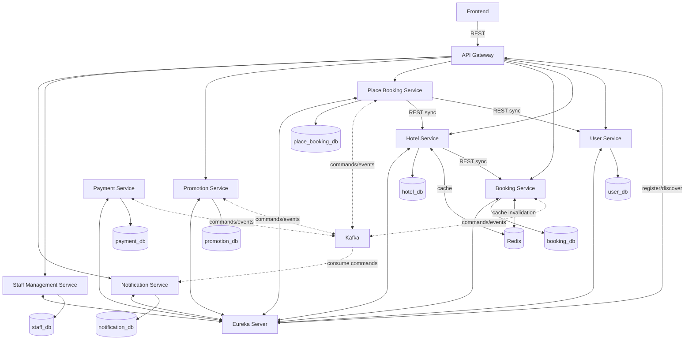

# System Architecture

## 1. Pattern Selection

| Pattern | Selected? | Business/Technical Justification |
| --- | --- | --- |
| API Gateway | Yes | Cung cấp một entry point cho client, xử lý JWT, routing, CORS và rate limiting tập trung. |
| Database per Service | Yes | Mỗi service sở hữu database riêng; service khác chỉ truy cập qua API hoặc Kafka event. |
| Saga Orchestration | Yes | Place Booking Service điều phối luồng đặt phòng, thanh toán, promotion và compensating transaction. |
| Event-driven (Kafka) | Yes | Tách rời Place Booking Service khỏi Booking, Payment, Promotion và Notification Service trong các bước bất đồng bộ. |
| Transactional Outbox | Yes | Business data và event được ghi trong cùng transaction, sau đó relay publish lên Kafka với cơ chế retry. |
| Circuit Breaker | Yes | Bảo vệ Payment Service khi cổng thanh toán bên ngoài chậm hoặc không khả dụng. |
| Service Discovery | Yes | Eureka cung cấp đăng ký và discovery cho API Gateway cùng các lời gọi REST nội bộ. |
| CQRS | No | Read/write model hiện tại chưa đủ phức tạp để cần tách riêng. |

## 2. System Components

### 2.1. Application and infrastructure components

| Component | Responsibility | Tech Stack | External Port |
| --- | --- | --- | --- |
| Frontend | Giao diện cho Customer, Staff, Owner và Admin | React + Vite | 3000 |
| API Gateway | JWT validation, routing, CORS, rate limiting | Spring Cloud Gateway | 8080 |
| Eureka Server | Service registry và discovery | Spring Cloud Netflix Eureka | 8761 |
| User Service | Tài khoản, xác thực, RBAC, tenant/subscription | Spring Boot | 5002 |
| Hotel Service | Khách sạn, loại phòng, phòng, tiện ích và giá | Spring Boot | 5003 |
| Booking Service | Vòng đời booking, trạng thái và lịch sử | Spring Boot | 5004 |
| Place Booking Service | Saga Orchestrator cho đặt phòng và hủy phòng | Spring Boot | 5001 |
| Payment Service | Thanh toán, hoàn tiền và tích hợp payment gateway | Spring Boot | 5005 |
| Promotion Service | Promotion, coupon, validation và usage | Spring Boot | 5007 |
| Staff Management Service | Nhân viên khách sạn và phân quyền nội bộ | Spring Boot | 5008 |
| Notification Service | Email, FCM push, inbox và delivery log | Spring Boot | 5006 |
| Kafka Broker | Message broker cho command/event bất đồng bộ | Apache Kafka | 9092 |
| Redis | Cache dữ liệu tìm kiếm, khách sạn và phòng | Redis | 6379 |

### 2.2. Data stores

| Data store | Owner | Technology | External Port |
| --- | --- | --- | --- |
| `user_db` | User Service | PostgreSQL | 5432 |
| `hotel_db` | Hotel Service | PostgreSQL | 5433 |
| `booking_db` | Booking Service | PostgreSQL | 5434 |
| `place_booking_db` | Place Booking Service | PostgreSQL | 5435 |
| `payment_db` | Payment Service | PostgreSQL | 5436 |
| `promotion_db` | Promotion Service | PostgreSQL | 5437 |
| `staff_db` | Staff Management Service | PostgreSQL | 5438 |
| `notification_db` | Notification Service | PostgreSQL | 5439 |

Promotion Service, Staff Management Service và các database tương ứng đã có trong thiết kế logic nhưng chưa được cấu hình trong `docker-compose.yml`; vì vậy tài liệu không gán port giả định cho các component này.

## 3. Communication

### 3.1. Communication styles

| Style | From | To | Purpose |
| --- | --- | --- | --- |
| REST sync | Client qua API Gateway | Các application service | Request cần phản hồi tức thời cho giao diện. |
| REST sync | Place Booking Service | User Service | Xác minh người dùng trước khi khởi tạo Saga. |
| REST sync | Place Booking Service | Hotel Service | Kiểm tra dữ liệu khách sạn, loại phòng và availability ban đầu. |
| REST sync | Hotel Service | Booking Service | Lấy số booking đang hoạt động khi tính availability. |
| Kafka async | Place Booking Service | Booking Service | Tạo, xác nhận hoặc hủy booking và nhận kết quả xử lý. |
| Kafka async | Place Booking Service | Payment Service | Yêu cầu thanh toán/hoàn tiền và nhận kết quả. |
| Kafka async | Place Booking Service | Promotion Service | Kiểm tra, xác nhận hoặc hoàn tác việc sử dụng promotion. |
| Kafka async | Place Booking Service | Notification Service | Yêu cầu gửi thông báo mà không chặn Saga. |

### 3.2. Kafka topics and event schemas

Danh sách topic, publisher, consumer, event type và schema chi tiết được quản lý tập trung tại [kafka-events.md](kafka-events.md). Khi thêm hoặc thay đổi event, cập nhật file này thay vì sao chép schema vào tài liệu kiến trúc.

### 3.3. Service discovery

| Scenario | Pattern | Mechanism |
| --- | --- | --- |
| Client -> API Gateway | Server-side discovery | Client chỉ biết Gateway; Gateway dùng Eureka để tìm service đích. |
| Internal REST | Client-side discovery | Service gọi dùng Eureka và Spring Cloud LoadBalancer để chọn instance. |
| Kafka | Không dùng Eureka | Broker address được cấu hình qua biến môi trường. |

### 3.4. Inter-service communication matrix

| From | To | Protocol |
| --- | --- | --- |
| Frontend | API Gateway | REST |
| API Gateway | User, Hotel, Booking, Place Booking, Promotion, Staff, Notification | REST |
| Place Booking Service | User Service | REST sync |
| Place Booking Service | Hotel Service | REST sync |
| Hotel Service | Booking Service | REST sync |
| Place Booking Service | Booking Service | Kafka command/event |
| Place Booking Service | Payment Service | Kafka command/event |
| Place Booking Service | Promotion Service | Kafka command/event |
| Place Booking Service | Notification Service | Kafka command |

## 4. Architecture Diagram

## 5. Deployment

- Các service được containerize bằng Docker.
- Docker Compose hiện khởi tạo Frontend, Gateway, Eureka, Kafka, các service đã triển khai và database tương ứng.
- Service trong Docker network gọi nhau bằng service name, không dùng `localhost`.
- Promotion Service, Staff Management Service, Redis và các database còn thiếu cần được bổ sung vào Compose khi implementation sẵn sàng.

### 5.1. Startup order

1. Zookeeper và Kafka.
2. Eureka Server và các database.
3. User, Hotel, Booking, Payment và Notification Service.
4. Place Booking Service.
5. API Gateway.
6. Frontend.

Promotion Service và Staff Management Service sẽ được đặt ở bước 3 sau khi được bổ sung vào deployment.
