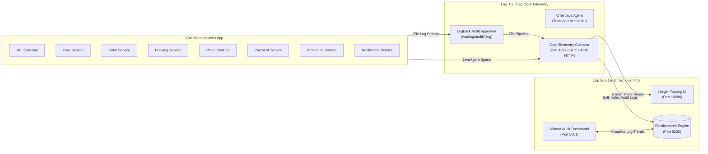
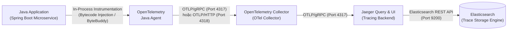
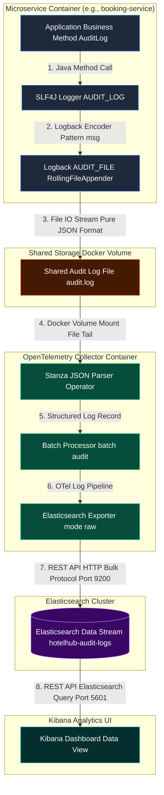

# TÀI LIỆU TỔNG HỢP KIẾN TRÚC & HƯỚNG DẪN CÀI ĐẶT
# DISTRIBUTED TRACING & AUDIT LOGGING TRONG HỆ THỐNG MICROSERVICES (HOTELHUB)

---

## MỤC LỤC
1. [Lý thuyết & Khái niệm Cơ bản](#1-lý-thuyết--khái-niệm-cơ-bản)
2. [Phân tích Hệ thống Microservices HotelHub](#2-phân-tích-hệ-thống-microservices-hotelhub)
3. [Công nghệ & Hệ sinh thái Sử dụng](#3-công-nghệ--hệ-sinh-thái-sử-dụng)
4. [Kiến trúc Tổng thể Hệ thống Tracing & Audit Log](#4-kiến-trúc-tổng-thể-hệ-thống-tracing--audit-log)
5. [Cơ chế Hoạt động Chi tiết của OpenTelemetry Java Agent](#5-cơ-chế-hoạt-động-chi-tiết-của-opentelemetry-java-agent)
6. [Ứng dụng Spring AOP & SpEL trong Module Audit Logging](#6-ứng-dụng-spring-aop--spel-trong-module-audit-logging)
7. [Hướng dẫn Cài đặt & Sử dụng Chi tiết](#7-hướng-dẫn-cài-đặt--sử-dụng-chi-tiết)
8. [Nghiệm thu & Đánh giá](#8-nghiệm-thu--đánh-giá)

---

## 1. LÝ THUYẾT & KHÁI NIỆM CƠ BẢN

### 1.1. Distributed Tracing (Truy Vết Phân Tán)
Trong kiến trúc Microservices, một yêu cầu từ người dùng có thể đi qua hàng chục service khác nhau (API Gateway $\rightarrow$ Place Booking Service $\rightarrow$ Promotion Service $\rightarrow$ Booking Service $\rightarrow$ Payment Service $\rightarrow$ Notification Service), kết hợp cả giao tiếp đồng bộ (HTTP/REST) và bất đồng bộ (Kafka/Outbox Pattern).

Khi xảy ra sự cố (chậm, lỗi 500, nghẽn mạng), việc tìm ra nguyên nhân nếu chỉ dựa vào log từng service độc lập là rất khó khăn. **Distributed Tracing** ra đời để giải quyết vấn đề này bằng cách theo dõi toàn bộ đường đi của một request qua các service.

Các khái niệm lõi trong Tracing:
* **Trace**: Đại diện cho toàn bộ luồng xử lý của một request từ đầu đến cuối hệ thống. Mỗi Trace có một **TraceId** duy nhất (ví dụ: `4bf92f3577b34da6a3ce929d0e0e4736`).
* **Span**: Đại diện cho một đơn vị công việc nhỏ trong luồng (một HTTP Request, một truy vấn DB PostgreSQL, một lệnh Redis, một thao tác gửi/nhận message Kafka). Mỗi Span có một **SpanId** duy nhất và có quan hệ Cha - Con (Parent-Child relationship).
* **Context Propagation (Lan truyền Ngữ cảnh)**: Cơ chế truyền thông tin Trace (`traceparent`) qua các ranh giới mạng (HTTP Header, Kafka Message Header, Outbox Table). Chuẩn phổ biến hiện nay là **W3C Trace Context**:
  $$\text{traceparent: } \text{version}-\text{trace\_id}-\text{parent\_id}-\text{trace\_flags}$$
  *Ví dụ:* `00-4bf92f3577b34da6a3ce929d0e0e4736-00f067aa0ba902b7-01`

---

### 1.2. Audit Logging (Ghi Log Nghiệp Vụ)
Khác với **Application Log** (log kỹ thuật phục vụ dev/ops như `DEBUG`, `INFO`, `ERROR` đơn thuần), **Audit Log** phục vụ cho **an toàn thông tin, tuân thủ pháp lý (Compliance) và nghiệp vụ doanh nghiệp (Business Intelligence)**.

Đặc điểm của Audit Log:
* **Tính cấu trúc (Structured JSON)**: Luôn lưu ở dạng JSON với schema cố định, dễ dàng đánh chỉ mục và truy vấn trên Elasticsearch.
* **Ai (Actor) - Làm gì (Action) - Trên cái gì (Target) - Khi nào (Timestamp) - Kết quả ra sao (ResultStatus)**.
* **Tính toàn vẹn & Không thể chối bỏ (Immutability & Non-repudiation)**: Ghi lại chính xác danh tính người dùng (Keycloak User Sub/Service Account) và IP client.
* **Hoạt động độc lập**: Audit Log **phải luôn được ghi** kể cả khi request không được trace (do Sampling rate hoặc Tracing bị tắt).

---

### 1.3. So sánh & Mối quan hệ giữa Tracing và Audit Logging

| Tiêu chí | Distributed Tracing (Jaeger) | Audit Logging (Elasticsearch/ELK) |
|---|---|---|
| **Mục đích chính** | Monitor hiệu năng (Latency), phát hiện nghẽn bottleneck, lỗi kỹ thuật | Kiểm toán nghiệp vụ, bảo mật, tuân thủ, vết hành động người dùng |
| **Đối tượng sử dụng** | DevOps, SRE, System Engineers | Business Analyst, Security Auditor, Management |
| **Dữ liệu lưu trữ** | Spans, Spans timeline, Trace Tree | JSON Audit Log Entries (Structured) |
| **Độ tin cậy** | Có thể bị Sampling (chỉ lưu 1%, 10% request) để tiết kiệm bộ nhớ | **100% Request nghiệp vụ quan trọng phải được ghi lại** |
| **Liên kết** | Span chứa `TraceId` / `SpanId` | Audit Log đính kèm `TraceId` / `SpanId` để liên kết sang Jaeger |

> **Điểm kết nối:** Trong kiến trúc của HotelHub, khi một Audit Log được tạo ra, nếu request đó đang nằm trong một Tracing Span, hệ thống sẽ tự động trích xuất `TraceId` & `SpanId` đính kèm vào Audit Log JSON, đồng thời bắn thêm một **Span Event** lên Jaeger. Việc này giúp Developer vừa tra được log nghiệp vụ trên Kibana, vừa click ngay sang Jaeger để xem timeline chi tiết của request đó.

---

## 2. PHÂN TÍCH HỆ THỐNG MICROSERVICES HOTELHUB

### 2.1. Kiến trúc Saga Đặt phòng (Place Booking Saga)
Hệ thống HotelHub sử dụng mô hình **Saga Orchestrator Pattern** để xử lý giao dịch phân tán giữa các service:

```
[Client] ──> [API Gateway] ──> [Place Booking Service (Orchestrator)]
                                    │
    ┌───────────────────────────────┼───────────────────────────────┐
    ▼                               ▼                               ▼
[Hotel Service]            [Booking Service]            [Payment Service]
(Lấy phòng/Cập nhật status) (Tạo đơn/Khóa Redis)        (Thanh toán Gateway)
    │                               │                               │
    └───────────────────────────────┼───────────────────────────────┘
                                    ▼
                         [Notification Service]
                         (Gửi Push / Email Noti)
```

Các bước trong luồng Saga:
1. **Place Booking Service** nhận `POST /place-booking` $\rightarrow$ Validate user qua UserService $\rightarrow$ Validate hotel/room qua HotelService $\rightarrow$ Pre-validate coupon qua PromotionService $\rightarrow$ Tạo `SagaState` (`IN_PROGRESS`).
2. Gửi event `CreateBooking` sang Kafka `booking-commands`.
3. **Booking Service** tiêu thụ `CreateBooking` $\rightarrow$ Thử giữ phòng trên Redis Atomic Reservation $\rightarrow$ Lưu `BookingEntity` (`PENDING`) $\rightarrow$ Gửi event `BookingCreated` sang Kafka `booking-events`.
4. **Place Booking Service** nhận `BookingCreated` $\rightarrow$ Cập nhật `SagaState` $\rightarrow$ Gửi command `ProcessPayment` sang Kafka `payment-commands`.
5. **Payment Service** nhận `ProcessPayment` $\rightarrow$ Gọi Payment Gateway $\rightarrow$ Lưu `PaymentEntity` $\rightarrow$ Bắn event `PaymentSucceeded` / `PaymentFailed` sang `payment-events`.
6. **Place Booking Service** nhận `PaymentSucceeded` $\rightarrow$ Gửi command `ConfirmBooking` $\rightarrow$ Booking Service chuyển status `CONFIRMED` $\rightarrow$ Bắn event `BookingConfirmed` $\rightarrow$ Place Booking gửi `SendBookingConfirmed` cho Notification Service.

---

### 2.2. Nhu cầu Tracing & Audit Log trong HotelHub

#### Những đối tượng CẦN TRACING:
* Tất cả HTTP Requests đi qua Spring Cloud Gateway và các Servlet Filters.
* Luồng gửi/nhận tin nhắn qua **Kafka Topics** (`booking-commands`, `booking-events`, `payment-commands`, `payment-events`, `promotion-commands`, `notification-commands`).
* Các giao dịch DB qua PostgreSQL JDBC driver.
* Các câu lệnh thao tác với **Redis Cache** và **Redis Atomic Reservation** (`roomInventoryRedisService.tryReserve`).
* Thao tác lưu/đọc file trên **MinIO Object Storage**.
* **Outbox Pattern Relay**: Truyền `traceparent` từ Thread xử lý HTTP request vào cột `traceparent` của DB Outbox Table, sau đó Scheduled Task đọc Outbox bắn sang Kafka vẫn giữ nguyên Trace context ban đầu.

#### Những hành động CẦN AUDIT LOGGING:

| Nghiệp vụ | Event Type | Target Type | TargetId SpEL | ExtraData trích xuất |
|---|---|---|---|---|
| Bắt đầu Saga đặt phòng | `CREATE_BOOKING` | `BOOKING` | `#bookingId` | `hotelId`, `userId`, `checkin`, `checkout` |
| Tạo booking trong DB | `CREATE_BOOKING` | `BOOKING` | `#command.bookingId` | `hotelId`, `userId`, `totalAmount` |
| Xử lý thanh toán | `PROCESS_PAYMENT` | `PAYMENT` | `#processPayment.bookingId` | `amount`, `currency`, `paymentMethod`, `sagaId` |
| Xác nhận thanh toán thành công | `PROCESS_PAYMENT` | `BOOKING` | `#paymentSucceeded.bookingId` | `paymentId` |
| Thanh toán thất bại | `PROCESS_PAYMENT` | `BOOKING` | `#paymentFailed.bookingId` | `reason` |
| Xác nhận đơn đặt phòng | `CONFIRM_BOOKING` | `BOOKING` | `#bookingId` | `sagaId` |
| Hủy đơn đặt phòng | `CANCEL_BOOKING` | `BOOKING` | `#bookingId` | `reason` |
| Duyệt / Đình chỉ khách sạn | `APPROVE_HOTEL` | `HOTEL` | `#hotelId` | `status` |
| Cập nhật trạng thái phòng | `UPDATE_HOTEL` | `HOTEL` | (Request body) | `oldStatus`, `newStatus` |

---

## 3. CÔNG NGHỆ & HỆ SINH THÁI SỬ DỤNG

```
┌────────────────────────────────────────────────────────────────────────┐
│                          APPLICATION LAYER                             │
│       Spring Boot 3.5  │  Spring AOP  │  Spring Security OAuth2        │
└───────────────────────────────────┬────────────────────────────────────┘
                                    │
     ┌──────────────────────────────┴──────────────────────────────┐
     ▼                                                             ▼
┌──────────────────────────────┐                ┌────────────────────────────────┐
│   AUDIT LOGGING ARCHITECTURE │                │ DISTRIBUTED TRACING ARCHITECT  │
│  - AuditLogAspect            │                │  - OpenTelemetry Java Agent    │
│  - Jackson (Structured JSON) │                │  - OTel API Context / Propagator│
│  - SLF4J / Logback Encoder   │                │  - OTLP Exporter               │
└──────────────┬───────────────┘                └───────────────┬────────────────┘
               │                                                │
               ▼                                                ▼
┌──────────────────────────────┐                ┌────────────────────────────────┐
│      LOGGING PIPELINE        │                │       TRACING PIPELINE         │
│  Logback AsyncAppender       │                │  OpenTelemetry Collector       │
│        │                     │                │        │                       │
│        ▼                     │                │        ▼                       │
│  Elasticsearch / Kibana      │                │  Jaeger Tracing UI             │
└──────────────────────────────┘                └────────────────────────────────┘
```

1. **OpenTelemetry (OTel) Java Agent**:
   - Tự động can thiệp (Bytecode Instrumentation) vào JVM mà không cần sửa code ứng dụng.
   - Hỗ trợ tự động tạo Span cho Spring MVC, WebFlux, Feign Client, PostgreSQL, Redis, MinIO, Async, Scheduler.

> Java Agent cũng hỗ trợ tự động tạo Span cho Kafka Producer và Consumer, tuy nhiên do đặc thù của Outbox Pattern nên cần phải cấu hình thêm để không mất span.

2. **Spring AOP (Aspect Oriented Programming)**:
   - Xây dựng `@AuditLog` annotation để tách biệt hoàn toàn code ghi audit log ra khỏi Business Code.
3. **Spring SpEL (Spring Expression Language)**:
   - Trích xuất dữ liệu động (`targetId`, `extraData`) từ các đối tượng tham số phương thức hoặc kết quả trả về.
4. **Logstash Logback Encoder**:
   - Format log đầu ra dạng Structured JSON chuẩn hóa cho ELK Stack.
5. **Keycloak & Spring Security**:
   - Trích xuất danh tính Actor (`actorId` từ JWT claim `sub`, `actorType` từ client credentials / preferred username).

---

## 4. KIẾN TRÚC TỔNG THỂ HỆ THỐNG TRACING & AUDIT LOG

### 4.1. Sơ đồ Kiến trúc Thu thập Tracing & Audit Log



### 4.2. Sơ đồ Luồng Xử lý Dữ liệu Audit Log & Span Event

```
                         Method có @AuditLog
                                  │
                                  ▼
                         AuditLogAspect (Around)
                                  │
            ┌─────────────────────┴─────────────────────┐
            │                                           │
            ▼                                           ▼
      AuditLogger                               SpanEventPublisher
            │                                           │
            ▼                                           ▼
     AuditLogEntry                              Span.current()
  (Resolver: Actor, IP,                      (Kiểm tra isRecording)
   TraceId, SpEL data)                                  │
            │                                           ▼
            ▼                                  span.addEvent(...)
Structured JSON Log dòng đơn                   span.recordException(...)
            │                                           │
            ▼                                           ▼
      AsyncAppender                            OpenTelemetry Agent
            │                                           │
            ▼                                           ▼
      Elasticsearch                               Jaeger UI
```

---

### 4.2. Thiết kế Module `audit` trong `hotelbooking-chassis`

Cấu trúc package trong `hotelbooking-chassis`:
```text
com.hotelbooking.chassis.audit/
├── AuditAutoConfiguration.java   # Spring Boot Auto-Configuration
├── AuditEventType.java           # Enum phân loại sự kiện nghiệp vụ
├── AuditLog.java                 # Annotation @AuditLog hỗ trợ SpEL
├── AuditLogAspect.java           # Aspect chính xử lý AOP & SpEL
├── AuditLogEntry.java            # DTO chứa 20 trường thông tin Audit Log
├── AuditLogger.java              # Component serialize JSON và ghi qua SLF4J
├── ActorResolver.java            # Trích xuất actorId, actorType từ SecurityContext
├── RequestResolver.java          # Trích xuất IP, Endpoint, HTTP Method từ Servlet Context
├── Severity.java                 # Enum mức độ nghiêm trọng (INFO, WARN, ERROR)
├── SpanEventPublisher.java       # Component đẩy Event lên OpenTelemetry Span
└── TargetType.java               # Enum loại đối tượng tác động (BOOKING, HOTEL, PAYMENT...)
```

---

### 4.3. Cấu trúc Chuẩn JSON Audit Log Entry (Schema)

Một dòng Audit Log JSON khi xuất ra log stream luôn có đầy đủ 20 trường thông tin chuẩn hóa:

```json
{
  "logId": "a1b2c3d4-e5f6-7890-1234-56789abcdef0",
  "timestamp": "2026-08-07T01:30:00.123Z",
  "eventType": "CREATE_BOOKING",
  "message": "Create booking from saga command",
  "severity": "INFO",
  "actorId": "3b2c1a0-8899-4455-bbee-112233445566",
  "actorType": "USER",
  "requestIp": "192.168.1.100",
  "targetId": "c4d3e2f1-9988-7766-5544-33221100aabb",
  "targetType": "BOOKING",
  "serviceName": "booking-service",
  "traceId": "4bf92f3577b34da6a3ce929d0e0e4736",
  "spanId": "00f067aa0ba902b7",
  "httpMethod": "POST",
  "endpoint": "/place-booking",
  "resultStatus": "SUCCESS",
  "durationMs": 45,
  "errorCode": null,
  "errorMessage": null,
  "extraData": {
    "hotelId": "11111111-2222-3333-4444-555555555555",
    "userId": "3b2c1a0-8899-4455-bbee-112233445566",
    "checkin": "2026-08-10",
    "checkout": "2026-08-12",
    "totalAmount": 1500000
  }
}
```

---

## 5. CƠ CHẾ HOẠT ĐỘNG CHI TIẾT CỦA OPENTELEMETRY JAVA AGENT

### 5.1. Luồng thu thập, lưu trữ và trực quan trace

Biểu đồ Mermaid thể hiện luồng dữ liệu Tracing từ ứng dụng Spring Boot qua OpenTelemetry Java Agent, giao thức OTLP, OpenTelemetry Collector, Jaeger và lưu trữ trên Elasticsearch:



#### Miêu tả chi tiết quá trình thu thập, xử lý và trực quan Trace:

1. **Giai đoạn Thu thập tại Ứng dụng (Application & Java Agent)**:
   Khi Microservice chạy với tham số `-javaagent:opentelemetry-javaagent.jar`, **OpenTelemetry Java Agent** được nạp trực tiếp vào cùng không gian bộ nhớ (In-Process) với JVM ứng dụng. Thông qua công nghệ Bytecode Instrumentation (dùng ByteBuddy), Java Agent tự động gắn các điểm đo (Hooks) vào Servlet, Feign Client, JDBC, Redis, Kafka để sinh ra các **Span** thời điểm runtime.

2. **Giai đoạn Đóng gói và Đẩy dữ liệu (OTLP Protocol)**:
   Java Agent gom các Span lại theo lô (Batch Processor trong bộ nhớ) và định kỳ gửi dữ liệu Trace sang **OpenTelemetry Collector** thông qua giao thức **OTLP (OpenTelemetry Protocol)** chuẩn hóa qua **gRPC** (cổng mặc định 4317) hoặc **HTTP/Protobuf** (cổng 4318). Giao thức OTLP mang lại hiệu năng cực cao nhờ nén dữ liệu dạng Protobuf nhị phân.

3. **Giai đoạn Xử lý trung gian tại OTel Collector**:
   **OpenTelemetry Collector** đóng vai trò là trạm trung chuyển (Pipeline Coordinator). Tại đây, Collector tiếp nhận (Receiver), xử lý lọc/làm sạch (Processor), sau đó chuyển tiếp dữ liệu (Exporter) sang **Jaeger** thông qua giao thức **OTLP/gRPC** (cổng 4317). Việc sử dụng Collector giúp giảm tải xử lý cho ứng dụng và linh hoạt cấu hình gửi Trace tới nhiều hệ thống quan sát (Monitoring Systems) khác nhau mà không phải sửa code.

4. **Giai đoạn Lưu trữ lâu dài tại Elasticsearch**:
   Backend của Jaeger nhận dữ liệu Tracing và chuyển đổi thành các tài liệu chỉ mục (Index documents) lưu trữ lâu dài trên **Elasticsearch** thông qua **Elasticsearch REST API** (cổng 9200). Elasticsearch giúp tối ưu truy vấn vết Trace cực nhanh theo `traceId`, `serviceName`, `spanName` hoặc các tag custom.

5. **Giai đoạn Trực quan hóa (Jaeger UI)**:
   Khi Developer hoặc System Administrator truy cập giao diện Jaeger UI, Jaeger Query engine sẽ truy vấn dữ liệu từ Elasticsearch và dựng thành sơ đồ timeline trực quan (Span Tree) của toàn bộ request qua các Microservices.

---

### 5.2. Java Agent Bytecode Manipulation
OpenTelemetry Java Agent hoạt động ở tầng JVM thông qua cơ chế `-javaagent`. Khi các class của Spring Framework, Kafka Client, HikariCP, PostgreSQL JDBC driver được nạp vào ClassLoader, Java Agent sử dụng **ByteBuddy** để sửa đổi bytecode (Instrument) thời điểm runtime:

1. **HTTP/REST Instrumentation**: Tự động chặn các Servlet `doFilter` và RestTemplate/FeignClient `execute`, tạo Span mới, tự động inject/extract header `traceparent`.
2. **Kafka Instrumentation**:
   - Khi `KafkaTemplate.send()` được gọi: Agent chèn `traceparent` vào `ProducerRecord.headers()`.
   - Khi `@KafkaListener` nhận message: Agent đọc `ConsumerRecord.headers()`, khôi phục Context và tạo Child Span.

---

### 5.2. Giải pháp Context Propagation qua Outbox Pattern

Một thách thức lớn trong mô hình Microservices là **Outbox Pattern**: HTTP Thread ghi record vào DB table `outbox_messages`, sau đó một Background Thread (Scheduler) định kỳ đọc record từ DB và publish sang Kafka.

Nếu chỉ dùng Java Agent tự động, Background Thread sẽ tạo ra một Trace mới độc lập, làm đứt gãy luồng Trace của người dùng.

**Giải pháp đã cài đặt trong HotelHub:**
1. Trong HTTP Thread (khi lưu outbox): Trích xuất `traceparent` từ Span hiện tại và lưu vào cột `traceparent` của DB Outbox Table:
   ```java
   String traceparent = extractCurrentTraceparent();
   outboxMessage.setTraceparent(traceparent);
   ```
2. Trong Scheduler Thread (khi publish sang Kafka): Khôi phục Context từ cột `traceparent` trước khi gửi message sang Kafka:
   ```java
   Context extractedContext = GlobalOpenTelemetry.getPropagators()
       .getTextMapPropagator()
       .extract(Context.current(), carrier, MAP_GETTER);
   try (Scope scope = extractedContext.makeCurrent()) {
       kafkaProducerService.sendMessage(...);
   }
   ```
Nhờ đó, luồng Trace trên Jaeger liền mạch từ API Gateway $\rightarrow$ Place Booking $\rightarrow$ DB Outbox $\rightarrow$ Kafka $\rightarrow$ Booking Service.

---

## 6. KIẾN TRÚC THU THẬP AUDIT LOG QUA OPENTELEMETRY COLLECTOR & SPRING AOP

### 6.1. Luồng Thu thập, Lưu trữ và Trực quan hóa Audit Log qua OpenTelemetry Collector

Hệ thống HotelHub thiết lập một pipeline thu thập và xuất Audit Log hoàn toàn tách biệt khỏi luồng Distributed Tracing, sử dụng **OpenTelemetry Collector** làm trung gian xử lý để không phụ thuộc vào ứng dụng và không gây tắc nghẽn giao dịch nghiệp vụ.

Sơ đồ kiến trúc dưới đây mô tả toàn bộ hành trình của một Audit Log Record từ khi được sinh ra tại Microservice cho đến khi hiển thị trên giao diện Kibana UI, kèm theo các giao thức truyền tải chi tiết giữa từng thành phần:



---

#### Miêu tả & Giải thích Chi tiết Quá trình Thu thập Audit Log:

1. **Giai đoạn Sinh Log tại Ứng dụng (Java Method Call & SLF4J)**:
   - Khi phương thức nghiệp vụ có gắn `@AuditLog` thi hành, `AuditLogAspect` giải mã SpEL context, thu thập thông tin ngữ cảnh (`actorId`, `targetId`, `traceId`, `spanId`, `extraData`...) và khởi tạo một đối tượng `AuditLogEntry`.
   - `AuditLogger` serialize `AuditLogEntry` thành chuỗi **Structured JSON** thuần túy và đẩy sang SLF4J Logger có tên riêng biệt là `AUDIT_LOG` thông qua lệnh gọi phương thức Java `AUDIT_LOG.info(json)`.

2. **Giai đoạn Đệm & Ghi File Cụ thể (Logback Isolation & File I/O)**:
   - Trong `logback-spring.xml`, logger `AUDIT_LOG` được cấu hình với thuộc tính `additivity="false"`. Điều này đảm bảo Audit Log **không bao giờ chảy lên Root Logger**, không bị lẫn vào stdout hay log ứng dụng chung (như Hibernate, Spring, Kafka).
   - Appender `AUDIT_FILE` (`RollingFileAppender`) sử dụng pattern `%msg%n` để chỉ ghi nội dung chuỗi JSON thuần (không có timestamp hay log level prefix của Logback). File được lưu trực tiếp tại đường dẫn `/var/log/audit/${SERVICE_NAME}-audit.log` trong container của service.

3. **Giai đoạn Chia sẻ Dữ liệu qua Docker Volume (Shared Storage)**:
   - Tất cả các Microservice (`booking-service`, `place-booking-service`, `payment-service`...) và `otel-collector` container đều được mount chung một Docker Named Volume tên là `audit-logs` tại thư mục `/var/log/audit`.
   - Mỗi service ghi log vào file riêng biệt theo tên của service đó (ví dụ `booking-service-audit.log`), tránh hoàn toàn tình trạng xung đột ghi file (file lock contention).

4. **Giai đoạn Thu thập & Đọc Log (OTel Collector Filelog Receiver)**:
   - Container OpenTelemetry Collector sử dụng receiver `filelog/audit` lắng nghe liên tục các file log trong thư mục `/var/log/audit/*.log` theo cơ chế stream file (tương tự `tail -f`).
   - Operator `json_parser` đọc chuỗi JSON từ trường `body` của từng dòng log và tự động phân tích (parse) thành các thuộc tính structured log record.

5. **Giai đoạn Gom lô & Xử lý (OTel Collector Batch Processing)**:
   - Log Record đi qua `batch/audit` processor với cấu hình `send_batch_size: 10` và `timeout: 1s` để tối ưu số lượng HTTP connection và giảm thiểu độ trễ xuất dữ liệu.

6. **Giai đoạn Export sang Elasticsearch (HTTP Bulk Protocol - Port 9200)**:
   - Exporter `elasticsearch/audit` của OTel Collector đóng gói các Log Record thành các lệnh Bulk Indexing và gửi qua giao thức **REST API / HTTP (chân cổng 9200)** sang Elasticsearch Cluster.
   - Exporter sử dụng cấu hình `mapping.mode: raw` để giữ nguyên 100% cấu trúc các trường JSON do ứng dụng tự sinh ra (`logId`, `eventType`, `actorId`, `targetId`, `extraData`...), không tự ý chuyển đổi tên trường.

7. **Giai đoạn Lưu trữ dạng Data Stream (Elasticsearch Storage)**:
   - Elasticsearch tiếp nhận HTTP Bulk Request và định tuyến dữ liệu vào **Data Stream `hotelhub-audit-logs`** (được quản lý bởi Index Template `hotelhub-audit-logs` với các kiểu dữ liệu `keyword`, `date`, `long`, `object` đã định nghĩa sẵn).

8. **Giai đoạn Trực quan hóa & Truy vấn (Kibana UI - Port 5601)**:
   - Quản trị viên hoặc Developer truy cập Kibana UI qua **HTTP REST API (chân cổng 5601)**.
   - Kibana kết nối đến Data Stream `hotelhub-audit-logs*` để cung cấp giao diện lọc, tìm kiếm theo `eventType`, `traceId`, `actorId`, `targetId` hoặc vẽ các biểu đồ thống kê thời gian thực.

---

### 6.2. Thiết kế Custom Annotation `@AuditLog`

Annotation `@AuditLog` được thiết kế chỉ chứa thông tin metadata tĩnh và các biểu thức SpEL:

```java
@Target(ElementType.METHOD)
@Retention(RetentionPolicy.RUNTIME)
@Documented
public @interface AuditLog {
    AuditEventType eventType();
    String message();
    Severity severity() default Severity.INFO;
    TargetType targetType() default TargetType.OTHER;
    
    // SpEL Expression trích xuất targetId
    String targetId() default "";
    
    // Mảng SpEL Expression trích xuất extraData ("key=SpEL")
    String[] extraData() default {};
}
```

---

### 6.3. Cơ chế Giải mã SpEL trong `AuditLogAspect`

`AuditLogAspect` khai báo `@Around("@annotation(auditLog)")`. Khi phương thức được gọi, Aspect chuẩn bị `MethodBasedEvaluationContext` để tính toán SpEL:

```java
private EvaluationContext createEvaluationContext(Method method, Object[] args, Object result) {
    MethodBasedEvaluationContext context = new MethodBasedEvaluationContext(
            null, method, args, paramNameDiscoverer
    );
    context.setVariable("result", result);
    context.setVariable("args", args);
    return context;
}
```

Cơ chế trích xuất `targetId` và `extraData`:
* Nối tên tham số phương thức vào SpEL context (ví dụ: `#command`, `#bookingId`, `#processPayment`).
* Biến `#result` đại diện cho kết quả trả về của phương thức.
* Biến `#args` chứa mảng các tham số.

Ví dụ khai báo nghiệp vụ:
```java
@AuditLog(
    eventType = AuditEventType.CREATE_BOOKING,
    message = "Create booking from saga command",
    severity = Severity.INFO,
    targetType = TargetType.BOOKING,
    targetId = "#command.bookingId",
    extraData = {
        "hotelId=#command.hotel.hotelId",
        "userId=#command.user.userId",
        "totalAmount=#command.effectiveFinalAmount()"
    }
)
public void handleCreateBooking(CreateBookingCommand command, List<UUID> sortedRoomTypeId, boolean isReversed) {
    // Code nghiệp vụ thuần túy - không chứa bất kỳ dòng log nào!
}
```

---

### 6.4. Giải quyết Vấn đề Spring AOP Proxy Self-Call (Self-Injection)

Trong Spring AOP (Proxy-based), khi một phương thức trong cùng một Bean gọi một phương thức khác trong cùng Bean đó (Internal Self-Call), ví dụ: `KafkaConsumerService.bookingEventsHandler()` gọi `this.handleBookingCreated()`, Spring Proxy sẽ bị bỏ qua (bypass), dẫn đến `@AuditLog` trên `handleBookingCreated` **không được kích hoạt**.

**Giải pháp đã cài đặt:** Sử dụng **Self-Injection với `@Lazy`**:
```java
@Service
@RequiredArgsConstructor
@FieldDefaults(level = AccessLevel.PRIVATE, makeFinal = true)
public class KafkaConsumerService {

    @Autowired @Lazy @lombok.experimental.NonFinal
    KafkaConsumerService self; // Inject chính proxy của bean này

    @KafkaListener(topics = "booking-events")
    public void bookingEventsHandler(String payloadJson) {
        // ...
        switch (eventType) {
            case "BookingCreated" -> self.handleBookingCreated(...); // Gọi qua proxy!
        }
    }

    @AuditLog(...)
    public void handleBookingCreated(BookingCreated bookingCreated) {
        // Aspect sẽ chặn được hàm này vì được gọi qua self reference!
    }
}
```

---

### 6.5. Xử lý Luồng Thành công & Luồng Exception

Aspect bảo đảm hai nguyên tắc cốt lõi:
1. **Ghi Audit Log cả khi thành công lẫn thất bại**:
   - Khi thành công (`After Returning`): `resultStatus = "SUCCESS"`, ghi log với mức severity mặc định, bắn Span Event thành công.
   - Khi xảy ra lỗi (`After Throwing`): `resultStatus = "FAILURE"`, `severity = "ERROR"`, đính kèm `errorCode` và `errorMessage`, gọi `Span.recordException(ex)`, `Span.setStatus(StatusCode.ERROR)` và **luôn re-throw exception** (không nuốt lỗi).
2. **Safety First**: Xử lý `try-catch` bọc quanh toàn bộ logic trích xuất Audit Log & Span Event. Nếu việc trích xuất log gặp lỗi (ví dụ SpEL sai cú pháp), hệ thống chỉ ghi warning log kỹ thuật và **tuyệt đối không làm gián đoạn luồng giao dịch nghiệp vụ** của người dùng.

---

## 7. HƯỚNG DẪN CÀI ĐẶT & SỬ DỤNG CHI TIẾT

### Bước 1: Khai báo Dependency trong `pom.xml` của Service
Thêm `hotelbooking-chassis` và các dependency cần thiết:

```xml
<dependency>
    <groupId>com.hotelbooking</groupId>
    <artifactId>hotelbooking-chassis</artifactId>
    <version>1.0.0</version>
</dependency>
```

---

### Bước 2: Tự động Đăng ký Auto-Configuration
Kiểm tra file `chassis/src/main/resources/META-INF/spring/org.springframework.boot.autoconfigure.AutoConfiguration.imports`:
```properties
com.hotelbooking.chassis.tracing.config.TracingAutoConfiguration
com.hotelbooking.chassis.audit.AuditAutoConfiguration
```

---

### Bước 3: Cấu hình `application.yml` cho Service
```yaml
spring:
  application:
    name: booking-service

chassis:
  audit:
    enabled: true  # Bật/tắt module audit
  logging:
    json-enabled: true
```

---

### Bước 4: Thêm Annotation `@AuditLog` vào Phương thức Nghiệp vụ
Ví dụ trong `PaymentService.java`:
```java
@CircuitBreaker(name = "paymentGateway", fallbackMethod = "paymentGatewayFallback")
@AuditLog(
    eventType = AuditEventType.PROCESS_PAYMENT,
    message = "Process payment via gateway",
    severity = Severity.INFO,
    targetType = TargetType.PAYMENT,
    targetId = "#processPayment.bookingId",
    extraData = {
        "amount=#processPayment.amount",
        "currency=#processPayment.currency",
        "paymentMethod=#processPayment.paymentMethod",
        "sagaId=#processPayment.sagaId"
    }
)
public PaymentProcessResult processPayment(ProcessPayment processPayment) {
    // Code xử lý thanh toán
}
```

---

### Bước 5: Khai báo OpenTelemetry Java Agent khi Chạy JVM
Khi khởi chạy ứng dụng Spring Boot (qua Dockerfile hoặc Command Line), thêm tham số `-javaagent`:

```bash
java -javaagent:/path/to/opentelemetry-javaagent.jar \
     -Dotel.service.name=booking-service \
     -Dotel.exporter.otlp.endpoint=http://otel-collector:4317 \
     -Dotel.logs.exporter=none \
     -jar booking-service.jar
```

---

## 8. NGHIỆM THU & ĐÁNH GIÁ

Kết quả Kiểm thử Trực quan trên Dashboard

1. **Trên Kibana (Elasticsearch Log Stream)**:
   - Tất cả các thao tác nghiệp vụ quan trọng đều sinh ra log 1 dòng JSON chuẩn.
   - Có thể filter dễ dàng theo `eventType: "CREATE_BOOKING"`, `actorId`, `targetId`, hoặc `extraData.hotelId`.
   - Mỗi Audit Log đều có `traceId` và `spanId` liên kết.

2. **Trên Jaeger UI (Tracing Timeline)**:
   - Tìm kiếm Trace theo `TraceId` trích xuất từ Audit Log.
   - Hiển thị cây xử lý (Span Tree) kéo dài qua nhiều Microservices: API Gateway $\rightarrow$ Place Booking $\rightarrow$ Kafka $\rightarrow$ Booking Service $\rightarrow$ Payment Service.
   - Trong chi tiết của Span có các **Span Events** tương ứng với từng mốc Audit Log (`audit.CREATE_BOOKING`, `audit.PROCESS_PAYMENT`).

---

## NGUYÊN TẮC THIẾT KẾ ĐÃ ĐẠT ĐƯỢC

- **Non-intrusive (Không xâm nhập)**: Code nghiệp vụ hoàn toàn sạch sẽ, không chứa câu lệnh logger rác.
- **Trace-independent Audit Log**: Audit Log được ghi 100% độc lập, không bị ảnh hưởng bởi tỷ lệ Sampling của Tracing.
- **High Performance**: Log JSON được ghi thông qua Logback `AsyncAppender` với hàng đợi bộ nhớ, không gây nghẽn Thread nghiệp vụ.
- **Full Trace Context Propagation**: Truyền vết liên tục từ HTTP Request sang Outbox Database và Kafka Async Messaging.


---

# Phụ lục

## Custom Java agent Tracing:

### Cách 1: Tắt cụ thể từng thư viện không mong muốn (Targeted Suppression)

Java Agent phân loại các thư viện theo module name. Bạn có thể thêm các biến môi trường sau vào `docker-compose.yml` (hoặc `-D` flag trong JVM arguments) của các service:

####  Tắt Tracing Redis (Lettuce / Jedis / Redisson):
```yaml
environment:
  - OTEL_INSTRUMENTATION_LETTUCE_ENABLED=false
  - OTEL_INSTRUMENTATION_JEDIS_ENABLED=false
  - OTEL_INSTRUMENTATION_REDISSON_ENABLED=false
```

#### Tắt Tracing Database (PostgreSQL / JDBC / Spring Data):
```yaml
environment:
  - OTEL_INSTRUMENTATION_JDBC_ENABLED=false          # Tắt vết truy vấn SQL thuần
  - OTEL_INSTRUMENTATION_SPRING_DATA_ENABLED=false   # Tắt vết Repository method
  - OTEL_INSTRUMENTATION_HIKARI_ENABLED=false       # Tắt Connection Pool trace
```

####  Tắt Tracing Kafka / RabbitMQ:
```yaml
environment:
  - OTEL_INSTRUMENTATION_KAFKA_ENABLED=false
```

---

### Cách 2: Chiến lược "Mặc định TẮT HẾT, chỉ BẬT cái mình chọn" (Opt-in Strategy)


```yaml
environment:
  # 1. Tắt tất cả auto-instrumentation mặc định
  - OTEL_INSTRUMENTATION_COMMON_DEFAULT_ENABLED=false

  # 2. Chỉ bật lại những phần bạn CHỦ ĐỘNG muốn Trace (Ví dụ: Web HTTP + Custom Span @AuditLog)
  - OTEL_INSTRUMENTATION_SPRING_WEB_ENABLED=true
  - OTEL_INSTRUMENTATION_SERVLET_ENABLED=true
  - OTEL_INSTRUMENTATION_SPRING_WEBMVC_ENABLED=true
```

### Cách 3: Bỏ qua Tracing theo URL / Endpoint (VD: `/actuator/*`)

Để tránh việc Jaeger bị rác bởi các request định kỳ như healthcheck hay Prometheus scrape metrics:

```yaml
environment:
  - OTEL_INSTRUMENTATION_HTTP_SERVER_TELEMETRY_EXCLUDED_PATTERN=/actuator/*,/healthcheck,/favicon.ico
```

---

### Cách 4: Lọc ở tầng OpenTelemetry Collector (Collector Filtering)


Trong file [otel-collector.yaml](file:///d:/hoc%20tap%20ptit/sem2_year4/VNPT_Internship/hotel-booking-system/infra/otel/otel-collector.yaml):

```yaml
processors:
  # Bộ lọc loại bỏ các Span DB và Redis
  filter/spans:
    spans:
      exclude:
        match_type: regexp
        attributes:
          - key: "db.system"
            value: "(postgresql|redis)"  # Loại bỏ toàn bộ span có db.system là postgresql hoặc redis

service:
  pipelines:
    traces:
      receivers: [otlp]
      processors: [resource, filter/spans, batch]  # Thêm filter/spans vào pipeline
      exporters: [otlp/jaeger]
```

---

## Cấu hình Jaeger v2 với Elasticsearch Storage

Đối với phiên bản **Jaeger v2 (`2.x.x`)**, Jaeger hoạt động dưới dạng một OpenTelemetry Collector distribution và sử dụng file cấu hình YAML thay cho các biến môi trường cũ (`SPAN_STORAGE_TYPE`).

Cấu hình tại [infra/jaeger/jaeger.yaml](file:///d:/hoc%20tap%20ptit/sem2_year4/VNPT_Internship/hotel-booking-system/infra/jaeger/jaeger.yaml):

```yaml
service:
  extensions: [jaeger_storage, jaeger_query]
  pipelines:
    traces:
      receivers: [otlp]
      processors: [batch]
      exporters: [jaeger_storage_exporter]

processors:
  batch:
    send_batch_size: 1000
    timeout: 5s

receivers:
  otlp:
    protocols:
      grpc:
        endpoint: "0.0.0.0:4317"
      http:
        endpoint: "0.0.0.0:4318"

exporters:
  jaeger_storage_exporter:
    trace_storage: es_backend

extensions:
  jaeger_storage:
    backends:
      es_backend:
        elasticsearch:
          server_urls:
            - "http://elasticsearch:9200"
          indices:
            index_prefix: "jaeger"

  jaeger_query:
    storage:
      traces: "es_backend"
```

Cấu hình container trong `docker-compose.yml`:
```yaml
  jaeger:
    image: jaegertracing/jaeger:2.20.0
    command: ["--config=/etc/jaeger/jaeger.yaml"]
    volumes:
      - ./infra/jaeger:/etc/jaeger:ro
```

---

## Lan truyền Context nâng cao với OpenTelemetry Baggage

Trong môi trường Microservices bất đồng bộ (Saga Pattern qua Kafka Consumer / Outbox Relay):
- Các thông tin khởi tạo như `actorId`, `actorType`, `requestIp` chỉ xuất hiện ở điểm vào HTTP Request (`place-booking-service`).
- Để các Service tiêu thụ tin nhắn phía sau (`booking-service`, `payment-service`) ghi nhận chính xác `actorId` mà không làm rác DTO nghiệp vụ, hệ thống sử dụng **OpenTelemetry Baggage** (chuẩn W3C).

1. **Khởi tạo Baggage ở HTTP Context**:
   ```java
   Baggage.current().toBuilder()
       .put("actorId", userId)
       .put("actorType", "CUSTOMER")
       .put("requestIp", requestIp)
       .build().makeCurrent();
   ```

2. **Truyền qua W3C Headers & Kafka Record Headers**:
   OTel Propagator tự động mã hóa `baggage` thành header W3C (`baggage: actorId=...`) truyền qua HTTP và Kafka Headers.

3. **Fallback tại `ActorResolver` / `RequestResolver`**:
   Các Service phía sau giải mã Baggage từ Context nếu `SecurityContext` rỗng:
   ```java
   String actorId = Baggage.current().getEntryValue("actorId");
   ```

