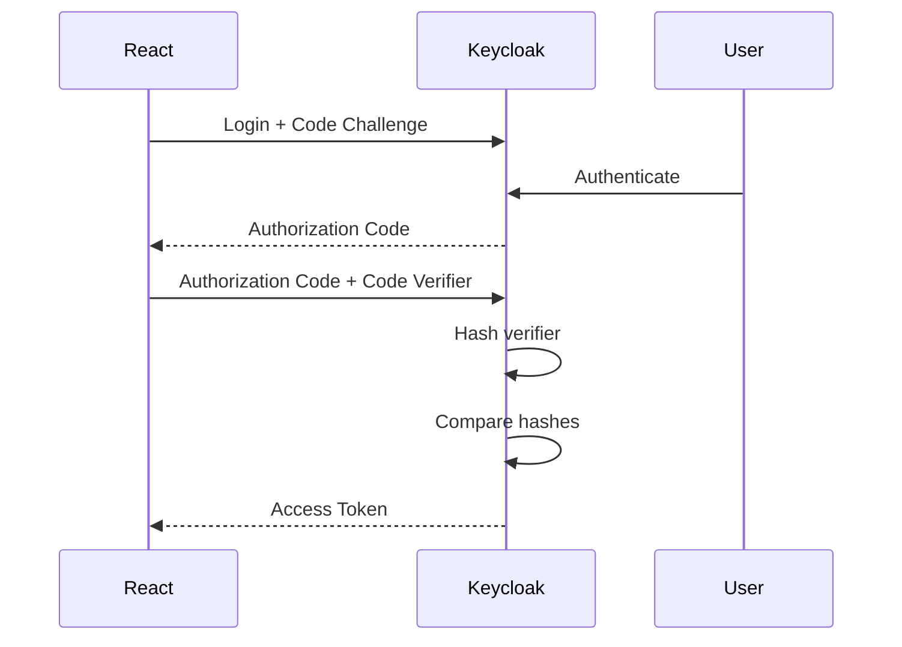

# IAM knowledge

## Authentication protocol

### OpenID Connect (OIDC)
OpenID Connect is an identity layer on top of the OAuth 2.0 protocol. It allows clients to verify the identity of the end-user based on the authentication performed by an authorization server, as well as to obtain basic profile information about the end-user in an interoperable and REST-like manner.

### OAuth 2.0
OAuth 2.0 is an **authorization** framework that enables applications to obtain limited access to user accounts on an HTTP service, such as Google, Facebook, GitHub, and others. It works by delegating user authentication to the service that hosts the user account, and authorizing third-party applications to obtain access tokens (strings that represent a specific scope, lifetime, and permissions) on behalf of the user.

### JWT (JSON Web Tokens)
JWT is an open standard (RFC 7519) that defines a compact and self-contained way for securely transmitting information between parties as a JSON object. This information can be verified and trusted because it is digitally signed. JWTs can be signed using a secret (with the HMAC algorithm) or a public/private key pair using RSA or ECDSA.

### PKCE (Proof Key for Code Exchange)
PKCE is a technique used to mitigate the threat of authorization code interception attacks in OAuth 2.0 flows. It works by having the client generate a code verifier and a code challenge before initiating the authorization request. The code challenge is sent to the authorization server along with the authorization request, and the code verifier is used to validate the authorization code when it is exchanged for an access token.

PKCE flow:

