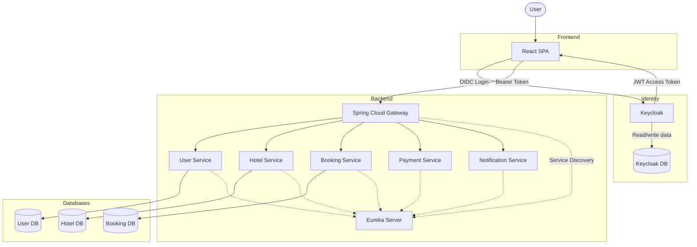
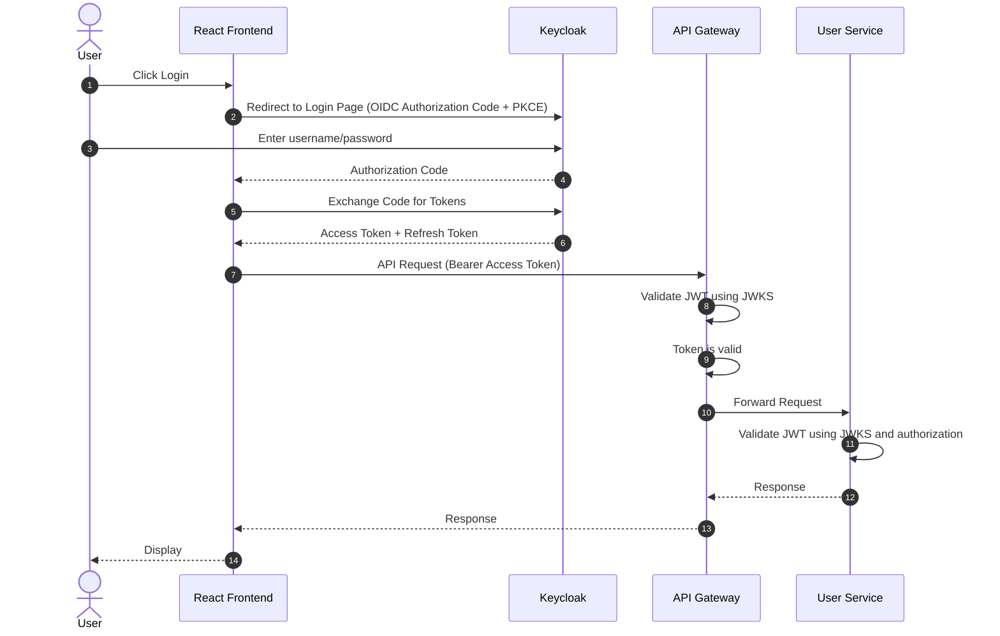
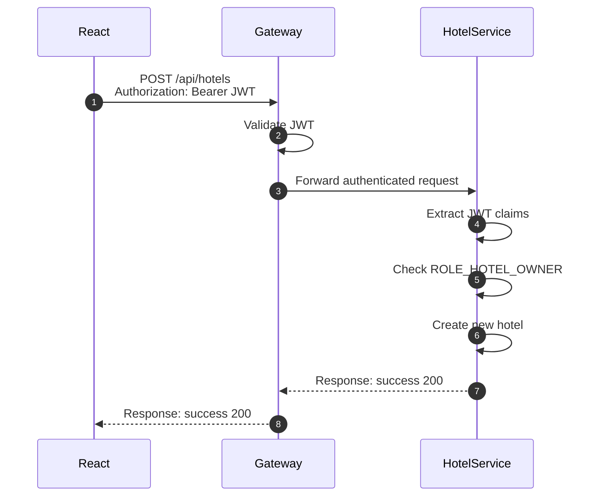
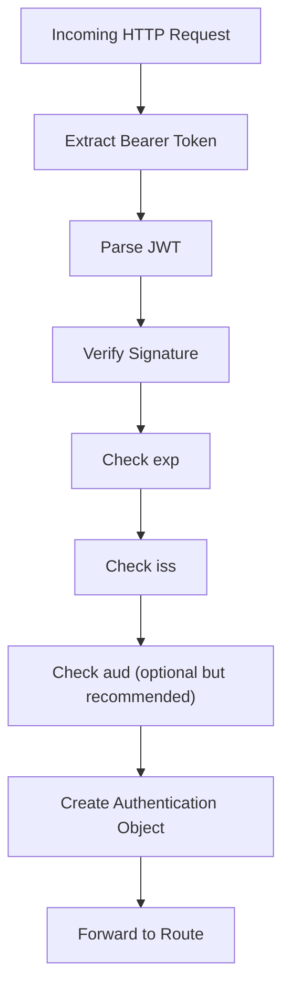
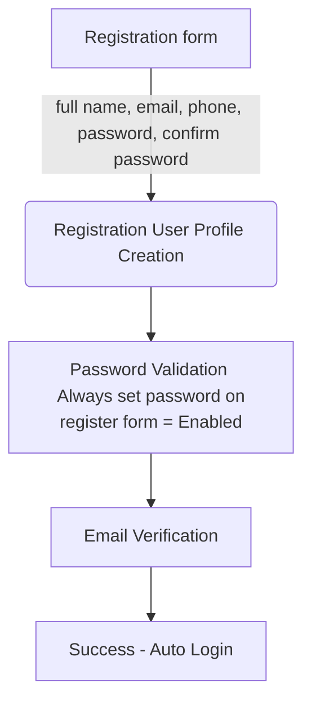
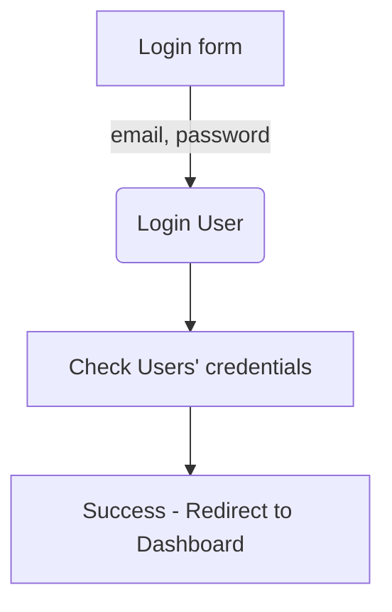
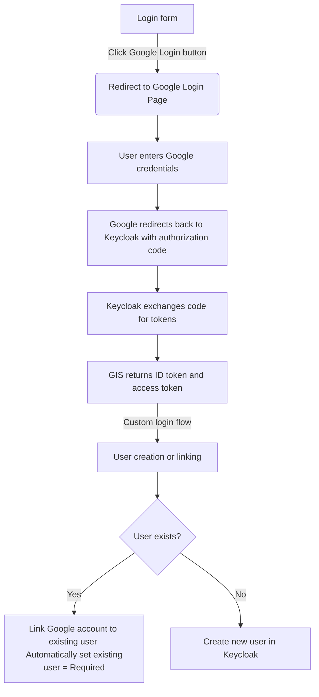

# I. Giới thiệu về Keycloak

## 1. Keycloak là gì?

Keycloak là một giải pháp **Identity and Access Management (IAM)** mã nguồn mở, cung cấp khả năng authentication, authorization và quản lý user cho application và service.

Keycloak chịu trách nhiệm cho:
- Login
- Logout
- Password hashing
- Password reset
- Forgot password
- MFA
- Email verification
- Sessions
- Access Token
- Refresh Token
- SSO
- OAuth2
- OpenID Connect
- Social Login
- User Credentials
- Role management

## 2. Vị trí của Keycloak trong kiến trúc hệ thống

### 2.1 Kiến trúc Authentication



> Thay vì gọi Keycloak để validate mỗi request, gateway và các service (được cấu hình là resource servers) thường **validate JWT cục bộ (local) bằng JWKS (public signing keys) do Keycloak publish**. Cách này tránh phải gọi thêm 1 network hop cho mỗi request, trong khi vẫn đảm bảo signature, issuer, audience và expiration của token hợp lệ.

### 2.2 Authentication Flow



### 2.3 Authorization Flow



# II. Tích hợp Keycloak

Quá trình tích hợp Keycloak được chia thành 9 giai đoạn (phase), liệt kê dưới đây:

| Phase | Chủ đề                  | Mục tiêu                                   |
| ----- | ---------------------- | ------------------------------------------ |
| 1     | Khái niệm IAM           | Hiểu Keycloak thực chất thay thế cho phần nào |
| 2     | Cài đặt Keycloak        | Môi trường local development               |
| 3     | Cấu hình Realm          | Clients, Roles, Users                      |
| 4     | Tích hợp Gateway        | JWT authentication                         |
| 5     | Tích hợp User Service   | Đồng bộ user & profile                     |
| 6     | Tích hợp React             | OIDC login, Registration, Logout                     |
| 7 | Phân quyền mặc định cho user mới | Default Group và Realm Role |
| 8     | Required Actions trong Realm | Các required Actions được bặt tắt tuỷ chỉnh                      |
| 9     | Logout     | Thiết kế quản lý user                      |

# 2.1 Khái niệm IAM và Keycloak

JWT do Keycloak phát hành chứa:
- **sub**: UUID của user trong DB Keycloak (= `id` PK trong DB của user service)
- email
- name
- scope: giá trị có thể là `openid`, `profile`, `email`
- realm_access: chứa các role được gán cho user trong realm, roles: giá trị có thể là `CUSTOMER`, `HOTEL_STAFF`, `HOTEL_OWNER`, `PLATFORM_ADMIN`
- iat: thời điểm phát hành token (issued at)
- exp: thời điểm hết hạn (expiration)
- iss: issuer
- aud: audience, giá trị có thể là `account`, `gateway`, `user-service`, `hotel-service`, `booking-service`, `payment-service`, `notification-service`

ví dụ về JWT payload của Keycloak:
```json
{
  "exp": 1784597763,
  "iat": 1784597463,
  "auth_time": 1784597461,
  "jti": "onrtac:a5d48a60-7288-50ce-7589-7921f167b3f4",
  "iss": "http://localhost:8085/realms/hotel-booking-system",
  "aud": "account",
  "sub": "19248615-e184-4fe8-baf8-6931512a2658",
  "typ": "Bearer",
  "azp": "frontend-client",
  "sid": "o-tDg38v3GPtEnKkH59LpO2K",
  "acr": "1",
  "allowed-origins": [
    "http://localhost:3000"
  ],
  "realm_access": {
    "roles": [
      "offline_access",
      "CUSTOMER",
      "uma_authorization",
      "default-roles-hotel-booking-system"
    ]
  },
  "resource_access": {
    "account": {
      "roles": [
        "manage-account",
        "manage-account-links",
        "view-profile"
      ]
    }
  },
  "scope": "openid email profile",
  "email_verified": true,
  "phone": "0987654321",
  "fullName": "minh daon",
  "preferred_username": "minhzyr04@gmail.com",
  "email": "minhzyr04@gmail.com"
}
```

# 2.2 Cài đặt Keycloak và kết nối với Postgres DB

- Cài Keycloak bằng docker, image sử dụng: `quay.io/keycloak/keycloak:26.7.0`.
- Kết nối Keycloak với Postgres DB riêng (`keycloak-db`) để persist dữ liệu qua docker volume.

Config trong `docker-compose.yml`:
```yaml
keycloak-db:
    image: postgres:16-alpine
    container_name: keycloak-db

    ports:
      - "${KEYCLOAK_DB_EXTERNAL_PORT:-5437}:${KEYCLOAK_DB_PORT:-5432}"
    environment:
      POSTGRES_DB: ${KEYCLOAK_DB_NAME:-keycloak_db}
      POSTGRES_USER: ${KEYCLOAK_DB_USER:-db}
      POSTGRES_PASSWORD: ${KEYCLOAK_DB_PASSWORD:-}

    volumes:
      - keycloak-db-data:/var/lib/postgresql/data

    healthcheck:
      test: ["CMD-SHELL", "pg_isready -U ${KEYCLOAK_DB_USER:-db} -d ${KEYCLOAK_DB_NAME:-keycloak_db}"]
      interval: 5s
      timeout: 5s
      retries: 10

    networks:
      - app-network

  keycloak:
    image: quay.io/keycloak/keycloak:26.7.0
    container_name: keycloak
    command: start-dev
    depends_on:
      keycloak-db:
        condition: service_healthy
    environment:
      KC_DB: ${KC_DB:-postgres}
      KC_DB_URL_HOST: ${KC_DB_URL_HOST:-keycloak-db}
      KC_DB_URL_DATABASE: ${KC_DB_URL_DATABASE:-keycloak_db}
      KC_DB_USERNAME: ${KC_DB_USERNAME:-db}
      KC_DB_PASSWORD: ${KC_DB_PASSWORD:-your-password}

      KC_BOOTSTRAP_ADMIN_USERNAME: ${KC_BOOTSTRAP_ADMIN_USERNAME:-}
      KC_BOOTSTRAP_ADMIN_PASSWORD: ${KC_BOOTSTRAP_ADMIN_PASSWORD:-}

    ports:
      - "8085:8080"

    networks:
      - app-network
```

# 2.3 Cấu hình Realm

Trong Keycloak Admin Console, tạo realm mới tên `hotel-booking-system` làm IAM cho toàn hệ thống. Realm này gồm các thành phần:

- **clients**: các application sử dụng Keycloak. Có 2 client:
    - `frontend-client`: React app
        - Client type: `openid-connect`
        - Access Type: `public`
        - Valid Redirect URIs: `http://localhost:3000/*`
        - Web Origins: `http://localhost:3000`
        - dùng PKCE cho authorization code exchange
        - lý do: frontend không thể lưu client secret an toàn, nên dùng public client type kèm PKCE để bảo vệ bước exchange authorization code.
    - `api-gateway`: Spring Cloud Gateway
        - Client type: `openid-connect`
        - Access Type: `confidential`
        - Valid Redirect URIs: `http://localhost:8080/*`
        - Web Origins: `http://localhost:8080`
        - dùng Client Authentication
- **roles**: các role trong hệ thống, có 4 role:
    - `CUSTOMER`
    - `HOTEL_STAFF`
    - `HOTEL_OWNER`
    - `PLATFORM_ADMIN`
- **groups**: nhóm user, 1 group có thể được gán nhiều role. Có 4 group:
    - `customer`: role `CUSTOMER`
    - `hotel staff`: role `HOTEL_STAFF`
    - `hotel owner`: role `HOTEL_OWNER`
    - `platform admins`: role `PLATFORM_ADMIN`

- **users**: user của hệ thống, mỗi user có thể được gán nhiều role và group.

# 2.4 Bảo mật API Gateway với Keycloak (JWT + JWKS)

API Gateway verify JWT do Keycloak phát hành bằng JWKS (JSON Web Key Set) lấy từ Keycloak để đảm bảo tính xác thực (authenticity) và toàn vẹn (integrity) của token. Gateway kiểm tra signature, issuer, audience và expiration của token trước khi forward request xuống các service phía sau.

API Gateway dùng Spring Security (đã implement sẵn) để:
- download JWKS từ Keycloak
- cache key
- verify signature
- check exp, issuer
- build authenticated principal

Các bước cấu hình Spring Security cho API Gateway:

- Cấu hình API Gateway thành OAuth2 Resource Server: thêm dependency vào `pom.xml`
```xml
<dependencies>
    <dependency>
        <groupId>org.springframework.boot</groupId>
        <artifactId>spring-boot-starter-security</artifactId>
    </dependency>

    <dependency>
        <groupId>org.springframework.boot</groupId>
        <artifactId>spring-boot-starter-oauth2-resource-server</artifactId>
    </dependency>
</dependencies>
```

- Cấu hình `application.yml` cho JWKS URI và JWT issuer URI (do có sự khác biệt giữa issuer của JWT — Keycloak chạy ở `localhost:8085` — và địa chỉ Keycloak server trong docker network dùng để lấy JWKS — `keycloak:8080`):
```yaml
keycloak:
  jwks-uri: ${KEYCLOAK_JWKS_URI:http://keycloak:8080/realms/hotel-booking-system/protocol/openid-connect/certs}
  issuer-uri: ${KEYCLOAK_ISSUER_URI:http://localhost:8085/realms/hotel-booking-system}
```

> Spring Security sẽ tự động fetch JWKS từ well-known endpoint của Keycloak: `http://keycloak:8080/realms/hotel-booking-system/protocol/openid-connect/certs` và dùng nó để validate JWT của các request đến.
>
> **Vì sao phải tách riêng `jwks-uri` và `issuer-uri`?** Vì `iss` claim trong JWT do Keycloak phát hành luôn mang giá trị URL mà **browser** dùng để truy cập Keycloak (`localhost:8085`, để Admin Console và luồng OIDC redirect hoạt động đúng từ phía trình duyệt), trong khi Gateway (chạy trong docker network) phải gọi Keycloak qua service name nội bộ (`keycloak:8080`) để lấy JWKS — 2 network path khác nhau. Nếu dùng chung 1 `issuer-uri` cho cả 2 mục đích (cách mặc định của Spring khi chỉ khai `spring.security.oauth2.resourceserver.jwt.issuer-uri`), Spring sẽ tự động discovery `.well-known` từ chính issuer URL đó và **validate issuer bị lệch** với JWKS URI thực tế cần gọi trong docker network → lỗi xác thực issuer. Cách khắc phục ở đây là tự định nghĩa `JwtDecoder` bean, tách bạch rõ "nơi lấy JWKS" (`jwks-uri`, dùng docker service name) và "giá trị issuer mong đợi khi validate" (`issuer-uri`, dùng URL browser-facing) — đây là pattern phổ biến khi Identity Provider nằm sau network topology khác domain với backend nội bộ, không phải workaround tạm.

- Cấu hình security chain:
```java
@Configuration
@EnableWebFluxSecurity
public class SecurityConfig {

        
    @Bean
    SecurityWebFilterChain springSecurityFilterChain(ServerHttpSecurity http) {

        return http
                .csrf(ServerHttpSecurity.CsrfSpec::disable)
                .cors(Customizer.withDefaults()) // without .cors(), Spring security ignores cors config in application.yml
                .authorizeExchange(exchanges -> exchanges
                        .pathMatchers(HttpMethod.OPTIONS, "/**").permitAll() // allow preflight request to pass security filter 
                        .pathMatchers(
                                "/actuator/**",
                                "/eureka/**"
                        ).permitAll()
                        .anyExchange().authenticated()
                )

                .oauth2ResourceServer(oauth2 ->
                        oauth2.jwt(Customizer.withDefaults())
                )

                .build();
    }
}

```

**Luồng Spring Security của API Gateway**:


## 2.5 Chỉnh sửa User Service để phù hợp với việc tích hợp Keycloak

User service không còn quản lý authentication và authorization nữa. Thay vào đó, trách nhiệm này được giao (delegate) cho Keycloak. User service chỉ còn chịu trách nhiệm quản lý user profile và các dữ liệu liên quan đến user.

### 2.5.1 DB schema

User service **không còn lưu** `password_hash`, `roles`, `user_roles`, `auth_providers`, `user_auth_providers`, `refresh_tokens` — toàn bộ được Keycloak đảm nhiệm. Bảng `users` dùng luôn `id` (UUID PK) làm định danh người dùng trong Keycloak (khớp với claim `sub` từ JWT).

**Bảng `users`**

| Cột | Kiểu dữ liệu | Ràng buộc | Mô tả                              |
| --- | --- | --- |------------------------------------|
| id | UUID | PK | Định danh người dùng (Keycloak User ID từ sub claim) |
| email | VARCHAR(255) | UNIQUE, NOT NULL | Email đăng nhập                    |
| phone | VARCHAR(20) | NULL | Số điện thoại                      |
| full_name | VARCHAR(255) | NOT NULL | Họ tên                             |
| avatar_url | VARCHAR(500) | NULL | Ảnh đại diện                       |
| address | VARCHAR(500) | NULL | Địa chỉ                            |
| status | ENUM | NOT NULL, DEFAULT 'ACTIVE' | ACTIVE, LOCKED         |
| created_at | TIMESTAMP | NOT NULL |                                    |
| updated_at | TIMESTAMP | NOT NULL |                                    |
| is_deleted | BOOLEAN | NOT NULL, DEFAULT false | Cờ đánh dấu xóa mềm (soft delete)  |


**Bảng `tenants`**

| Cột | Kiểu dữ liệu | Ràng buộc | Mô tả |
| --- | --- | --- | --- |
| id | UUID | PK | Định danh tenant |
| owner_user_id | UUID | FK → users.id, NOT NULL | Chủ khách sạn sở hữu tenant |
| name | VARCHAR(255) | NOT NULL | Tên doanh nghiệp/chuỗi khách sạn |
| status | ENUM | NOT NULL, DEFAULT 'ACTIVE' | ACTIVE, SUSPENDED |
| created_at | TIMESTAMP | NOT NULL | |
| updated_at | TIMESTAMP | NOT NULL | |
| is_deleted | BOOLEAN | NOT NULL, DEFAULT false | Cờ đánh dấu xóa mềm (soft delete) |

**Bảng `subscription_plans`**

| Cột | Kiểu dữ liệu | Ràng buộc | Mô tả |
| --- | --- | --- | --- |
| id | UUID | PK | Định danh gói thuê bao |
| code | VARCHAR(50) | UNIQUE, NOT NULL | FREE, BASIC, PRO |
| name | VARCHAR(255) | NOT NULL | Tên gói thuê bao |
| description | VARCHAR(500) | NULL | Mô tả gói |
| price | DECIMAL(12,2) | NOT NULL, DEFAULT 0 | Giá gói |
| billing_cycle | ENUM | NOT NULL | MONTHLY, YEARLY |
| created_at | TIMESTAMP | NOT NULL | |
| updated_at | TIMESTAMP | NOT NULL | |
| is_deleted | BOOLEAN | NOT NULL, DEFAULT false | Cờ đánh dấu xóa mềm (soft delete) |

**Bảng `tenant_subscriptions`**

| Cột | Kiểu dữ liệu | Ràng buộc | Mô tả |
| --- | --- | --- | --- |
| id | UUID | PK | Định danh lịch sử subscription của tenant |
| tenant_id | UUID | FK → tenants.id, NOT NULL | Tenant sử dụng gói |
| subscription_plan_id | UUID | FK → subscription_plans.id, NOT NULL | Gói thuê bao |
| status | ENUM | NOT NULL, DEFAULT 'ACTIVE' | ACTIVE, EXPIRED, CANCELLED, SUSPENDED |
| started_at | TIMESTAMP | NOT NULL | Thời điểm bắt đầu dùng gói |
| expires_at | TIMESTAMP | NULL | Thời điểm hết hạn |
| created_at | TIMESTAMP | NOT NULL | |
| is_deleted | BOOLEAN | NOT NULL, DEFAULT false | Cờ đánh dấu xóa mềm (soft delete) |

> Ràng buộc nghiệp vụ: mỗi `tenant` có thể có nhiều bản ghi trong `tenant_subscriptions` theo lịch sử, nhưng tại một thời điểm chỉ được có một subscription có `status = ACTIVE`.


**Bảng `account_lock_history`**

| Cột | Kiểu dữ liệu | Ràng buộc | Mô tả |
| --- | --- | --- | --- |
| id | UUID | PK | |
| user_id | UUID | FK → users.id, NOT NULL | Tài khoản bị khóa |
| locked_by | UUID | FK → users.id, NOT NULL | Admin thực hiện |
| reason | VARCHAR(500) | NOT NULL | |
| locked_at | TIMESTAMP | NOT NULL | |
| unlocked_at | TIMESTAMP | NULL | |
| is_deleted | BOOLEAN | NOT NULL, DEFAULT false | Cờ đánh dấu xóa mềm (soft delete) |

**Quan hệ**
- `tenants.owner_user_id` → `users.id` (1–1 trong phạm vi MVP: một Owner sở hữu một tenant).
- `tenant_subscriptions.tenant_id` → `tenants.id` (N–1: một tenant có nhiều lịch sử subscription).
- `tenant_subscriptions.subscription_plan_id` → `subscription_plans.id` (N–1).
- `account_lock_history.user_id`, `account_lock_history.locked_by` → `users.id` (N–1, hai quan hệ riêng tới cùng bảng).

### 2.5.2 Đồng bộ dữ liệu giữa Keycloak và User Service

- **Khi user mới được tạo**: dùng chiến lược **Lazy Creation** — khi user đăng nhập lần đầu, user service sẽ kiểm tra user đã tồn tại trong DB của mình chưa. Nếu chưa, tạo mới bản ghi user dựa trên thông tin lấy từ Keycloak.
- **Cập nhật thông tin user**: (email, phone, name)
- **Đổi mật khẩu**
- **Xoá user**: khi user bị xoá ở Keycloak, user service sẽ đánh dấu bản ghi user tương ứng là đã xoá (soft delete) trong DB của mình.

### 2.5.3 User Service API endpoints phục vụ tích hợp Keycloak
- `POST /api/users`: tạo mới user từ Keycloak về User Service DB.

### 2.5.4 Cấu hình Security cho User Service
- User Service phải là một OAuth2 Resource Server dùng Spring Security để validate JWT do Keycloak phát hành.

`pom.xml`:
```xml
<dependency>
    <groupId>org.springframework.boot</groupId>
    <artifactId>spring-boot-starter-security</artifactId>
</dependency>
<dependency>
    <groupId>org.springframework.boot</groupId>
    <artifactId>spring-boot-starter-oauth2-resource-server</artifactId>
</dependency>
```

- Cấu hình JWT issuer URI và JWKS URI trong `application.properties` và class Java config:
```properties
keycloak:
  jwks-uri: ${KEYCLOAK_JWKS_URI:http://keycloak:8080/realms/hotel-booking-system/protocol/openid-connect/certs}
  issuer-uri: ${KEYCLOAK_ISSUER_URI:http://localhost:8085/realms/hotel-booking-system}
```

```java
@Configuration
public class JwtConfig{
    @Value("${keycloak.jwks-uri}")
    private String jwksUri;
    @Value("${keycloak.issuer-uri}")
    private String issuerUri;

    @Bean

    public JwtDecoder jwtDecoder() {
        NimbusJwtDecoder jwtDecoder = NimbusJwtDecoder
            .withJwkSetUri(jwksUri)
            .build();

        OAuth2TokenValidator<Jwt> withIssuer =
            JwtValidators.createDefaultWithIssuer(issuerUri);
        jwtDecoder.setJwtValidator(withIssuer);

        return jwtDecoder;
    }
}
```

## 2.6 Tích hợp React với Keycloak (Login, Registration, Logout)

**Dependencies**:
- `keycloak-js`: Keycloak JavaScript adapter để tích hợp Keycloak vào React app. Dependency này cung cấp các method cho:
    - Khởi tạo Keycloak
    - Xử lý login và logout
    - Quản lý user session
    - Refresh token

Các bước thực hiện:

1. Tạo file `src/features/auth/keycloak.js` để khởi tạo Keycloak instance, cấu hình Keycloak server URL, realm, và client ID.
2. `src/features/auth/utils/postAuthRedirect.js`: xử lý redirect sau khi authenticate xong (login/logout thành công), lưu và khôi phục `redirectTo`, `checkoutDraft` qua `sessionStorage`.
3. `public/silent-check-sso.html`: xử lý silent SSO check để refresh token mà không cần user tương tác.
4. Trong `AuthContext.js`, thêm/chỉnh sửa các method: `login()`, `register()`, `googleLogin()`, `isAuthenticated`, `logout()` và khởi tạo (init) Keycloak.
5. `axiosClient.js`: thêm interceptor để đính access token vào outgoing request, xử lý refresh token bằng `updateToken()`.
6. Trong `authStorage.js`, `storageKey.js`, `authService.js`: xoá phần lưu access token, user info ở `localStorage` (Keycloak lưu các thông tin này trong memory).
7. `LoginPage.jsx`, `RegisterPage.jsx`, `GoogleLoginButton.jsx`: gọi các method của Keycloak để dùng UI login/register hosted bởi Keycloak.
8. Thêm biến môi trường vào `.env` cho Keycloak:
```text
VITE_KEYCLOAK_URL=
VITE_KEYCLOAK_REALM=
VITE_KEYCLOAK_CLIENT_ID=
```

9. Cấu hình Email cho realm `hotel-booking-system`:

    Template:
    - from: my-email

    Connection & authentication:
    - SMTP server: smtp.gmail.com
    - Port: 587
    - Encryption: STARTTLS
    - Auth:
        - Enable: ON
        - username: my-email
        - password: gmail-app-password

10. Cấu hình Keycloak cho Google Login:
    - Thêm Google identity provider trong Keycloak Admin Console
    - Config:
        - redirect URI: `http://localhost:8085/realms/hotel-booking-system/broker/google/endpoint` (thêm URI này vào Authorized Redirect URI ở Google Cloud Console của project Google)
        - set alias=`google`
        - Client ID và Client Secret: lấy từ Google Cloud Console của project Google
        - JWT Authorization grant: ON
        - Trust Email: ON (không cần verify lại email từ Google sau lần login đầu)
        - First login flow override: `first broker login`

11. Custom Authentication Flow:

    - **Registration flow**:


    - **Login Email/password flow**:



    - **Login Google Keycloak flow**: tạo custom login flow duplicate từ `first broker login flow`


12. Customize trang login Keycloak (Keycloak Custom Theme):

    ### 13.1 Tổng quan theme

    Theme `hotelhub` chỉ can thiệp vào **login theme** (đăng nhập, đăng ký, xác thực email, các trang bổ sung thông tin/thông báo/lỗi), giao diện được thiết kế lại giống hệt `AuthLayout.jsx` cũ của frontend (layout 2 cột, branding panel bên trái).

    Danh sách file trong theme (`themes/hotelhub/login/`):

    | File | Vai trò |
    | --- | --- |
    | `theme.properties` | Khai báo `parent=keycloak`, `styles`, `scripts`, `locales` |
    | `template.ftl` | Layout khung chung (macro `registrationLayout`), toàn bộ trang tự viết đều import và dùng chung macro này |
    | `login.ftl` | Form Email/Mật khẩu + nút "Tiếp tục với Google" |
    | `register.ftl` | Form Họ và tên / Email / SĐT / Mật khẩu / Xác nhận mật khẩu |
    | `login-verify-email.ftl` | Trang "Kiểm tra hộp thư" hiện ngay sau khi đăng ký (Required Action `VERIFY_EMAIL`) |
    | `login-update-password.ftl` | Trang đặt mật khẩu mới (Required Action `UPDATE_PASSWORD`) |
    | `login-update-profile.ftl` | Trang bổ sung thông tin còn thiếu — `fullName`/`phone` (Required Action `UPDATE_PROFILE`, tự động kích hoạt khi User Profile có attribute bắt buộc mà user đang thiếu, không phân biệt user tạo qua form hay qua IDP) |
    | `idp-review-user-profile.ftl` | Trang "Hoàn tất hồ sơ" hiện ở lần đăng nhập Google đầu tiên (First Broker Login → execution "Review Profile"), thu thập `fullName`/`phone` mà Google không cung cấp |
    | `info.ftl` | Trang thông báo chung (ví dụ khi link xác thực email được mở ở thiết bị/trình duyệt khác — không resume được session gốc) |
    | `error.ftl` | Trang lỗi chung |
    | `resources/css/styles.css` | CSS thuần, dịch thủ công từ token Tailwind (`slate-*`, `sky-*`, `blue-*`, `red-*`, `green-*`) đang dùng ở `AuthLayout.jsx`/`FormField.jsx` — **2 nguồn tách biệt, cần đồng bộ tay** nếu sau này đổi thiết kế React |
    | `resources/js/app.js` | Script toggle hiện/ẩn mật khẩu |
    | `messages/messages_vi.properties`, `messages_en.properties` | Nhãn field + message tuỳ biến |
    | `user-profile.json` | Cấu hình Declarative User Profile (đính kèm riêng, dán vào Admin Console) |

    > Theme dùng **Declarative User Profile** (mặc định bật từ Keycloak ~22 trở lên).

    ### 13.2 Các lưu ý bắt buộc khi maintain theme (rút ra từ quá trình debug thực tế)

    - **Tên file `register.ftl` là bắt buộc**, không phải `register-user-profile.ftl` — Keycloak luôn tìm đúng tên `register.ftl` cho endpoint đăng ký (kể cả khi realm bật Declarative User Profile). Đặt sai tên sẽ khiến Keycloak fallback dùng `register.ftl` của theme cha `keycloak`, gây lỗi 500 do macro `registrationLayout` không khớp tham số.

    - **`template.ftl` phải khai báo đủ bộ tham số chuẩn của Keycloak** trong macro `registrationLayout`: `bodyClass`, `displayInfo`, `displayMessage`, `displayRequiredFields`, `displayWide`, `showAnotherWayIfPresent` (có giá trị mặc định). Lý do: bất kỳ trang `.ftl` nào **không** được override (kế thừa nguyên trạng từ theme cha `keycloak`) vẫn sẽ `<#import "template.ftl">` — và do cơ chế child-theme-override, import này **luôn resolve về `template.ftl` của theme `hotelhub`**, không phải của theme cha. Nếu macro thiếu tham số nào mà trang kế thừa đó truyền vào → lỗi `Macro "registrationLayout" has no parameter with name "..."`.

    - **Nhiều trang inherited từ theme cha dùng cơ chế `<#nested "section">`** (gọi `#nested` nhiều lần với tên vùng khác nhau — `header`, `form`, ... — nội dung nested tương ứng check qua biến `section`). Vì các trang tự viết trong theme `hotelhub` chỉ dùng `<#nested>` (không có tham số) theo kiểu flat content, **bất kỳ trang nào chưa được override sẽ lỗi** `section` evaluate to null khi rơi vào flow tương ứng. Đã gặp thực tế với: `login-update-password.ftl` (Required Action Update Password), `idp-review-user-profile.ftl` (First Broker Login), `login-update-profile.ftl` (Required Action Update Profile). **Cách xử lý**: viết đè (override) từng file cụ thể theo mẫu flat content sẵn có trong theme, không cố mô phỏng lại cơ chế `section` của theme cha. Các trang **có khả năng** cần override thêm nếu bật thêm tính năng sau này: `login-reset-password.ftl` (nếu bật "Forgot password"), `login-config-totp.ftl`/`webauthn-register.ftl` (nếu bật MFA), `terms.ftl` (nếu bật "Terms and conditions").

    - **`messagesPerField.get()` chỉ nhận 1 tham số** ở phiên bản Keycloak đang dùng (không phải overload nhận nhiều field name như một số phiên bản/tài liệu khác) — dùng `messagesPerField.get('tenField')`, không dùng `messagesPerField.get('field1','field2')`. Riêng `existsError(...)` vẫn nhận nhiều field bình thường.

    ### 13.3 Setup theme

    **1. Copy theme vào Keycloak**

    Chạy trực tiếp (không Docker):
    ```bash
    cp -r hotelhub $KEYCLOAK_HOME/themes/hotelhub
    ```

    Docker (mount volume, dev nhanh):
    ```yaml
    services:
      keycloak:
        image: quay.io/keycloak/keycloak:26.7.0
        volumes:
          - ./keycloak/theme/hotelhub:/opt/keycloak/themes/hotelhub
        command: start-dev
    ```

    Docker (build vào image, dùng cho production):
    ```dockerfile
    FROM quay.io/keycloak/keycloak:26.7.0
    COPY keycloak-theme/hotelhub /opt/keycloak/themes/hotelhub
    RUN /opt/keycloak/bin/kc.sh build
    ```

    Sau khi copy, **restart Keycloak** để nhận theme mới (`start-dev` đã tự tắt theme cache; production cần set thêm `spi-theme-static-max-age=-1` và `spi-theme-cache-themes=false` nếu muốn tắt cache khi debug).

    **2. Gán theme cho realm**

    Admin Console → **Realm settings → Themes**: Login theme = `hotelhub` → Save.

    Admin Console → **Realm settings → Localization**: bật Internationalization, Default locale = `vi`, Supported locales thêm `vi`, `en`.

    **3. Cấu hình User Profile**

    Admin Console → **Realm settings → User profile → JSON editor**, dán nội dung file `user-profile.json` (đã cấu hình `username`, `email`, `fullName`, `phone` là bắt buộc; `firstName`/`lastName` giữ lại nhưng **không bắt buộc** vì form không hiển thị 2 field này).

    **4. Cấu hình realm login/registration**

    Admin Console → **Realm settings → Login**:
    - User registration: ON
    - Email as username: ON
    - Login with email: ON
    - Verify email: ON

    **5. Password Policy** (khớp hint hiển thị trên form đăng ký)

    Admin Console → **Authentication → Policies → Password policy**: Minimum Length `8`, Uppercase Characters `1`, Lowercase Characters `1`, Digits `1`.

    **6. Protocol Mappers** — đưa `fullName`/`phone` vào token

    Vì `fullName`/`phone` là custom attribute (không phải claim chuẩn OIDC), cần thêm protocol mapper để chúng xuất hiện trong ID Token/Access Token/UserInfo — frontend đọc các claim này để hiển thị và để gọi `POST /api/users`.

    Admin Console → **Clients → frontend-client → Client scopes → frontend-client-dedicated → Add mapper → By configuration → User Attribute**:

    | Mapper | Name | User Attribute | Token Claim Name | Claim JSON Type | ID token | Access token | Userinfo |
    | --- | --- | --- | --- | --- | --- | --- | --- |
    | 1 | fullName | `fullName` | `fullName` | String | ✅ | ✅ | ✅ |
    | 2 | phone | `phone` | `phone` | String | ✅ | ✅ | ✅ |

    **7. "Always set password on register form"**

    Ở execution **Password Validation** trong flow `registration`, option **"Always set password on register form" = Enabled**.

    Giải thích ý nghĩa (theo docstring chính thức của Keycloak): khi tắt (false) và "Verify Email" đang bật, mật khẩu **không** được set ngay ở form đăng ký, mà chỉ set **sau khi** email được xác thực (qua Required Action `Update Password` tự động gắn vào lúc đó) — đây là hướng được Keycloak khuyến nghị vì lý do bảo mật (ràng buộc việc tạo credential vào bằng chứng đã sở hữu email, tránh account-squatting bằng email không thuộc sở hữu). Khi bật (true, đang dùng trong project) — password field xuất hiện ngay trên form đăng ký, set được **trước khi** email verify xong, đúng với UX 1-form hiện tại (fullName/email/phone/password/confirm cùng lúc).

    > ⚠️ **Option này đã bị đánh dấu deprecated**, có thể bị Keycloak gỡ bỏ trong tương lai. Nếu bị gỡ, hành vi mặc định gần như chắc chắn sẽ chỉ còn lại **verify email → set password sau** (an toàn hơn). Khi đó cần: (1) bỏ 2 field password khỏi `register.ftl`, (2) bật lại Required Action `Update Password` làm default cho user mới, (3) trang `login-update-password.ftl` đã có sẵn trong theme, dùng lại được ngay không cần viết mới.

    **8. Cấu hình client `frontend-client`** (đã thống nhất trước đó, nhắc lại để đối chiếu)

    - Client authentication: OFF (public client)
    - Standard flow: ON
    - Direct access grants: OFF
    - Advanced → PKCE Code Challenge Method: S256
    - Valid redirect URIs / Valid post logout redirect URIs: domain frontend tương ứng
    - Web origins: domain frontend tương ứng

    ### 13.4 Test nhanh luồng end-to-end

    1. Frontend → `/register` → "Đăng ký với email" → chuyển sang `register.ftl` (theme mới) → điền đủ form → submit.
    2. Keycloak tạo user (chưa verified) → hiện `login-verify-email.ftl` ("Kiểm tra hộp thư của bạn").
    3. Mở email, bấm link xác thực **trên cùng trình duyệt/tab đã đăng ký** → Keycloak verify xong → tự động hoàn tất login → redirect về `<frontend-origin>/verify-email` kèm auth code → frontend exchange token → `VerifyEmailPage` hiện "Xác thực email thành công".
    4. `useSyncUserProfile` (hook chạy ngầm toàn app) gọi `POST /api/users` với `{ keycloakId, fullName, email, phone }` để tạo record trong User DB — xem chi tiết ở bước 14.

    > **Lưu ý:** nếu link xác thực được mở ở **thiết bị/trình duyệt khác** nơi đã đăng ký, Keycloak không "resume" được session cũ để redirect thẳng về frontend — chỉ hiển thị `info.ftl` báo xác thực thành công, user cần tự quay lại app và đăng nhập bình thường. `useSyncUserProfile` vẫn tạo record đúng trong trường hợp này (xem bước 14), nên hệ thống vẫn nhất quán dữ liệu dù rơi vào case này.

14. Đồng bộ thông tin user từ Keycloak sang User Service:
    - Khi user đăng nhập, gửi request đến API `/api/users` để tạo user trong User Service nếu chưa tồn tại. User service extract thông tin user từ JWT và tạo bản ghi user mới trong DB của mình.
    - User service controller lấy user id từ JWT claim `sub` (dùng làm `id` PK); `email`, `fullName`, `phone` từ payload `CreateUserRequest`.
    - **`POST /api/users` bắt buộc phải idempotent theo `id`** (upsert / bỏ qua nếu đã tồn tại), vì frontend gọi lại API này mỗi phiên trình duyệt (không đảm bảo chỉ gọi đúng 1 lần duy nhất trong đời user — xem giải thích ở mục dưới).
    - **Cơ chế gọi ở phía frontend** (`useSyncUserProfile` hook, chạy ở component gốc `App.jsx`): không cố xác định chính xác "đây có phải lần đăng nhập đầu tiên" (vì `sessionStorage` bị xoá khi đóng tab/đổi thiết bị, không đáng tin cho mục đích này) — chỉ đảm bảo gọi **ít nhất 1 lần mỗi phiên trình duyệt**, dựa vào flag lưu trong `sessionStorage` theo user id để tránh gọi lặp lại nhiều lần trong cùng phiên. Việc đảm bảo "chỉ tạo 1 bản ghi duy nhất" là trách nhiệm của backend (upsert theo `id`), không phải frontend.
    - Nếu cần biết chính xác "đây là lần đầu" (ví dụ để hiện onboarding UI), nên dựa vào **status code response** của `POST /api/users` (`201 Created` = user mới, `200 OK` = đã tồn tại) thay vì suy đoán ở phía client.

## 2.7 Required Actions trong Realm

Bảng dưới liệt kê trạng thái các Required Action đang cấu hình cho realm `hotel-booking-system` (Admin Console → **Authentication → Required actions**), kèm lý do:

| Required Action | Enabled | Set as default action | Lý do |
| --- | --- | --- | --- |
| **Verify Email** | ON | ON | Bắt buộc user xác thực quyền sở hữu email trước khi tài khoản được coi là hợp lệ (áp dụng cho đăng ký qua form email/password). Với user đăng nhập Google, IDP có **Trust Email = ON** nên bước này được bỏ qua (Google đã tự verify). |
| **Update Password** | OFF | **OFF** | Vì execution **Password Validation** trong flow `registration` đang bật **"Always set password on register form" = Enabled**, mật khẩu được set ngay lúc đăng ký — không cần ép user đổi mật khẩu ở bước sau nữa. |
| **Update Profile** | ON | OFF | Không set làm default action — nhưng vẫn có thể tự động kích hoạt **độc lập với toggle này**, vì `fullName`/`phone` được khai là attribute bắt buộc trong **User Profile** (Admin Console → Realm settings → User profile). Khi user (đặc biệt là user tạo qua Google) thiếu 1 trong 2 field này, Keycloak vẫn ép hiển thị trang bổ sung thông tin (`login-update-profile.ftl` hoặc `idp-review-user-profile.ftl` tuỳ luồng) — **muốn tắt hẳn phải sửa ở User Profile config** (bỏ `required`), không sửa được chỉ bằng cách tắt Required Action này. |
| **Configure OTP** | OFF | OFF | Chưa triển khai MFA trong phạm vi dự án hiện tại. |
| **Webauthn Register** / **Webauthn Register Passwordless** | OFF | OFF | Chưa dùng passkey/WebAuthn. |
| **Terms and Conditions** | OFF | OFF | Khớp với execution "Terms and conditions" đang **Disabled** trong flow `registration`. |
| **Delete Account** | OFF | OFF | Không cho phép user tự xoá tài khoản (mặc định Keycloak, chưa có nhu cầu thay đổi). |
| **Update User Locale** | ON (mặc định Keycloak) | OFF | Giữ mặc định, chưa cần tuỳ biến theo locale riêng từng user. |

> ⚠️ Khi bật thêm bất kỳ Required Action nào ở trên (đặc biệt Configure OTP / Webauthn / Terms), cần kiểm tra xem theme `hotelhub` đã có file `.ftl` tương ứng chưa (xem bảng danh sách file ở mục 13.1) — nếu chưa, trang đó sẽ **fallback về theme cha và lỗi `section` evaluate to null** (xem mục 13.2), cần override thêm file tương ứng trước khi bật.

## 2.8 Phân quyền mặc định cho user mới (Default Group & Realm Role)

Mục tiêu: mọi user **mới được tạo trong realm** (qua form đăng ký email/password, hoặc qua First Broker Login khi Google tạo user mới — **không** áp dụng cho trường hợp Google auto-link vào account cũ đã tồn tại, vì trường hợp đó không tạo user mới) đều tự động:
- được thêm vào group `customers`
- có Realm Role `CUSTOMER`

Không cần custom Authentication Flow hay SPI riêng — dùng tính năng **Default Groups** có sẵn của Keycloak.

**Các bước cấu hình:**

1. **Tạo Realm Role `CUSTOMER`** (nếu chưa có): Admin Console → **Realm roles → Create role** → Name: `CUSTOMER`.
2. **Tạo group `customers`** (nếu chưa có): **Groups → Create group** → Name: `customers`.
3. **Gán role `CUSTOMER` cho group `customers`**: vào group `customers` → tab **Role mapping** → **Assign role** → chọn `CUSTOMER`. User được thêm vào group này sẽ tự động thừa hưởng role, không cần assign role riêng cho từng user.
4. **Set `customers` làm Default Group**: **Realm settings → User registration** → mục **Default groups** → **Join Group** → chọn `customers`.

**Kiểm tra:**
- Đăng ký user mới qua form email/password → **Users → [user] → Groups tab** thấy `customers` → **Role mapping tab** thấy `CUSTOMER` (gắn nhãn kế thừa từ group).
- Đăng nhập Google lần đầu (email chưa tồn tại) → user mới được tạo → cũng tự vào group `customers` tương tự.
- Đăng nhập Google với email **đã trùng** account cũ (auto-link) → user **không** bị thêm vào group (đúng vì không phải user mới).

**Giới hạn cần lưu ý:**
- Default Groups áp dụng cho **mọi** user mới không phân biệt luồng tạo ra họ. Nếu sau này có thêm role khác cần phân biệt theo luồng đăng ký (ví dụ luồng đăng ký riêng cho `HOTEL_OWNER`), **không dùng chung** cơ chế Default Groups cho case đó — cần thêm 1 authenticator có điều kiện trong custom flow để gán group theo ngữ cảnh, phức tạp hơn phạm vi hiện tại.

## 2.9 Logout

Logout dùng **OIDC RP-Initiated Logout** (`keycloak-js` v26 tự động gọi `end_session_endpoint` của Keycloak kèm `id_token_hint` lấy từ session hiện có, và `post_logout_redirect_uri`), không tự tay gọi REST API logout của Keycloak.

**Thứ tự xử lý trong `AuthContext.logout()`** (frontend):

```js
const logout = useCallback(async () => {
  const fcmToken = getStoredFcmToken();
  try {
    await logoutUser(fcmToken); // (1) báo backend huỷ FCM token — gọi TRƯỚC khi Keycloak logout
  } catch {
    // best-effort — vẫn tiếp tục logout Keycloak dù API backend lỗi
  } finally {
    clearAuthStorage();
    await keycloak.logout({ redirectUri: window.location.origin }); // (2) RP-Initiated Logout, full-page redirect
  }
}, []);
```

- **(1) phải chạy trước (2)**: lúc gọi `POST /api/auth/logout` (huỷ FCM token phía backend), `keycloak.authenticated` vẫn còn `true` nên `axiosClient` mới đính kèm được `Bearer <access token>` hợp lệ cho request đó. Nếu gọi sau khi `keycloak.logout()` đã redirect, request sẽ không còn cơ hội chạy.
- **(2) `keycloak.logout()`** thực hiện full-page redirect sang Keycloak để kill session ở server (SSO session thật sự bị huỷ, không chỉ xoá token phía client), sau đó Keycloak redirect ngược lại `redirectUri`.
- Callback `onAuthLogout` (đăng ký trong `keycloak.init()`) đồng bộ lại state React (`authenticated=false`, `user=null`) — kể cả khi logout xảy ra do session hết hạn hoặc bị logout từ tab/thiết bị khác (không chỉ khi user tự bấm nút Đăng xuất).

**Cấu hình bắt buộc phía Keycloak:** client `frontend-client` phải khai **Valid post logout redirect URIs** khớp domain frontend (`http://localhost:3000/*` và domain production tương ứng) — thiếu cấu hình này, Keycloak sẽ từ chối redirect về sau khi logout, user bị kẹt lại ở trang Keycloak.


---

sign up: 
registration url: http://localhost:8085/realms/hotel-booking-system/login-actions/registration?session_code=-7TMGOohPZh0s6xfswwv3O6IxXNVqv7MDE1Tusi81Ks&execution=c08ce255-43be-4b2f-bde7-0672b6824efd&client_id=frontend-client&tab_id=7bswUvwiurI&client_data=eyJydSI6Imh0dHA6Ly9sb2NhbGhvc3Q6MzAwMC92ZXJpZnktZW1haWwiLCJydCI6ImNvZGUiLCJybSI6ImZyYWdtZW50Iiwic3QiOiI3ODRmYzY0Ni05ZjcxLTRkNjItYjBlOC1hMzNmZGMwNDdlM2UifQ
form data: 5 fields

required-action:
url: http://localhost:8085/realms/hotel-booking-system/login-actions/required-action?execution=VERIFY_EMAIL&client_id=frontend-client&tab_id=7bswUvwiurI&client_data=eyJydSI6Imh0dHA6Ly9sb2NhbGhvc3Q6MzAwMC92ZXJpZnktZW1haWwiLCJydCI6ImNvZGUiLCJybSI6ImZyYWdtZW50Iiwic3QiOiI3ODRmYzY0Ni05ZjcxLTRkNjItYjBlOC1hMzNmZGMwNDdlM2UifQ

query param
execution VERIFY_EMAIL
client_id frontend-client
tab_id 7bswUvwiurI
client_data eyJydSI6Imh0dHA6Ly9sb2NhbGhvc3Q6MzAwMC92ZXJpZnktZW1haWwiLCJydCI6ImNvZGUiLCJybSI6ImZyYWdtZW50Iiwic3QiOiI3ODRmYzY0Ni05ZjcxLTRkNjItYjBlOC1hMzNmZGMwNDdlM2UifQ


verify email url:
http://localhost:8085/realms/hotel-booking-system/login-actions/action-token?key=eyJhbGciOiJIUzUxMiIsInR5cCIgOiAiSldUIiwia2lkIiA6ICI0ZjAyNzZjNi0zODM0LTQwZTgtYjU0OC1iNmZlNDcwMzM0NzgifQ.eyJleHAiOjE3ODQ1MTkwOTUsImlhdCI6MTc4NDUxODc5NSwianRpIjoiYTFiOTQwNTQtZGE5Yi00NjQxLWExMmEtNTUzYjRiMWNmNWJlIiwiaXNzIjoiaHR0cDovL2xvY2FsaG9zdDo4MDg1L3JlYWxtcy9ob3RlbC1ib29raW5nLXN5c3RlbSIsImF1ZCI6Imh0dHA6Ly9sb2NhbGhvc3Q6ODA4NS9yZWFsbXMvaG90ZWwtYm9va2luZy1zeXN0ZW0iLCJzdWIiOiIzY2QwZGUwYS1mOGIxLTQxMjUtODBjYi0zNWE0MDA3ZjBmNTEiLCJ0eXAiOiJ2ZXJpZnktZW1haWwiLCJhenAiOiJmcm9udGVuZC1jbGllbnQiLCJub25jZSI6IjJmZTlhOTMwLTA0NzctNTAxZi04ZTZkLTRjY2FmMjE1ZWU3NCIsImFzaWQiOiJVc3VuUkpQSUw4WlJQX1ozMzdZT2U1bHQudzdIRzZuYVlOdTguMDMyNjQ0YWItMzk0MC00MTdkLWIwMjYtYTBjNTk3ZGIzZjY3IiwiZW1sIjoibWluaHp5cjA0QGdtYWlsLmNvbSJ9.yxhjE1W14qtKrdVwX8chWpeylWZoxSLD6L9ByPv3qcxU3JOkkKXhtrtn0Uk2m_RRKO6Ocn0brPlh9CThh069HA&client_id=frontend-client&tab_id=w7HG6naYNu8&client_data=eyJydSI6Imh0dHA6Ly9sb2NhbGhvc3Q6MzAwMC92ZXJpZnktZW1haWwiLCJydCI6ImNvZGUiLCJybSI6ImZyYWdtZW50Iiwic3QiOiIwNzI4ZjljNC0zYzQ2LTQ0ZDMtOWI2ZC1mNWQzMmM2OTk4NDkifQ


http://localhost:8085/realms/hotel-booking-system/login-actions/required-action?session_code=G967dINqDlvXxQMeeALAZAjCzfOhnk_con4ZKJv6YWY&execution=UPDATE_PASSWORD&client_id=frontend-client&tab_id=w7HG6naYNu8&client_data=eyJydSI6Imh0dHA6Ly9sb2NhbGhvc3Q6MzAwMC92ZXJpZnktZW1haWwiLCJydCI6ImNvZGUiLCJybSI6ImZyYWdtZW50Iiwic3QiOiIwNzI4ZjljNC0zYzQ2LTQ0ZDMtOWI2ZC1mNWQzMmM2OTk4NDkifQ


http://localhost:8085/realms/hotel-booking-system/login-actions/required-action?session_code=vDsx25C2qBOTnZImJeRhai2uT2llCbMScCZo0UvqYGI&execution=UPDATE_PASSWORD&client_id=frontend-client&tab_id=w7HG6naYNu8&client_data=eyJydSI6Imh0dHA6Ly9sb2NhbGhvc3Q6MzAwMC92ZXJpZnktZW1haWwiLCJydCI6ImNvZGUiLCJybSI6ImZyYWdtZW50Iiwic3QiOiIwNzI4ZjljNC0zYzQ2LTQ0ZDMtOWI2ZC1mNWQzMmM2OTk4NDkifQ


2026-07-20 04:34:40,174 WARN  [org.keycloak.events] (executor-thread-69) type="REFRESH_TOKEN_ERROR", realmId="a08090fc-9e8f-4367-927b-0beb14ff15d2", realmName="hotel-booking-system", clientId="frontend-client", userId="null", sessionId="UsunRJPIL8ZRP_Z337YOe5lt", ipAddress="172.18.0.1", error="invalid_token", reason="Session not active", grant_type="refresh_token", refresh_token_type="Refresh", refresh_token_id="9b4de191-dd12-f2c3-0c37-998c20a42070", refresh_token_sub="3cd0de0a-f8b1-4125-80cb-35a4007f0f51", client_auth_method="client-secret"