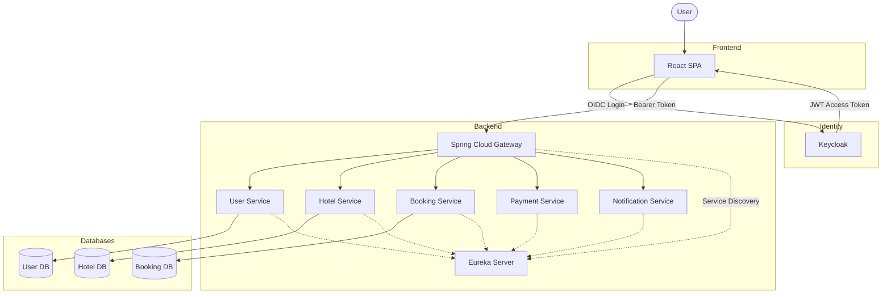
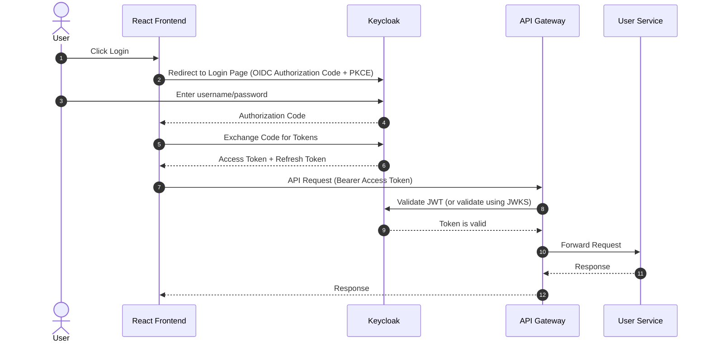
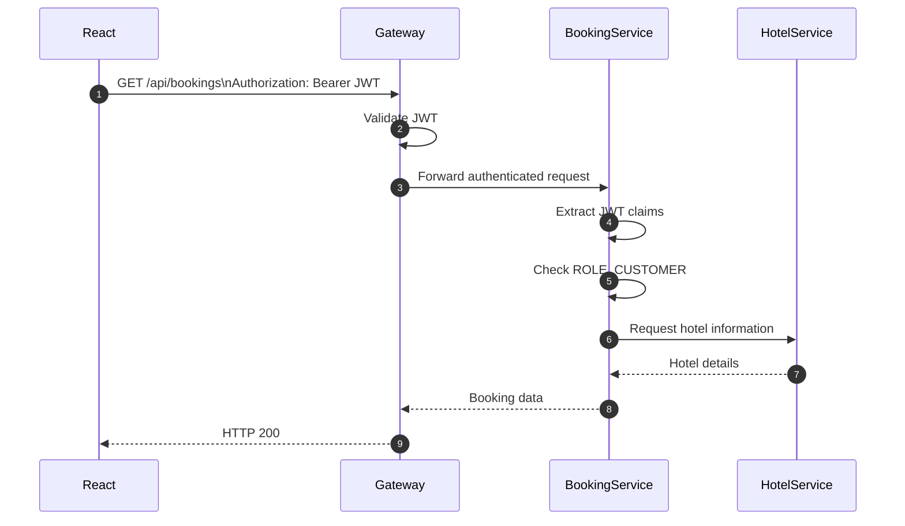

# I. Introduction to Keycloak
## 1. What is Keycloak?
Keycloak is an open-source Identity and Access Management (IAM) solution that provides authentication, authorization, and user management capabilities for applications and services.

Keycloak is responsible for:
- Login
- Logout
- Password hashing
- Password reset
- Forgot password
- MFA
- Email verification
- Sessions
- Access Token
- Refresh Token
- SSO
- OAuth2
- OpenID Connect
- Social Login  
- User Credentials
- Role management

## 2. Keycloak Position in the System Architecture

### 2.1 Authenticaion Architecture

> Production note: Rather than calling Keycloak to validate every request, the gateway (and often each resource server) typically **validates JWTs locally using Keycloak's published JWKS (public signing keys)**. This avoids an extra network hop on every request while still ensuring the token's signature, issuer, audience, and expiration are valid
.
### 2.2 Authentication Flow

### 2.3 Authorization Flow

# II. Keycloak Integration
## User service:
User service no longer manages authentication and authorization. Instead, it delegates these responsibilities to Keycloak. The user service is responsible for managing user profiles and other user-related data.

Therefore, its DB schema must be updated. 
**Old Schema:**

**Bảng `users`**
| Cột | Kiểu dữ liệu | Ràng buộc | Mô tả                              |
| --- | --- | --- |------------------------------------|
| id | UUID | PK | Định danh người dùng               |
| email | VARCHAR(255) | UNIQUE, NOT NULL | Email đăng nhập                    |
| phone | VARCHAR(20) | NULL | Số điện thoại                      |
| password_hash | VARCHAR(255) | NULL | NULL nếu chỉ đăng nhập bằng social |
| full_name | VARCHAR(255) | NOT NULL | Họ tên                             |
| avatar_url | VARCHAR(500) | NULL | Ảnh đại diện                       |
| address | VARCHAR(500) | NULL | Địa chỉ                            |
| status | ENUM | NOT NULL, DEFAULT 'UNVERIFIED' | UNVERIFIED, ACTIVE, LOCKED         |
| created_at | TIMESTAMP | NOT NULL |                                    |
| updated_at | TIMESTAMP | NOT NULL |                                    |
| is_deleted | BOOLEAN | NOT NULL, DEFAULT false | Cờ đánh dấu xóa mềm (soft delete)  |

**Bảng `roles`**

| Cột | Kiểu dữ liệu | Ràng buộc | Mô tả |
| --- | --- | --- | --- |
| id | UUID | PK | Định danh vai trò |
| name | VARCHAR(100) | UNIQUE, NOT NULL | CUSTOMER, HOTEL_STAFF, HOTEL_OWNER, PLATFORM_ADMIN |
| description | VARCHAR(255) | NULL | Mô tả vai trò |
| created_at | TIMESTAMP | NOT NULL | |
| is_deleted | BOOLEAN | NOT NULL, DEFAULT false | Cờ đánh dấu xóa mềm (soft delete) |

**Bảng `user_roles`**

| Cột | Kiểu dữ liệu | Ràng buộc | Mô tả |
| --- | --- | --- | --- |
| user_id | UUID | PK, FK → users.id | Người dùng |
| role_id | UUID | PK, FK → roles.id | Vai trò |
| created_at | TIMESTAMP | NOT NULL | Thời điểm gán vai trò |
| is_deleted | BOOLEAN | NOT NULL, DEFAULT false | Cờ đánh dấu xóa mềm (soft delete) |

**Bảng `auth_providers`**
| Cột | Kiểu dữ liệu | Ràng buộc | Mô tả |
| --- | --- | --- | --- |
| code | VARCHAR(20) | PK | Định danh nhà cung cấp xác thực |
| name | VARCHAR(100) | NOT NULL | Tên nhà cung cấp |
| created_at | TIMESTAMP | NOT NULL | Thời điểm tạo bản ghi |
| is_deleted | BOOLEAN | NOT NULL, DEFAULT false | Cờ đánh dấu xóa mềm (soft delete) |

**Bảng `user_auth_providers`**
| Cột | Kiểu dữ liệu | Ràng buộc | Mô tả |
| --- | --- | --- | --- |
| user_id | UUID | PK, FK → users.id | Người dùng |
| auth_provider_code | VARCHAR(20) | PK, FK → auth_providers.code |
| provider_user_id | VARCHAR(255) | NOT NULL, UNIQUE | Định danh người dùng trên nhà cung cấp xác thực |
| created_at | TIMESTAMP | NOT NULL | Thời điểm gán nhà cung cấp xác thực |
| is_deleted | BOOLEAN | NOT NULL, DEFAULT false | Cờ đánh dấu xóa mềm (soft delete) |

**Bảng `refresh_tokens`**

| Cột | Kiểu dữ liệu | Ràng buộc | Mô tả |
| --- | --- | --- | --- |
| id | UUID | PK | |
| user_id | UUID | FK → users.id, NOT NULL | |
| token_hash | VARCHAR(255) | NOT NULL | |
| expires_at | TIMESTAMP | NOT NULL | |
| revoked | BOOLEAN | NOT NULL, DEFAULT false | |
| created_at | TIMESTAMP | NOT NULL | |

**Quan hệ**

- `tenants.owner_user_id` → `users.id` (1–1 trong phạm vi MVP: một Owner sở hữu một tenant).
- `user_roles.user_id` → `users.id` (N–1).
- `user_roles.role_id` → `roles.id` (N–1).
- `user_roles.tenant_id` → `tenants.id` (N–1, NULL nếu role không gắn với tenant).
- `tenant_subscriptions.tenant_id` → `tenants.id` (N–1: một tenant có nhiều lịch sử subscription).
- `tenant_subscriptions.subscription_plan_id` → `subscription_plans.id` (N–1).
- `refresh_tokens.user_id` → `users.id` (N–1).
- `account_lock_history.user_id`, `account_lock_history.locked_by` → `users.id` (N–1, hai quan hệ riêng tới cùng bảng).
- `user_auth_providers.user_id` → `users.id` (N–1), `user_auth_providers.auth_provider_code` → `auth_providers.code` (N–1). (một user có thể đăng nhập bằng nhiều nhà cung cấp xác thực, ví dụ Google, Facebook, v.v.)

New Schema:

**Bảng `users`**
| Cột | Kiểu dữ liệu | Ràng buộc | Mô tả                              |
| --- | --- | --- |------------------------------------|
| id | UUID | PK | Định danh người dùng               |
| keycloak_id | VARCHAR(255) | UNIQUE, NOT NULL | Định danh người dùng trong Keycloak |
| email | VARCHAR(255) | UNIQUE, NOT NULL | Email đăng nhập                    |
| phone | VARCHAR(20) | NULL | Số điện thoại                      |
| full_name | VARCHAR(255) | NOT NULL | Họ tên                             |
| avatar_url | VARCHAR(500) | NULL | Ảnh đại diện                       |
| address | VARCHAR(500) | NULL | Địa chỉ                            |
| status | ENUM | NOT NULL, DEFAULT 'UNVERIFIED' | UNVERIFIED, ACTIVE, LOCKED         |
| created_at | TIMESTAMP | NOT NULL |                                    |
| updated_at | TIMESTAMP | NOT NULL |                                    |
| is_deleted | BOOLEAN | NOT NULL, DEFAULT false | Cờ đánh dấu xóa mềm (soft delete)  |

**Bảng `roles`**

| Cột | Kiểu dữ liệu | Ràng buộc | Mô tả |
| --- | --- | --- | --- |
| id | UUID | PK | Định danh vai trò |
| name | VARCHAR(100) | UNIQUE, NOT NULL | CUSTOMER, HOTEL_STAFF, HOTEL_OWNER, PLATFORM_ADMIN |
| description | VARCHAR(255) | NULL | Mô tả vai trò |
| created_at | TIMESTAMP | NOT NULL | |
| is_deleted | BOOLEAN | NOT NULL, DEFAULT false | Cờ đánh dấu xóa mềm (soft delete) |

**Bảng `user_roles`**

| Cột | Kiểu dữ liệu | Ràng buộc | Mô tả |
| --- | --- | --- | --- |
| user_id | UUID | PK, FK → users.id | Người dùng |
| role_id | UUID | PK, FK → roles.id | Vai trò |
| created_at | TIMESTAMP | NOT NULL | Thời điểm gán vai trò |
| is_deleted | BOOLEAN | NOT NULL, DEFAULT false | Cờ đánh dấu xóa mềm (soft delete) |

**Bảng `auth_providers`**
| Cột | Kiểu dữ liệu | Ràng buộc | Mô tả |
| --- | --- | --- | --- |
| code | VARCHAR(20) | PK | Định danh nhà cung cấp xác thực |
| name | VARCHAR(100) | NOT NULL | Tên nhà cung cấp |
| created_at | TIMESTAMP | NOT NULL | Thời điểm tạo bản ghi |
| is_deleted | BOOLEAN | NOT NULL, DEFAULT false | Cờ đánh dấu xóa mềm (soft delete) |

**Bảng `user_auth_providers`**
| Cột | Kiểu dữ liệu | Ràng buộc | Mô tả |
| --- | --- | --- | --- |
| user_id | UUID | PK, FK → users.id | Người dùng |
| auth_provider_code | VARCHAR(20) | PK, FK → auth_providers.code |
| provider_user_id | VARCHAR(255) | NOT NULL, UNIQUE | Định danh người dùng trên nhà cung cấp xác thực |
| created_at | TIMESTAMP | NOT NULL | Thời điểm gán nhà cung cấp xác thực |
| is_deleted | BOOLEAN | NOT NULL, DEFAULT false | Cờ đánh dấu xóa mềm (soft delete) |

**Bảng `refresh_tokens`**

| Cột | Kiểu dữ liệu | Ràng buộc | Mô tả |
| --- | --- | --- | --- |
| id | UUID | PK | |
| user_id | UUID | FK → users.id, NOT NULL | |
| token_hash | VARCHAR(255) | NOT NULL | |
| expires_at | TIMESTAMP | NOT NULL | |
| revoked | BOOLEAN | NOT NULL, DEFAULT false | |
| created_at | TIMESTAMP | NOT NULL | |

**Quan hệ**

- `tenants.owner_user_id` → `users.id` (1–1 trong phạm vi MVP: một Owner sở hữu một tenant).
- `user_roles.user_id` → `users.id` (N–1).
- `user_roles.role_id` → `roles.id` (N–1).
- `user_roles.tenant_id` → `tenants.id` (N–1, NULL nếu role không gắn với tenant).
- `tenant_subscriptions.tenant_id` → `tenants.id` (N–1: một tenant có nhiều lịch sử subscription).
- `tenant_subscriptions.subscription_plan_id` → `subscription_plans.id` (N–1).
- `refresh_tokens.user_id` → `users.id` (N–1).
- `account_lock_history.user_id`, `account_lock_history.locked_by` → `users.id` (N–1, hai quan hệ riêng tới cùng bảng).
- `user_auth_providers.user_id` → `users.id` (N–1), `user_auth_providers.auth_provider_code` → `auth_providers.code` (N–1). (một user có thể đăng nhập bằng nhiều nhà cung cấp xác thực, ví dụ Google, Facebook, v.v.)

# III. Keycloak Learning

## 3.1 Learning phases:
| Phase | Topic                  | Goal                                       |
| ----- | ---------------------- | ------------------------------------------ |
| 1     | IAM concepts           | Understand what Keycloak actually replaces |
| 2     | Install Keycloak       | Local development                          |
| 3     | Configure Realm        | Clients, Roles, Users                      |
| 4     | Integrate Gateway      | JWT authentication                         |
| 5     | Integrate User Service | Synchronize users & profile                |
| 6     | Spring Security        | Resource server configuration              |
| 7     | React Login            | OIDC login                                 |
| 8     | Registration           | Keycloak registration                      |
| 9     | Identity & Profile     | User management design                     |
| 10    | SSO                    | Multiple applications                      |
| 11    | Google Login           | Identity federation                        |
| 12    | Production             | Security, HA, DB, Monitoring               |
