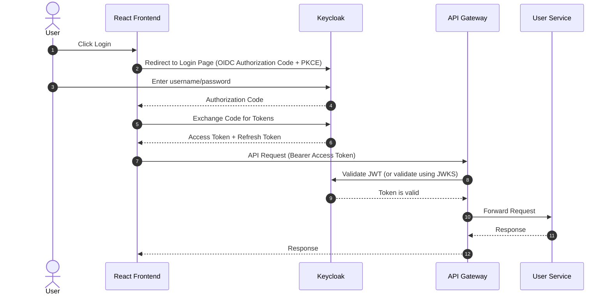
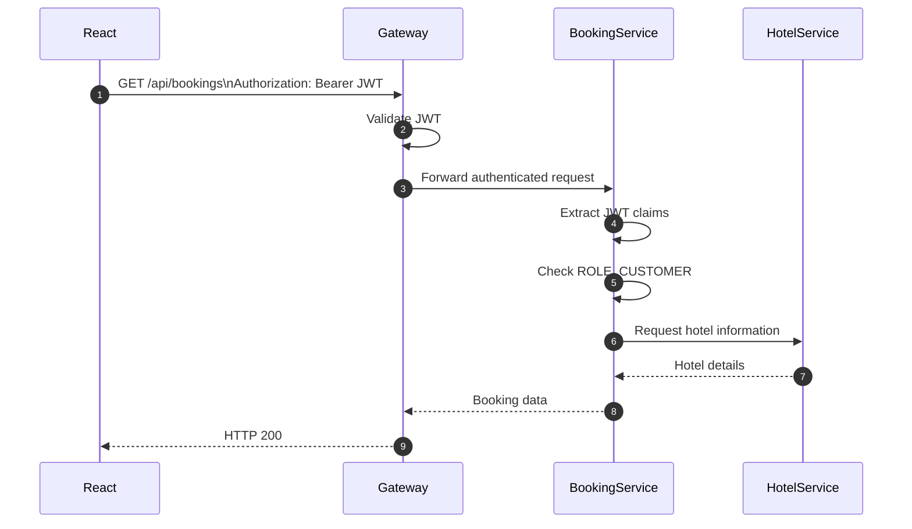
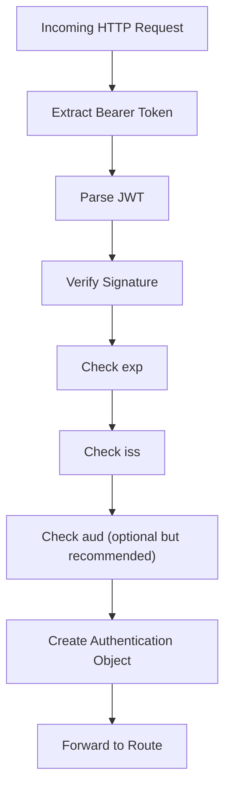

# I. Introduction to Keycloak
## 1. What is Keycloak?
Keycloak is an open-source Identity and Access Management (IAM) solution that provides authentication, authorization, and user management capabilities for applications and services.

Keycloak is responsible for:
- Login
- Logout
- Password hashing
- Password reset
- Forgot password
- MFA
- Email verification
- Sessions
- Access Token
- Refresh Token
- SSO
- OAuth2
- OpenID Connect
- Social Login  
- User Credentials
- Role management

## 2. Keycloak Position in the System Architecture

### 2.1 Authenticaion Architecture


> Production note: Rather than calling Keycloak to validate every request, the gateway (and often each resource server) typically **validates JWTs locally using Keycloak's published JWKS (public signing keys)**. This avoids an extra network hop on every request while still ensuring the token's signature, issuer, audience, and expiration are valid
.
### 2.2 Authentication Flow

### 2.3 Authorization Flow


# II. Keycloak Integration

The process of Keycloak integration can be divided into 12 phases, listed below:

| Phase | Topic                  | Goal                                       |
| ----- | ---------------------- | ------------------------------------------ |
| 1     | IAM concepts           | Understand what Keycloak actually replaces |
| 2     | Install Keycloak       | Local development                          |
| 3     | Configure Realm        | Clients, Roles, Users                      |
| 4     | Integrate Gateway      | JWT authentication                         |
| 5     | Integrate User Service | Synchronize users & profile                |
| 6     | Spring Security        | Resource server configuration              |
| 7     | React Login            | OIDC login                                 |
| 8     | Registration           | Keycloak registration                      |
| 9     | Identity & Profile     | User management design                     |
| 10    | SSO                    | Multiple applications                      |
| 11    | Google Login           | Identity federation                        |
| 12    | Production             | Security, HA, DB, Monitoring               |

# 2.1 IAM concepts and Keycloak

Keycloak JWT contains:
- **sub**: UUID of user in Keycloak DB (= `keycloak_id` in user service DB)
- email
- name
- roles: values can be `CUSTOMER`, `HOTEL_STAFF`, `HOTEL_OWNER`, `PLATFORM_ADMIN`
- scope: values can be `openid`, `profile`, `email`, `roles`
- realm_access: contains roles assigned to the user in the realm
- iat: issued at timestamp
- exp: expiration timestamp
- iss: issuer
- aud: audience, values can be `account`, `gateway`, `user-service`, `hotel-service`, `booking-service`, `payment-service`, `notification-service`
# 2.2 Install Keycloak and connect to Postgres DB

- Install keycloak with docker, docker image used: `quay.io/keycloak/keycloak:26.7.0`. 
- Connect Keycloak to keycloak Postgres DB to persist data with docker volume

config in docker-compose.yml:
```yaml
keycloak-db:
    image: postgres:16-alpine
    container_name: keycloak-db

    ports:
      - "${KEYCLOAK_DB_EXTERNAL_PORT:-5437}:${KEYCLOAK_DB_PORT:-5432}"
    environment:
      POSTGRES_DB: ${KEYCLOAK_DB_NAME:-keycloak_db}
      POSTGRES_USER: ${KEYCLOAK_DB_USER:-db}
      POSTGRES_PASSWORD: ${KEYCLOAK_DB_PASSWORD:-}

    volumes:
      - keycloak-db-data:/var/lib/postgresql/data

    healthcheck:
      test: ["CMD-SHELL", "pg_isready -U ${KEYCLOAK_DB_USER:-db} -d ${KEYCLOAK_DB_NAME:-keycloak_db}"]
      interval: 5s
      timeout: 5s
      retries: 10

    networks:
      - app-network

  keycloak:
    image: quay.io/keycloak/keycloak:26.7.0
    container_name: keycloak
    command: start-dev
    depends_on:
      keycloak-db:
        condition: service_healthy
    environment:
      KC_DB: ${KC_DB:-postgres}
      KC_DB_URL_HOST: ${KC_DB_URL_HOST:-keycloak-db}
      KC_DB_URL_DATABASE: ${KC_DB_URL_DATABASE:-keycloak_db}
      KC_DB_USERNAME: ${KC_DB_USERNAME:-db}
      KC_DB_PASSWORD: ${KC_DB_PASSWORD:-your-password}

      KC_BOOTSTRAP_ADMIN_USERNAME: ${KC_BOOTSTRAP_ADMIN_USERNAME:-}
      KC_BOOTSTRAP_ADMIN_PASSWORD: ${KC_BOOTSTRAP_ADMIN_PASSWORD:-}

    ports:
      - "8085:8080"

    networks:
      - app-network
```


# 2.3 Configure Realm

In Keycloak Admin console,  create a new realm named `hotel-booking-system` for IAM of the system. This realm contains these elements:
- clients: the applications use Keycloak service. We have 2 clients:
    - `frontend-client`: React app, 
        - Client type: `openid-connect`
        - Access Type: `public`
        - Valid Redirect URIs: `http://localhost:3000/*`
        - Web Origins: `http://localhost:3000`
        - use PKCE for authorization code exchange
        - why? frontend can't safely store client secret, so we use public client type and PKCE to secure the authorization code exchange.     
    - `api-gateway`: Spring Cloud Gateway
        - Client type: `openid-connect`
        - Access Type: `confidential`
        - Valid Redirect URIs: `http://localhost:8080/*`
        - Web Origins: `http://localhost:8080`
        - use Client Authentication
- roles: the roles used in the system, we have 4 roles:
    - `CUSTOMER`
    - `HOTEL_STAFF`
    - `HOTEL_OWNER`
    - `PLATFORM_ADMIN`
- groups: user groups, a group can be assigned with multiple roles. we have 4 groups:
    - `customer`: role `CUSTOMER`
    - `hotel staff`: role `HOTEL_STAFF`
    - `hotel owner`: role `HOTEL_OWNER`
    - `platform admins`: role `PLATFORM_ADMIN`

- users: the users of the system, each user can be assigned with multiple roles and groups.

# 2.4 Secure API Gateway with Keycloak (JWT + JWKS)
API Gateway verifies JWTs issued by Keycloak using JWKS (JSON Web Key Set) from Keycloak to ensure the authenticity and integrity of the tokens. The gateway checks the token's signature, issuer, audience, and expiration before forwarding requests to downstream services.

API Gateway uses Spring Security (already implemented) to:
- download JWKS from Keycloak
- caches keys
- verify signature
- check exp, issuer
- build authenticated principal 

Steps to config Spring Security for API Gateway:
- config API Gateway as Oauth2 Resource Server: add dependencies to pom.xml
```xml
<dependencies>
    <dependency>
        <groupId>org.springframework.boot</groupId>
        <artifactId>spring-boot-starter-security</artifactId>
    </dependency>

    <dependency>
        <groupId>org.springframework.boot</groupId>
        <artifactId>spring-boot-starter-oauth2-resource-server</artifactId>
    </dependency>
</dependencies>
```
- configure application.yml for API Gateway:
```yaml
security:
    oauth2:
      resourceserver:
        jwt:
          issuer-uri: ${KEYCLOAK_ISSUER_URI:http://keycloak:8080/realms/hotel-booking-system}
```

> Spring Security will automatically fetch the JWKS from Keycloak's well-known endpoint: `http://keycloak:8080/realms/hotel-booking-system/protocol/openid-connect/certs` and use it to validate incoming JWTs.

- config security chain
```java
package com.hotelbooking.gateway.config;
import org.springframework.context.annotation.Configuration;
import org.springframework.context.annotation.Bean;
import org.springframework.security.config.Customizer;
import org.springframework.security.config.annotation.web.reactive.EnableWebFluxSecurity;
import org.springframework.security.config.web.server.ServerHttpSecurity;
import org.springframework.security.web.server.SecurityWebFilterChain;
@Configuration
@EnableWebFluxSecurity
public class SecurityConfig {

    @Bean
    SecurityWebFilterChain springSecurityFilterChain(ServerHttpSecurity http) {

        return http
                .csrf(ServerHttpSecurity.CsrfSpec::disable)

                .authorizeExchange(exchanges -> exchanges
                        .pathMatchers(
                                "/actuator/**",
                                "/eureka/**"
                        ).permitAll()
                        .anyExchange().authenticated()
                )

                .oauth2ResourceServer(oauth2 ->
                        oauth2.jwt(Customizer.withDefaults())
                )

                .build();
    }
}

```

**Api Gateway Spring Security flow**:


## 2.5 Modify User service to fit Keycloak integration:
User service no longer manages authentication and authorization. Instead, it delegates these responsibilities to Keycloak. The user service is responsible for managing user profiles and other user-related data.

### 2.5.1 Update DB schema
Therefore, its DB schema must be updated. 
**Old Schema:**

**Bảng `users`**
| Cột | Kiểu dữ liệu | Ràng buộc | Mô tả                              |
| --- | --- | --- |------------------------------------|
| id | UUID | PK | Định danh người dùng               |
| email | VARCHAR(255) | UNIQUE, NOT NULL | Email đăng nhập                    |
| phone | VARCHAR(20) | NULL | Số điện thoại                      |
| password_hash | VARCHAR(255) | NULL | NULL nếu chỉ đăng nhập bằng social |
| full_name | VARCHAR(255) | NOT NULL | Họ tên                             |
| avatar_url | VARCHAR(500) | NULL | Ảnh đại diện                       |
| address | VARCHAR(500) | NULL | Địa chỉ                            |
| status | ENUM | NOT NULL, DEFAULT 'UNVERIFIED' | UNVERIFIED, ACTIVE, LOCKED         |
| created_at | TIMESTAMP | NOT NULL |                                    |
| updated_at | TIMESTAMP | NOT NULL |                                    |
| is_deleted | BOOLEAN | NOT NULL, DEFAULT false | Cờ đánh dấu xóa mềm (soft delete)  |

**Bảng `roles`**

| Cột | Kiểu dữ liệu | Ràng buộc | Mô tả |
| --- | --- | --- | --- |
| id | UUID | PK | Định danh vai trò |
| name | VARCHAR(100) | UNIQUE, NOT NULL | CUSTOMER, HOTEL_STAFF, HOTEL_OWNER, PLATFORM_ADMIN |
| description | VARCHAR(255) | NULL | Mô tả vai trò |
| created_at | TIMESTAMP | NOT NULL | |
| is_deleted | BOOLEAN | NOT NULL, DEFAULT false | Cờ đánh dấu xóa mềm (soft delete) |

**Bảng `user_roles`**

| Cột | Kiểu dữ liệu | Ràng buộc | Mô tả |
| --- | --- | --- | --- |
| user_id | UUID | PK, FK → users.id | Người dùng |
| role_id | UUID | PK, FK → roles.id | Vai trò |
| created_at | TIMESTAMP | NOT NULL | Thời điểm gán vai trò |
| is_deleted | BOOLEAN | NOT NULL, DEFAULT false | Cờ đánh dấu xóa mềm (soft delete) |

**Bảng `auth_providers`**
| Cột | Kiểu dữ liệu | Ràng buộc | Mô tả |
| --- | --- | --- | --- |
| code | VARCHAR(20) | PK | Định danh nhà cung cấp xác thực |
| name | VARCHAR(100) | NOT NULL | Tên nhà cung cấp |
| created_at | TIMESTAMP | NOT NULL | Thời điểm tạo bản ghi |
| is_deleted | BOOLEAN | NOT NULL, DEFAULT false | Cờ đánh dấu xóa mềm (soft delete) |

**Bảng `user_auth_providers`**
| Cột | Kiểu dữ liệu | Ràng buộc | Mô tả |
| --- | --- | --- | --- |
| user_id | UUID | PK, FK → users.id | Người dùng |
| auth_provider_code | VARCHAR(20) | PK, FK → auth_providers.code |
| provider_user_id | VARCHAR(255) | NOT NULL, UNIQUE | Định danh người dùng trên nhà cung cấp xác thực |
| created_at | TIMESTAMP | NOT NULL | Thời điểm gán nhà cung cấp xác thực |
| is_deleted | BOOLEAN | NOT NULL, DEFAULT false | Cờ đánh dấu xóa mềm (soft delete) |


**Bảng `refresh_tokens`**

| Cột | Kiểu dữ liệu | Ràng buộc | Mô tả |
| --- | --- | --- | --- |
| id | UUID | PK | |
| user_id | UUID | FK → users.id, NOT NULL | |
| token_hash | VARCHAR(255) | NOT NULL | |
| expires_at | TIMESTAMP | NOT NULL | |
| revoked | BOOLEAN | NOT NULL, DEFAULT false | |
| created_at | TIMESTAMP | NOT NULL | |

**Quan hệ**

- `tenants.owner_user_id` → `users.id` (1–1 trong phạm vi MVP: một Owner sở hữu một tenant).
- `user_roles.user_id` → `users.id` (N–1).
- `user_roles.role_id` → `roles.id` (N–1).
- `user_roles.tenant_id` → `tenants.id` (N–1, NULL nếu role không gắn với tenant).
- `tenant_subscriptions.tenant_id` → `tenants.id` (N–1: một tenant có nhiều lịch sử subscription).
- `tenant_subscriptions.subscription_plan_id` → `subscription_plans.id` (N–1).
- `refresh_tokens.user_id` → `users.id` (N–1).
- `account_lock_history.user_id`, `account_lock_history.locked_by` → `users.id` (N–1, hai quan hệ riêng tới cùng bảng).
- `user_auth_providers.user_id` → `users.id` (N–1), `user_auth_providers.auth_provider_code` → `auth_providers.code` (N–1). (một user có thể đăng nhập bằng nhiều nhà cung cấp xác thực, ví dụ Google, Facebook, v.v.)

New Schema:
- In table `users`, remove `password_hash` column and add `keycloak_id` column to store the Keycloak user ID.
- Remove tables `roles`, `user_roles`, `auth_providers`, `user_auth_providers` and `refresh_tokens` as Keycloak will handle refresh tokens, roles and authentication providers.

**Bảng `users`**

| Cột | Kiểu dữ liệu | Ràng buộc | Mô tả                              |
| --- | --- | --- |------------------------------------|
| id | UUID | PK | Định danh người dùng               |
| keycloak_id | UUID | UNIQUE, NOT NULL | Định danh người dùng trong Keycloak |
| email | VARCHAR(255) | UNIQUE, NOT NULL | Email đăng nhập                    |
| phone | VARCHAR(20) | NULL | Số điện thoại                      |
| full_name | VARCHAR(255) | NOT NULL | Họ tên                             |
| avatar_url | VARCHAR(500) | NULL | Ảnh đại diện                       |
| address | VARCHAR(500) | NULL | Địa chỉ                            |
| status | ENUM | NOT NULL, DEFAULT 'ACTIVE' | ACTIVE, LOCKED         |
| created_at | TIMESTAMP | NOT NULL |                                    |
| updated_at | TIMESTAMP | NOT NULL |                                    |
| is_deleted | BOOLEAN | NOT NULL, DEFAULT false | Cờ đánh dấu xóa mềm (soft delete)  |


**Bảng `tenants`**

| Cột | Kiểu dữ liệu | Ràng buộc | Mô tả |
| --- | --- | --- | --- |
| id | UUID | PK | Định danh tenant |
| owner_user_id | UUID | FK → users.id, NOT NULL | Chủ khách sạn sở hữu tenant |
| name | VARCHAR(255) | NOT NULL | Tên doanh nghiệp/chuỗi khách sạn |
| status | ENUM | NOT NULL, DEFAULT 'ACTIVE' | ACTIVE, SUSPENDED |
| created_at | TIMESTAMP | NOT NULL | |
| updated_at | TIMESTAMP | NOT NULL | |
| is_deleted | BOOLEAN | NOT NULL, DEFAULT false | Cờ đánh dấu xóa mềm (soft delete) |

**Bảng `subscription_plans`**

| Cột | Kiểu dữ liệu | Ràng buộc | Mô tả |
| --- | --- | --- | --- |
| id | UUID | PK | Định danh gói thuê bao |
| code | VARCHAR(50) | UNIQUE, NOT NULL | FREE, BASIC, PRO |
| name | VARCHAR(255) | NOT NULL | Tên gói thuê bao |
| description | VARCHAR(500) | NULL | Mô tả gói |
| price | DECIMAL(12,2) | NOT NULL, DEFAULT 0 | Giá gói |
| billing_cycle | ENUM | NOT NULL | MONTHLY, YEARLY |
| created_at | TIMESTAMP | NOT NULL | |
| updated_at | TIMESTAMP | NOT NULL | |
| is_deleted | BOOLEAN | NOT NULL, DEFAULT false | Cờ đánh dấu xóa mềm (soft delete) |

**Bảng `tenant_subscriptions`**

| Cột | Kiểu dữ liệu | Ràng buộc | Mô tả |
| --- | --- | --- | --- |
| id | UUID | PK | Định danh lịch sử subscription của tenant |
| tenant_id | UUID | FK → tenants.id, NOT NULL | Tenant sử dụng gói |
| subscription_plan_id | UUID | FK → subscription_plans.id, NOT NULL | Gói thuê bao |
| status | ENUM | NOT NULL, DEFAULT 'ACTIVE' | ACTIVE, EXPIRED, CANCELLED, SUSPENDED |
| started_at | TIMESTAMP | NOT NULL | Thời điểm bắt đầu dùng gói |
| expires_at | TIMESTAMP | NULL | Thời điểm hết hạn |
| created_at | TIMESTAMP | NOT NULL | |
| is_deleted | BOOLEAN | NOT NULL, DEFAULT false | Cờ đánh dấu xóa mềm (soft delete) |

> Ràng buộc nghiệp vụ: mỗi `tenant` có thể có nhiều bản ghi trong `tenant_subscriptions` theo lịch sử, nhưng tại một thời điểm chỉ được có một subscription có `status = ACTIVE`.


**Bảng `account_lock_history`**

| Cột | Kiểu dữ liệu | Ràng buộc | Mô tả |
| --- | --- | --- | --- |
| id | UUID | PK | |
| user_id | UUID | FK → users.id, NOT NULL | Tài khoản bị khóa |
| locked_by | UUID | FK → users.id, NOT NULL | Admin thực hiện |
| reason | VARCHAR(500) | NOT NULL | |
| locked_at | TIMESTAMP | NOT NULL | |
| unlocked_at | TIMESTAMP | NULL | |
| is_deleted | BOOLEAN | NOT NULL, DEFAULT false | Cờ đánh dấu xóa mềm (soft delete) |
**Quan hệ**
- `tenants.owner_user_id` → `users.id` (1–1 trong phạm vi MVP: một Owner sở hữu một tenant).
- `tenant_subscriptions.tenant_id` → `tenants.id` (N–1: một tenant có nhiều lịch sử subscription).
- `tenant_subscriptions.subscription_plan_id` → `subscription_plans.id` (N–1).
- `account_lock_history.user_id`, `account_lock_history.locked_by` → `users.id` (N–1, hai quan hệ riêng tới cùng bảng).

### 2.5.1 Data synchronization between Keycloak and User Service:

- **When new user is created**: use Lazy Creation: when a user logs in for the first time, the user service will check if the user exists in its database. If not, it will create a new user record based on the information from Keycloak.

- **Update user info**: (email, phone, name)
- **Change password**
- **Delete user**: when a user is deleted in Keycloak, the user service will mark the corresponding user record as deleted (soft delete) in its database.
### 2.5.2 User Service API endpoints for Keycloak integration:
- `GET /api/users/me`: Get the current authenticated user's profile.
- `GET /api/users/{id}`: Get a user's profile by ID (accessible only to admins or the user themselves).


## 2.6 Integrate React with Keycloak (Login, Registration, Logout)

**Dependencies**:
- `keycloak-js`: Keycloak JavaScript adapter for integrating Keycloak with React applications. this dependency provides methods for:
    - Initializing Keycloak
    - Handling login and logout
    - Managing user sessions
    - refreshing tokens

Steps:
1. create file `src/features/auth/keycloak.js` to initialize Keycloak instance and configure it with the Keycloak server URL, realm, and client ID.
2. `src/features/auth/utils/postAuthRedirect.js`: handle post-authentication redirection after successful login or logout, save and restore redirectTo, checkoutDraft via sessionStorage.
3. `public/silent-check-sso.html`: handle silent SSO check for token refresh without user interaction.
4. In `AuthContext.js`, modify methods: login(), register(), googleLogin(), isAuthenticated, logout() and init keycloak.
5. `axiosClient.js`: add interceptor to attach access token to outgoing requests and handle token refresh with `updateToken()`
6. In `authStorage.js`, `storageKey.js`, `authService.js` remove access token, user info stored in localStorage (keycloak stores them in memory)
7. `LoginPage.jsx`, `RegisterPage.jsx`, `GoogleLoginButton.jsx`: calls keycloak methods to use Keycloak UI for login and registration
8. `VerifyEmailPage.jsx`: removed. `router.jsx` remove route `/verify-email`
9. Add env vars in `.env` for keycloak
```text
VITE_KEYCLOAK_URL=
VITE_KEYCLOAK_REALM=
VITE_KEYCLOAK_CLIENT_ID=
```

10. Config Email for realm hotel-booking-system:
Template:
    - from: my-email
Connection & authentication:
    - SMTP server: smtp.gmail.com
    - Port: 587
    - Encryption: STARTTLS
    - Auth: 
        - Enable: ON
        - username: my-email
        - password: gmail-app-password

11. config Keycloak for Google Login:
- Add google identity provider in Keycloak Admin console
- Config:
    - redirect URI: `http://localhost:8085/realms/hotel-booking-system/broker/google/endpoint` (add this URI to Authorize Redirect URI to Google Cloud Console of google project)
    - Client ID and Client Secret: from Google Cloud Console of google project
    - Jwt Authorization grant: ON
    - Trust Email: ON (no need to verify email from Google after first login)
    - First login flow override: `first broker login`

